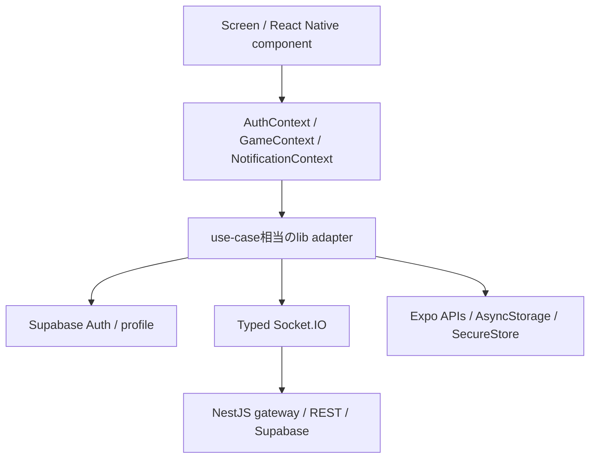
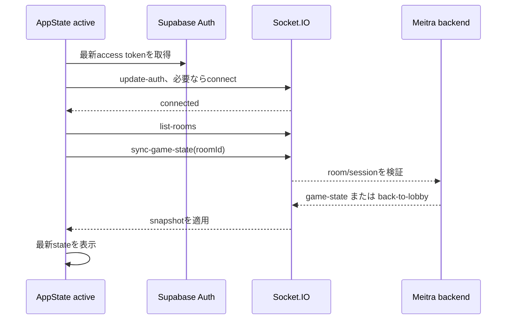

# Meitra モバイルネイティブアプリ設計

更新日: 2026-07-24
対象: iOS / Android
実装: Expo SDK 55 / React Native 0.83 / TypeScript / Expo Router / EAS

この文書は、`mei-tra-mobile/` に現存する実装を基準に、ネイティブアプリの境界、復帰モデル、通知、リリース条件を定義する。設計案だけの項目は未実装として扱い、ストア公開を意味する完了表現は使わない。

## 0. 状態の読み方

| 表示 | 意味 |
| --- | --- |
| **実装済み** | 対象コードまたは設定がこのブランチに存在する。実機・本番での動作確認を意味しない |
| **検証済み** | 自動テスト、CI、または実機・本番確認の証跡があり、対象範囲を限定して再現できる |
| **外部作業** | EAS、Apple、Google、Supabase本番など、このリポジトリだけでは完了できない作業 |
| **未実装** | 設計上は必要だが、現行コードに対応する実装がない |

現時点で、認証・ルーム・対局UI・再接続、通知、退会、共有Socket契約は**実装済み**である。npm workspace解決、自動テスト、build/export、390×844のbrowser smokeは**ローカル検証済み**である。一方、TestFlight / Google Play内部テスト、実端末のpush・background復帰、EAS project・署名資格情報、本番Supabase migrationは未完了である。したがって、この文書はストアリリース済み、またはリリース可能と宣言しない。

### 2026-07-24 ローカル検証スナップショット

| 対象 | 結果 | 検証境界 |
| --- | --- | --- |
| npm workspace | npm `10.9.2`でclean install成功 | root lockfileとworkspace packageのローカル解決 |
| mobile | 14 suites / 63 tests、Expo Doctor 19/19、iOS / Android export成功 | JavaScript・設定・bundle export。署名済みnative buildではない |
| backend | 52 suites / 300 tests、lint、build成功 | ローカルbackendとlocal Supabase |
| frontend | 27 suites / 78 tests、lint、build成功 | Web buildと共有Socket契約 |
| Web dev | HTTP 200 | ローカルdev serverの到達性 |
| Playwright 390×844 | seat identityのserver derivation後にfinal normal flowを再実行。signup、room作成、COM補充、shuffle、start、blow pass、合法card play、reload後のauthoritative restore、leave、settings/legal links、account deletion HTTP 200と成功後redirect、parameterなしcallbackの安全なredirect | browser smoke。TestFlight / Play・実端末・native pushではない |
| production dependency audit | `npm audit --omit=dev`でmoderate 10件、high / critical 0件 | Expoの`xcode`→`uuid`依存経路。強制fixはExpoをdowngradeするため未適用で、upstream dependency reviewを継続 |

active game reloadでは、標準のdevelopment情報を除きerror / warnを検出していない。

## 1. 目的と不変条件

### 目的

- WebViewラッパーではなく、React Native UIでMeitraを提供する。
- 既存のNestJS + Socket.IO backendを使い、Web版と同じルームで対戦・観戦できるようにする。
- モバイルのforeground/background、回線切替、push通知、端末固有の操作に耐える。
- Web版を廃止せず、Web / mobileの両クライアントを同じサーバ契約で運用する。

### 不変条件

1. フェーズ、手番、合法手、得点、勝敗、ルーム復帰の可否はbackendを正とする。
2. 座席は`seatId`、本人は`userId`で判定し、再接続で変わる`socket.id`を識別子にしない。
3. background中のイベント欠落を正常系とし、foreground復帰時に最新JWTとサーバスナップショットへ戻す。
4. クライアントのvalidatorや表示用stateは入力補助であり、サーバのゲームルールを置き換えない。
5. 通知や分析の失敗は、確定済みのゲーム進行をロールバックまたは停止させない。

## 2. リポジトリ構成と共有境界

```text
old-maid-mobile/
├── package.json               # npm@10.9.2 / workspace定義
├── package-lock.json          # root workspace lockfile
├── contracts/                 # Web / backend / mobile のwire契約
│   ├── package.json            # @meitra/contracts
│   ├── game.ts
│   ├── room.ts
│   ├── socket.ts               # typed Socket.IO event map と ack型
│   └── push.ts                 # push登録・通知payload型
├── shared/game-client/         # UI非依存の入力補助
│   ├── package.json            # @meitra/game-client
│   ├── blow.ts
│   └── card-legality.ts
├── mei-tra-frontend/           # Next.js Web
├── mei-tra-backend/            # NestJS + Socket.IO + Supabase
│   ├── src/push/               # token API とExpo送信
│   ├── src/services/           # gameplay push trigger
│   └── supabase/migrations/    # push_tokens migration
└── mei-tra-mobile/             # Expo React Native
    ├── src/app/                # Expo Router routes
    ├── src/components/         # React Native専用UI
    ├── src/context/            # Auth / game / notification state
    └── src/lib/                # storage / realtime / lifecycle / API
```

### 共有するもの

- `contracts/`のpayload、event map、ack response。
- `shared/game-client/`のブロー順位・候補生成・カード合法性判定。
- 将来追加するUI非依存のカードID変換やデザイントークン。

### 共有しないもの

- React / Next.js / React Nativeのコンポーネントとhooks。
- `window`、AsyncStorage、SecureStoreなどのプラットフォームAPI。
- Socket.IO clientインスタンス、ナビゲーション、アニメーション実装。
- サーバのゲームルール実装。

root `package.json`は`mei-tra-mobile`、`contracts`、`shared/game-client`をnpm workspacesとして定義する。共有packageはそれぞれ`@meitra/contracts`、`@meitra/game-client`としてexportされ、mobileはworkspace dependencyとして参照する。Metro、Jest、TypeScript、EAS archiveで同じpackage specifierを使う構成であり、npm `10.9.2`のclean installとローカルexportで解決を確認済みである。EAS remote archiveでの解決は`build:inspect`とpreview buildが未実施のため、外部ゲートとして残る。

### Socket.IO契約

`contracts/socket.ts`には、現行gatewayで使うclient-to-server / server-to-clientのイベント型、ルーム操作のack payload、`RoomAck` / `GatewayAck`がある。mobileの`MobileSocket`はこれを`Socket<ServerToClientEvents, ClientToServerEvents>`として利用し、ack付きルーム操作は`emitWithAck`でタイムアウト付きにする。

ただし、契約型をWeb・backendの全送受信箇所へ適用し終えたこと、全イベントのack shapeをCIで網羅的に検査できることは未検証である。契約追加後の移行を完了条件にし、イベント名だけの一致を型安全の証明とみなさない。

## 3. モバイルアプリ構造

### Route

現行の主なrouteは次のとおりである。

```text
mei-tra-mobile/src/app/
├── _layout.tsx
├── index.tsx                 # 認証状態に応じた入口
├── sign-in.tsx               # email/password と Google OAuth
├── rooms.tsx                 # ルーム一覧・作成・参加・観戦
├── room/[roomId].tsx         # 待機室または対局画面
└── settings.tsx              # 接続、通知、ログアウト、退会
```

`room/[roomId]`はサーバ状態を見て`WaitingRoom`と`GameBoard`を切り替える。`room/current`は作成直後や復帰導線で解決するための論理的な入口であり、固定のサーバルームIDではない。

### レイヤー



画面はContextの操作APIへ入力を渡し、Socket.IOを直接生成しない。現行実装では`GameContext`がsocket listenerとstate reducerを一元管理している。画面ごとにlistenerを登録しないため、画面再描画による二重受信を避けられる。

### 状態の所有者

| 状態 | 正の所有者 | mobile側の扱い |
| --- | --- | --- |
| フェーズ、手番、手札、場、得点、参加者 | backendのgame/room snapshot | `GameContext` reducerへ反映。イベントはsnapshotまたは限定patchとして適用 |
| 認証セッション | Supabase Auth | `AuthContext`が復元・refresh・logoutを管理 |
| Socket接続 | `GameContext` | `ConnectionStatus`とlistener cleanupを管理 |
| 選択カード、modal、入力中UI | mobile UI | ローカルのみ。送信前に確定済みstateへ反映しない |
| 復帰対象room | AsyncStorage | TTL付き導線。認可・在席の証拠にはしない |

## 4. 認証とローカル保存

### Supabase Auth

`src/lib/supabase.ts`はnativeで`persistSession`、`autoRefreshToken`、`detectSessionInUrl: false`、`processLock`を有効にし、Supabase session storageへ`LargeSecureStore`を渡す。`AppState`とNetInfoがactiveかつonlineのときだけauto refreshを動かし、それ以外では停止する。

`AuthContext`は次を実装している。

- email/passwordの登録・ログイン、Google OAuth callback。
- 起動時のsession復元と`user_profiles`の表示名・username・avatar読込。
- expiry 60秒前を閾値にしたsingle-flightの`refreshSession`。
- logout前のpush token削除試行、room recovery削除、local sign out。

### 大容量session

`src/lib/secure-storage.ts`の`LargeSecureStore`は、session本体をAES-GCM相当の暗号化データとしてAsyncStorageへ置き、暗号鍵だけをSecureStoreへ置く。過去のSecureStore単体・分割保存形式の読み出しと移行、破損値の破棄も持つ。通常値と4KB超の値を含むmobile testはローカルで61件すべて成功している。実端末でのOS再起動・keychain / keystore復元は未検証である。

### Room recovery

`src/lib/room-storage.ts`は次のrecordをAsyncStorageへ保存し、TTLを24時間とする。

```ts
interface RoomRecoveryRecord {
  roomId: string;
  savedAt: number;
  expiresAt: number;
}
```

接続時、foreground復帰時、`game-state`受信時にroom IDを更新し、game over・離室・`back-to-lobby`・復帰拒否時に削除する。期限切れや不正値は無視して削除する。期限内でも、復帰可否は必ずbackendの`sync-game-state`結果で決める。

## 5. Realtimeとライフサイクル

### 接続

`GameContext`は次のSocket.IO設定を使う。

- `transports: ['websocket', 'polling']`
- `tryAllTransports: true`
- 自動reconnect、無限attempt、1秒から10秒のdelay、30秒timeout
- `auth` callbackごとに最新access token、room ID、表示名を取得

接続イベントの型はshared contractから解決する。room作成・参加・観戦・ready・COM・team shuffle・startはack付き、ゲーム操作は現行gatewayのone-way emit + server event反映である。`emitWithAck`は接続なし・timeout・ack failureを共通の失敗形にする。

### 復帰シーケンス



実装済みの処理は、接続時とAppStateのactive遷移時にroom recoveryを読み、接続済みなら`update-auth`、`list-rooms`、`sync-game-state`を送る。`game-state`受信時はサーバsnapshotをstateの正として保存する。Socket listenerはprovider effect内で登録し、cleanup時に全解除・disconnectする。

### 現行の検証ギャップ

- `AppLifecycle`はNetInfoでonline/offlineを追跡するが、`ConnectionStatus`は`disconnected / connecting / resyncing / connected`で、独立した`offline`状態はまだない。
- browser reload後にauthoritative stateへ復元し、active game reload時に標準development情報以外のerror / warnがないことは390×844のPlaywright smokeで確認済みである。
- background 30秒・2分、process kill、Wi-Fi↔mobile回線切替は実端末で検証した証跡がない。
- 再同期中の全ゲーム操作をUIレベルで無効化できているか、古いsnapshotを操作できないかを受入テストで確認する必要がある。
- COM補充、shuffle、start、blow pass、合法card playまではbrowser smoke済みである。human→COM置換後の復帰、Web + mobile混在対局、次round初手、game overまでの完走は未検証である。

### Identity

mobileの参加payloadは認証accountを`userId`として送り、参加後にserverが解決した`seatId`を受け取る。接続ごとの`socketId`はtransportの補助情報であり、本人・席・手番の永続識別には使わない。state mergeとcurrent player解決は`seatId`を正本とする。

## 6. ゲームUIと入力補助

### 実装済みの画面

- portrait phone向けの待機室、相手席、手札、field、吹き、ネグリ、アガリ、得点、ゲーム終了表示。
- `Screen`によるsafe area、接続バナー、再試行導線、feedback banner。
- 連続タップを抑えるbusy/disabled表示。待機室のack操作とゲーム操作にはaction keyによる短時間の重複送信抑止がある。
- VoiceOver / TalkBack向けのaccessibility label、role、state、live regionを主要操作へ設定。
- カードは現時点ではカードID・文字表現をReact Native UIで描画する。

### 共有ロジック

`shared/game-client/blow.ts`は吹きのpair数とtrump強度から有効候補を生成し、`card-legality.ts`はfollow suit、trump、Joker、Tanzen時のカード選択を事前判定する。mobileはこれを操作補助として使い、backendのack・state更新を最終結果とする。共有関数とmobile側のgame-state / card変換にはunit testがある。

### 未実装・未検証のUI品質

- `react-native-reanimated`は依存にあるが、手札fan・カード移動・トリック回収の設計どおりのanimation実装とreduced-motion対応は未確認である。
- 44pt以上の全tap target、1.5x / 2.0x文字倍率、VoiceOver / TalkBack実機読み上げ、320pt幅・ノッチ端末の崩れは実機受入が必要である。
- カードSVGの静的asset registryはまだなく、Webの動的SVG URLをMetroへ移植する設計は保留する。正式なカード画像を追加する場合は、iOS / Androidのrelease buildで描画を確認する。
- `expo-haptics`、`expo-keep-awake`、チャット画面、Maestro E2Eは現行実装に含まれない。

## 7. Push通知

### mobile

`expo-notifications`を使い、native実機で権限を取得してExpo Push Tokenを作る。端末IDとlocal registrationはAsyncStorageへ保存し、認証後に`POST /api/push-tokens`へ送る。logout時は`DELETE /api/push-tokens?deviceId=...&platform=...`を試行してからlocal sign outする。通知tapの`roomId`は、未ログインなら保留し、認証後に`room/[roomId]`へ合流させる。

`app.json`にEAS project IDがない場合、通知登録は`missing-project-id`で止まる。シミュレーター、Web、通知拒否では対局自体は継続するが、pushは登録されない。

### backend

- `POST /api/push-tokens` / `DELETE /api/push-tokens`はAuthGuardで保護し、user IDはtokenから取得する。
- token値はmobileへ返さず、service-role経由で`push_tokens`へupsert・削除する。RLSとgrantはservice roleだけを許可する設計である。
- `PushNotificationService`はExpoへ最大100件単位で送信し、受理されたticketを`push_receipts`へ記録する。ticket response時点の`DeviceNotRegistered`は即時に無効tokenをcleanupする。
- `PushReceiptService`はaccepted ticketだけを対象に、初回をおよそT+15分、その後をT+20 / 35 / 65 / 125 / 245 / 485 / 965分でqueryする。30秒worker起動によるjitterを許容し、最大8回、最終queryのおよそ16時間5分でExpo receipt retention内に`expired`とする。Gameplay処理自身はreceiptをpollしない。
- `GameplayNotificationService`はゲーム開始と手番を対象にし、COM・spectator・通知拒否profileを除外し、process内bounded dedupeを使う。
- `20260806090000_create_push_tokens.sql`、`20260806150938_harden_push_token_access.sql`、`20260806165611_push_receipt_tracking.sql`はlocal Supabaseへ適用済みである。本番Supabaseへの適用・schema確認は未完了である。

push送信・receipt workerのunit/spec、SQL self-test、local push tokenのregister / delete smokeは検証済みである。ただし、本番migration、実機token登録、Expo受信、通知tap、無効token cleanup、delivery metricsは外部作業または実機検証の対象である。`push_receipts`はprovider delivery結果を追跡するが、Gameplay通知のin-memory dedupeは再起動・複数backend instanceをまたぐ重複event抑止ではない。

## 8. アカウント削除

現行の退会導線は実装済みである。

1. Settingsで`DELETE`入力を要求する。
2. mobileがBearer token付きで`DELETE /api/user-profile/:id`を呼ぶ。
3. backendが本人性を確認し、activeなwaiting / ready / playing roomの参加またはhostがあれば409で拒否する。
4. avatar objectを削除し、profile参照、room player、game state、game historyを匿名化する。
5. Supabase Auth userをadmin APIで削除し、auth cacheをinvalidateする。
6. 成功後、push token削除・room recovery削除・local sign outを行う。

削除処理のbackend spec、controller spec、mobile account API specに加え、`20260806160844_add_account_deletion_started_at.sql`、`20260806162505_anonymize_account_references_atomically.sql`、`20260806162619_reject_deleting_room_players.sql`、`20260806165711_serialize_account_deletion_room_membership.sql`をlocal Supabaseへ適用済みである。local migration historyは`20260806165711`まで揃い、transactional `account_anonymization`を含む全SQL self-testが成功している。seat identityのserver derivation後にPlaywrightのfinal normal flowを再実行し、Settingsからのaccount deletionがHTTP 200を返してsign-inへredirectすることを確認済みである。active roomの409、実端末、production data、store審査の削除要件は別途確認する。

## 9. EASとCI

### 現行設定

`mei-tra-mobile/eas.json`には次のprofileがある。

| profile | 配布 | environment / channel | 用途 |
| --- | --- | --- | --- |
| `development` | internal | development | `expo-dev-client`を使うdevelopment client |
| `preview` | internal | preview | 関係者の受入確認 |
| `production` | store | production | ストア用署名build。Android submitはinternal track |

`appVersionSource`はremote、`requireCommit`は有効、productionのbuild number / version codeはauto incrementである。`app.json`の現行識別子はiOS `com.kando1.meitra`、Android `com.kando1.meitra`、version `0.1.0`、portraitである。

`.github/workflows/mobile-ci.yml`はworkspace clean install、EAS monorepo packaging検証、mobile lint、typecheck、unit test、iOS / Android exportを定義する。path filterは`mei-tra-mobile/**`、`contracts/**`、`shared/game-client/**`、root workspace metadataを含む。今回の検証実績はローカル実行であり、GitHub Actions runの成功とは区別する。

`.github/workflows/mobile-release.yml`は`EXPO_TOKEN`、productionはmain dispatch、EAS project ID、development client依存をpreflightで確認し、EAS buildを実行する。`--freeze-credentials`によりCIが署名資格情報を自動更新しない。

### リリースを止める設定

- `app.json`に`expo.extra.eas.projectId`がないため、EAS project linkは未完了である。
- EAS login、EAS environment、`EXPO_TOKEN`、Apple Developer / App Store Connect、Android keystore / Play Console資格情報は未設定または未確認である。
- `20260806162505_anonymize_account_references_atomically.sql`、`20260806162619_reject_deleting_room_players.sql`、`20260806165611_push_receipt_tracking.sql`、`20260806165711_serialize_account_deletion_room_membership.sql`を含むlocal migration historyは本番Supabaseへ未適用・未検証である。
- `runtimeVersion`と`updates.url`がないため、EAS Updateは開始しない。channel定義だけではOTAは有効にならない。
- `eas build:inspect`、署名済みpreview build、TestFlight / Play内部テストは未実施である。

## 10. テスト戦略と完了条件

### 自動テスト

ローカルでは次の結果を確認済みである。

- mobile: 14 suites / 63 tests、Expo Doctor 19/19、lint、typecheck、iOS / Android export。
- backend: 52 suites / 300 tests、lint、build。
- frontend: 27 suites / 78 tests、lint、build。
- Web dev server: HTTP 200。
- production dependency audit: `npm audit --omit=dev`はExpoの`xcode`→`uuid`経路でmoderate 10件、high / critical 0件。強制fixはExpoをdowngradeするため適用せず、upstream dependency review項目として残す。

リリース候補commitでは、同じ検証を再実行して結果を記録する。

```bash
cd old-maid-mobile
npm ci
npm --workspace mei-tra-mobile run lint
npm --workspace mei-tra-mobile run typecheck
npm --workspace mei-tra-mobile test -- --ci
npm --workspace mei-tra-mobile run doctor
npm --workspace mei-tra-mobile run export:ios
npm --workspace mei-tra-mobile run export:android
```

### 必須の受入シナリオ

390×844のPlaywright smokeでは、seat identityのserver derivation後にfinal normal flowを再実行し、signup、room作成、COM補充、shuffle、start、blow pass、合法card play、reload後のauthoritative restore、leave、settings/legal links、account deletion HTTP 200と成功後redirect、parameterなしcallbackの安全なredirectを確認済みである。

- email / Google login、logout、再起動後session復元。
- 4KB超sessionの保存・復元・削除。
- ルーム作成・参加・観戦、ready、COM、team shuffle、start。
- 吹き、pass、ネグリ、Jokerを含むカードplay、field、得点、次round、game over。
- Web + mobile + COM混在で1ゲーム完了。
- WebSocket failureからpolling fallback、background、process kill、Wi-Fi↔mobile回線切替。
- 無効JWT、終了room、古いroom ID、COM置換後の復帰。
- 通知許可・拒否、実機token登録、logout削除、通知tapからroom復帰。
- active roomでの退会拒否、削除成功後のlocal cleanup。

browser smokeはnative lifecycle、署名、APNs / FCM、OS permission、実回線切替の代替ではない。TestFlight / Play、実端末push、background / foregroundのrunはまだ実施されていないため、これらを確認する前にストア提出を開始しない。

## 11. スコープ外

- Web版の廃止、またはWeb UI componentのmobile共有。
- オフライン対戦や、mobile側でのサーバルール再実装。
- 初期リリースでのlandscape専用UI、tablet専用UI。
- EAS projectやApple / Google資格情報のリポジトリ保存。
- production Supabase migrationをFly deployやEAS buildだけで代替すること。
