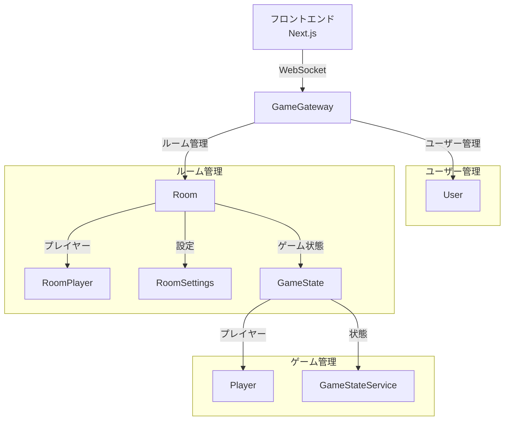

# 2025-06 Zenn 記事アーカイブ: 明専トランプ開発備忘録

この記事は、2025-06 に Zenn へ公開した当時の Meitra プロジェクト説明・備忘録のアーカイブです。

- Original: https://zenn.dev/hikaruendo/articles/5e2e28f32cde0c
- Published: 2025-06
- Note: 現行実装の source of truth ではありません。現在の構成は `README.md`、`ARCHITECTURE.md`、`docs/developer-guide/`、および実際の `mei-tra-frontend/` / `mei-tra-backend/` を優先してください。

---

# 序
## 概要
この記事では、4人2チームで対戦するオンラインカードゲーム「明専トランプ」の開発プロジェクトについて、その初期構想からシステム設計、フロントエンド・バックエンドの実装、デプロイの概要、そして今後の展望に至るまでを包括的に解説します。

## 対象読者
- TypeScriptを用いたフルスタック開発（特にNext.js, NestJS）に関心のあるWeb開発者の方
- WebSocketを活用したリアルタイムアプリケーション（オンラインゲームなど）の開発手法を学びたい方
- 具体的なプロジェクト事例を通じて、システム設計やアーキテクチャ、実装の詳細を理解したい方
- モダンな開発環境における技術選定、CI/CD、運用方法について知見を得たい方
- 「明専トランプ」のオンライン化プロジェクトそのものに興味がある方

## 背景と目的
「明専トランプ」は、大学の研究室で密かに流行っていた、4人2チームで対戦するトランプゲームです。その独特なルールと戦略性から、研究室のメンバーたちの間では、毎日のように白熱した対戦が繰り広げられていました。~~（研究しろ）~~

実は以前から、明専トランプはオンラインでプレイできる環境自体はありました。ただし、UIが不十分で分かりづらく、操作も多くが手動で行われる設計だったため、初見の人には遊びづらいものでした。
そこで今回のプロジェクトでは、「もっと直感的に・スムーズに・誰でも気軽に遊べるオンライン版を作る」ことを目標に掲げて開発を進めました。

このプロジェクトの第一の目的は、「明専トランプ」をより多くの人に、そしてもっと快適に楽しんでもらえるようにすることです。
現在、以下のURLから実際にプレイできますので、興味のある方はぜひ遊んでみてください。フィードバックも大歓迎です！

🎮 プレイはこちら → https://mei-tra-frontend.vercel.app/

また、開発の裏側やアップデートの共有・議論は、DiscordとGitHubで行っています。
コミュニティや開発に興味のある方の参加も大歓迎です！

💬 Discord: https://discord.com/channels/1360499598929559552/1360584058010210425
🛠 GitHub:
https://github.com/hikaruendo/mei-tra

## 明専トランプとは

明専トランプは、4人で2チームに分かれて対戦するトランプゲームです。このゲームは、以下のような特徴を持っています：

- **プレイヤー構成**: 4人で2チームに分かれて対戦
- **カード構成**: 通常のトランプから2,3,4を除いた40枚 + ジョーカー1枚
- **トランプの種類**:
  - `tra`: 最強のトランプ
  - `herz` (♥): ハート
  - `daiya` (♦): ダイヤ
  - `club` (♣): クラブ
  - `zuppe` (♠): スペード

### ゲームの流れ

1. **配札**: 各プレイヤーに10枚ずつカードを配る
2. **トランプ宣言**: プレイヤーは順番にトランプの種類とペア数を宣言
3. **プレイ**: 宣言で勝ったプレイヤーから始まり、カードを出し合う
4. **得点計算**: チームで獲得したポイントを計算

### 特殊ルール

- **ジャックの扱い**: 各トランプには「正J」と「副J」が存在
- **ジョーカー**: 最強のカードとして機能
- **チーム戦**: 2人1組で協力して勝利を目指す

# 1. はじめに

## 1.1 技術スタック選定の理由

このプロジェクトでは、以下の技術スタックを採用しました：

### フロントエンド
- **Next.js**:
  - サーバーサイドレンダリングによる高速な初期表示
  - ファイルベースのルーティングによる直感的な開発
  - TypeScriptとの相性の良さ

- **TypeScript**:
  - 型安全性による開発効率の向上
  - リファクタリングの容易さ
  - コードの可読性向上

### バックエンド
- **NestJS**:
  - モジュール化された構造による保守性の向上
  - TypeScriptの完全なサポート
  - WebSocketの統合が容易

- **WebSocket**:
  - リアルタイムなゲーム状態の同期
  - 双方向通信による即時のフィードバック
  - 低レイテンシーな通信

### 開発環境
- **Node.js**:
  - 高速な開発サーバー（`npm run start:dev`）
  - ホットリロードによる効率的な開発
  - 豊富なnpmパッケージの活用

## 1.2 プロジェクトの目的

このプロジェクトには以下の目的があります：

1. **技術的な挑戦**:
   - リアルタイムゲームの実装
   - 複雑なゲームロジックの型安全な実装
   - スケーラブルなアーキテクチャの構築

2. **実践的な学習**:
   - フルスタックTypeScript開発の経験
   - WebSocketを活用したリアルタイムアプリケーションの実装
   - モダンなフロントエンド開発の実践

3. **ユーザー体験の向上**:
   - 直感的なUI/UXの実現
   - スムーズなゲーム進行
   - エラーに強いシステムの構築

# 2. システム設計

## 2.1 アーキテクチャ概要

明専トランプのシステムは、フロントエンドとバックエンドの2つの主要なコンポーネントで構成されています。

### システム構成図



### 通信フロー

1. **初期接続**
   - クライアントがWebSocketでサーバーに接続
   - ルームIDに基づいてゲームルームに参加

2. **ゲーム状態の同期**
   - サーバーがゲーム状態を管理
   - 状態変更時に全クライアントに通知

3. **プレイヤーアクション**
   - クライアントからのアクションをサーバーが処理
   - 処理結果を全クライアントに通知

## 2.2 ディレクトリ構造

### フロントエンド（mei-tra-frontend）
mei-tra-frontend/
├── app/
│ ├── pgae.tsx/ # Next.jsのページコンポーネント
├── components/ # 再利用可能なUIコンポーネント
│ ├── GameTable/ # ゲームテーブル
│ ├── PlayerHand/ # プレイヤーの手札
│ ├── GameField/ # 場のカード
│ └── GameInfo/ # ゲーム情報
├── hooks/ # カスタムフック
│ └── useGame.ts # ゲーム管理フック
│ └── useRoom.ts # ルーム管理フック
├── types/ # TypeScript型定義
│ └── game.types.ts # ゲーム関連の型
│ └── room.types.ts # ルーム関連の型
└── utils/ # ユーティリティ関数

### バックエンド（mei-tra-backend）
mei-tra-backend/
├── src/
│ ├── services/ # ビジネスロジック
│ │ ├── card.service.ts # カード処理
│ │ ├── game-state.service.ts # ゲーム状態管理
│ │ ├── play.service.ts # プレイ処理
│ │ └── room.service.ts # ルーム管理
│ ├── types/ # 型定義
│ │ └── game.types.ts # ゲーム関連の型
│ │ └── room.types.ts # ルーム関連の型
│ └── game.gateway.ts # WebSocketゲートウェイ


## 2.3 主要な型定義

### ゲーム状態

```typescript
interface GameState {
  players: Player[];
  currentPlayerIndex: number;
  gamePhase: GamePhase;
  deck: string[];
  teamScores: Record<Team, { play: number; total: number }>;
  teamScoreRecords: Record<Team, ScoreRecord[]>;
  blowState: BlowState;
  playState?: PlayState;
  agari?: string;
  roundNumber: number;
  pointsToWin: number;
  teamAssignments: {
    [playerId: string]: Team;
  };
}
```

### ルーム管理

```typescript
interface Room {
  id: string;
  name: string;
  hostId: string;
  status: RoomStatus;
  players: RoomPlayer[];
  settings: RoomSettings;
  createdAt: Date;
  updatedAt: Date;
  lastActivityAt: Date;
}

interface RoomRepository {
  createRoom(room: Room): Promise<Room>;
  getRoom(roomId: string): Promise<Room | null>;
  updateRoom(roomId: string, updates: Partial<Room>): Promise<Room | null>;
  deleteRoom(roomId: string): Promise<void>;
  listRooms(): Promise<Room[]>;
}
```

### プレイヤー情報

```typescript
interface User {
  id: string;
  playerId: string;
  name: string;
}

interface Player extends User {
  hand: string[];
  team: Team;
  isPasser: boolean;
  hasBroken?: boolean;
  hasRequiredBroken?: boolean;
}
```

### トランプ宣言状態

```typescript
interface BlowState {
  currentTrump: TrumpType | null;
  currentHighestDeclaration: BlowDeclaration | null;
  declarations: BlowDeclaration[];
  lastPasser: string | null;
  isRoundCancelled: boolean;
  currentBlowIndex: number;
}
```

## 2.4 データフロー

1. **ルーム作成と参加**
   - プレイヤーがルームを作成
   - 他のプレイヤーがルームIDで参加
   - 4人揃うまで待機

2. **ゲーム初期化**
   - サーバーがデッキを生成
   - プレイヤーにカードを配布
   - 初期状態を全クライアントに通知

3. **トランプ宣言フェーズ**
   - プレイヤーが順番に宣言
   - サーバーが宣言を検証
   - 最高宣言を更新

4. **プレイフェーズ**
   - プレイヤーがカードを選択
   - サーバーがカードの有効性を検証
   - 場の状態を更新
   - 勝者を決定

5. **ラウンド終了**
   - スコアを計算
   - チームの勝利判定
   - 次のラウンドの準備

## 2.5 エラーハンドリング

- **接続エラー**
  - WebSocket接続の切断検知
  - 再接続メカニズム
  - 状態の復元

- **ルーム関連エラー**
  - 存在しないルームへの参加試行
  - 満員のルームへの参加試行
  - プレイヤーの切断処理

- **ゲームロジックエラー**
  - 無効なアクションの検証
  - エラーメッセージの適切な表示
  - 状態の整合性維持

- **バリデーション**
  - クライアント側の入力検証
  - サーバー側の厳密な検証
  - エラー状態の適切な処理

# 3. フロントエンド実装

## 3.1 コンポーネント設計

### 主要コンポーネントの役割

#### GameTable
- ゲームのメインコンテナ
- プレイヤーの手札、場のカード、ゲーム情報を統合
- WebSocket接続の管理

#### PlayerHand
- プレイヤーの手札表示
- カード選択とプレイ処理
- カードの有効性検証

#### GameField
- 場のカード表示
- プレイされたカードの表示
- プレイヤー名の表示

#### GameInfo
- 現在のトランプ表示
- チームスコア表示
- ルーム退出機能

## 3.2 状態管理

### カスタムフック

#### useRoom
- ルームの作成と参加
- WebSocket接続の管理
- ルーム状態の同期

#### useCardValidation
- カードの有効性検証
- トランプルールの適用
- プレイ可能なカードの判定

## 3.3 UI/UXの実装

### スタイリング
- SCSS Modulesを使用
- レスポンシブデザイン
- アニメーション効果

### インタラクション
- ドラッグ&ドロップ
- カード選択の視覚的フィードバック
- ゲーム状態のアニメーション

## 3.4 エラーハンドリング

### クライアント側のバリデーション
- カード選択の有効性チェック
- プレイヤーアクションの制限
- エラーメッセージの表示

### エラー表示
- トースト通知
- インラインエラーメッセージ
- モーダルダイアログ

## 3.5 パフォーマンス最適化

### レンダリング最適化
- React.memoの使用
- 不要な再レンダリングの防止
- コンポーネントの分割

### 状態更新の最適化
- 状態更新のバッチ処理
- メモ化の活用
- 非同期処理の最適化

# 4. バックエンド実装

## 4.1 ゲームロジック

### カード処理（CardService）

```typescript
@Injectable()
export class CardService {
  private readonly CARD_STRENGTHS: Record<string, number> = {
    JOKER: 150,
    A: 14,
    K: 13,
    Q: 12,
    J: 11,
    '10': 10,
    '9': 9,
    '8': 8,
    '7': 7,
    '6': 6,
    '5': 5,
  };

  private readonly TRUMP_STRENGTHS: Record<TrumpType, number> = {
    tra: 5,
    herz: 4,
    daiya: 3,
    club: 2,
    zuppe: 1,
  };

  // カードの強さを計算
getCardStrength(
  card: string,
  baseSuit: string,
  trumpType: TrumpType | null,
): number {
  if (card === 'JOKER') return this.CARD_STRENGTHS.JOKER;

  // カードの数字とスートを取得
  const value = card.startsWith('10') ? '10' : card[0];
  const suit = card.startsWith('10')
    ? card.slice(2)
    : this.getCardSuit(card, trumpType, baseSuit);

  let strength = this.CARD_STRENGTHS[value] || 0;

  // Jの強さを計算（tra以外の場合）
  if (value === 'J' && trumpType && trumpType !== 'tra') {
    if (this.isPrimaryJack(card, trumpType)) {
      strength = 19; // 正J
    } else if (this.isSecondaryJack(card, trumpType)) {
      strength = 18; // 副J
    }
  }

  // トランプが設定されていない、またはtraの場合は、ベーススートのみ考慮
  if (!trumpType || trumpType === 'tra') {
    if (suit === baseSuit) {
      strength += 50; // ベーススートボーナス
    }
    return strength;
  }

  // 現在のトランプタイプに対応するスートを取得
  const trumpSuit = this.TRUMP_TO_SUIT[trumpType];

  // カードのスートがトランプスートと一致する場合はボーナスを加算
  if (suit === trumpSuit) {
    strength += 100; // トランプスートボーナス
  }
  // カードのスートがベーススートと一致する場合はボーナスを加算
  else if (suit === baseSuit) {
    strength += 50; // ベーススートボーナス
  }

  return strength;
}
```

### ゲーム状態管理（GameStateService）

```typescript
@Injectable()
export class GameStateService {
  private initializeState(): void {
    this.state = {
      players: [],
      deck: [],
      currentPlayerIndex: 0,
      agari: undefined,
      teamScores: {
        0: { play: 0, total: 0 },
        1: { play: 0, total: 0 },
      } as Record<Team, TeamScore>,
      gamePhase: null,
      blowState: this.getInitialBlowState(),
      playState: this.getInitialPlayState(),
      teamScoreRecords: {
        0: [],
        1: [],
      } as Record<Team, ScoreRecord[]>,
      roundNumber: 1,
      pointsToWin: 10,
      teamAssignments: {},
    };
  }

  // カードを配る
  dealCards(): void {
    if (this.state.players.length === 0) return;

    // プレイヤーの手札をリセット
    this.state.players.forEach((player) => {
      player.hand = [];
      player.isPasser = false;
      player.hasBroken = false;
      player.hasRequiredBroken = false;
    });

    // 各プレイヤーに10枚ずつ配る
    for (let i = 0; i < 10; i++) {
      for (let j = 0; j < this.state.players.length; j++) {
        this.state.players[j].hand.push(
          this.state.deck[i * this.state.players.length + j],
        );
      }
    }

    // 上がりカードを設定
    this.state.agari = this.state.deck[40];

    // 手札をソート
    this.state.players.forEach((player) => {
      player.hand.sort((a, b) => this.cardService.compareCards(a, b));
    });

    // ブロークンを確認
    this.state.players.forEach((player) => {
      this.chomboService.checkForBrokenHand(player);
      this.chomboService.checkForRequiredBrokenHand(player);
    });
  }
}
```

## 4.2 WebSocket通信

### ゲートウェイ実装（クライアント接続処理）

```typescript
@WebSocketGateway({ cors: { origin: '*' } })
export class GameGateway implements OnGatewayConnection, OnGatewayDisconnect {
  @WebSocketServer() server: Server;

  handleConnection(client: Socket) {
    const auth = client.handshake.auth || {};
    const token =
      typeof auth.reconnectToken === 'string' ? auth.reconnectToken : undefined;
    const name = typeof auth.name === 'string' ? auth.name : undefined;
    const roomId = typeof auth.roomId === 'string' ? auth.roomId : undefined;

    // トークンがある場合は再接続として処理
    if (token && roomId) {
      // ルームのゲーム状態を取得
      void this.roomService.getRoomGameState(roomId).then((roomGameState) => {
        if (!roomGameState) {
          client.emit('error-message', 'Game state not found');
          client.disconnect();
          return;
        }

        const existingPlayer = roomGameState.findPlayerByReconnectToken(token);

        if (existingPlayer) {
          // ルームサービスで再接続処理
          void this.roomService
            .handlePlayerReconnection(
              roomId,
              existingPlayer.playerId,
              client.id,
            )
            .then((result) => {
              if (!result.success) {
                client.emit('error-message', 'Failed to reconnect');
                client.disconnect();
                return;
              }

              // ルームに参加
              this.playerRooms.set(client.id, roomId);
              void client.join(roomId);

              const state = roomGameState.getState();

              // ゲーム状態をクライアントに送信
              this.server.to(client.id).emit('game-state', {
                players: state.players.map((player) => ({
                  ...player,
                  hand:
                    player.playerId === existingPlayer.playerId
                      ? player.hand
                      : [], // 自分の手札のみ表示
                })),
                gamePhase: state.gamePhase || 'waiting',
                currentField: state.playState?.currentField,
                currentTurn:
                  state.currentPlayerIndex !== -1 &&
                  state.players[state.currentPlayerIndex]
                    ? state.players[state.currentPlayerIndex].playerId
                    : null,
                blowState: state.blowState,
                teamScores: state.teamScores,
                you: existingPlayer.playerId,
                negriCard: state.playState?.negriCard,
                fields: state.playState?.fields,
                roomId: roomId,
                pointsToWin: state.pointsToWin,
              });
              this.server.to(roomId).emit('update-players', state.players);
            });
        } else {
          client.emit('error-message', 'Player not found1');
          client.disconnect();
        }
      });
      return;
    }

    // 新規プレイヤーとして追加
    if (name) {
      if (this.gameState.addPlayer(client.id, name, token)) {
        const users = this.gameState.getUsers();
        const newUser = users.find((p) => p.id === client.id);

        if (newUser) {
          this.server
            .to(client.id)
            .emit('reconnect-token', `${newUser.playerId}`);
          this.server.emit('update-users', users);
        }
      } else {
        client.emit('error-message', 'Game is full!');
        client.disconnect();
      }
    } else {
      client.disconnect();
    }
  }

  async handleDisconnect(client: Socket) {
    const roomId = this.playerRooms.get(client.id);
    if (roomId) {
      this.playerRooms.delete(client.id);
      void client.leave(roomId);

      // Get room-specific game state
      const roomGameState = await this.roomService.getRoomGameState(roomId);
      const state = roomGameState.getState();
      const player = state.players.find((p) => p.id === client.id);

      if (player) {
        // プレイヤーのチーム情報を保持
        state.teamAssignments[player.playerId] = player.team;

        // Notify other players in the same room about the disconnection
        this.server.to(roomId).emit('player-left', {
          playerId: player.playerId,
          roomId,
        });

        // Set a timeout to remove the player if they don't reconnect
        const timeout: NodeJS.Timeout = setTimeout(() => {
          roomGameState.removePlayer(player.playerId);
          this.server
            .to(roomId)
            .emit('update-players', roomGameState.getState().players);
        }, 10000); // 10 seconds timeout

        // Store the timeout ID for potential cancellation on reconnection
        roomGameState.setDisconnectTimeout(player.playerId, timeout);
      }
    }
  }
}
```

### 4.3 エラーハンドリングとバリデーション

バックエンドのエラーハンドリングとバリデーションは、主に4つのサービスに分かれて実装されています：

1. **宣言のバリデーション（BlowService）**
   - 最小ペア数（6ペア）の要件チェック
   - 現在の最高宣言との比較による有効性検証
   - トランプタイプの強さに基づく宣言の優先順位付け
   - 宣言の作成と記録の一元管理

2. **反則行為の検出と処理（ChomboService）**
   - 4枚のジャック所持の検出
   - ブロークンハンドのチェック

3. **ルーム状態の遷移バリデーション（RoomService）**
   - 有効な状態遷移の定義と管理
   - ゲーム開始条件の厳密なチェック
   - プレイヤー数のバリデーション
   - プレイヤーの準備状態の確認
   - ルームの有効期限管理

4. **WebSocketイベントのバリデーション（GameGateway）**
   - プレイヤーのターンチェック
   - 宣言のバリデーション
   - エラーメッセージの適切な送信
   - 状態更新の検証

## 4.4 パフォーマンス最適化

### メモリ管理
- **定期的なクリーンアップ**
  - 1時間ごとのルームクリーンアップ（`RoomService`）
  - 24時間以上アクティビティのないルームの自動削除
  - 完了または放棄されたゲームの自動クリーンアップ

- **状態管理の最適化**
  - 不要な状態の即時削除（`GameStateService`）
  - 切断されたプレイヤーの15秒後の自動削除
  - タイマーの適切なクリアと管理

- **メモリリークの防止**
  - WebSocketイベントリスナーの適切なクリーンアップ
  - タイムアウト処理の確実な実行
  - 未使用の状態オブジェクトの削除

### 処理の最適化
- **非同期処理の活用**
  - WebSocketイベントの非同期処理
  - 状態更新の非同期実行
  - エラーハンドリングの非同期実装

- **バッチ処理の実装**
  - スコア更新の一括処理
  - プレイヤー状態の一括更新
  - フィールド完了時の一括処理

- **キャッシュの活用**
  - ルーム状態のキャッシュ
  - プレイヤー情報のキャッシュ
  - ゲーム状態の効率的な管理

### システムリソースの最適化

#### メモリ使用量の制御

1. **メモリ制限の設定**
   - `fly.toml`で1GBのメモリ制限を設定
   ```toml
   [[vm]]
     memory = '1gb'
     cpu_kind = 'shared'
     cpus = 1
   ```
   - この制限により、アプリケーションのメモリ使用量を予測可能に
   - メモリリークや過剰なメモリ使用を防止

2. **効率的なデータ構造の使用**
   - `Map`を使用した効率的なルーム管理
   ```typescript
   private rooms: Map<string, Room> = new Map();
   private roomGameStates: Map<string, GameStateService> = new Map();
   ```
   - プレイヤーIDとソケットIDの効率的なマッピング
   ```typescript
   private playerIds: Map<string, string> = new Map(); // token -> playerId
   ```
   - 切断されたプレイヤーの効率的な管理
   ```typescript
   private disconnectedPlayers: Map<string, NodeJS.Timeout> = new Map();
   ```

3. **不要なデータの即時解放**
   - ルームの自動クリーンアップ
   ```typescript
   private cleanupRooms() {
     const now = new Date();
     for (const [roomId, room] of this.rooms) {
       if (/* 条件 */) {
         void this.deleteRoom(roomId);
       }
     }
   }
   ```
   - 切断されたプレイヤーの自動削除
   ```typescript
   removePlayer(playerId: string) {
     // 15秒後に自動削除
     this.disconnectedPlayers.set(
       playerId,
       setTimeout(() => {
         this.disconnectedPlayers.delete(playerId);
         this.state.players = this.state.players.filter(
           (p) => p.playerId !== playerId,
         );
       }, 15000),
     );
   }
   ```

#### CPU使用率の最適化

1. **共有CPUリソースの効率的な使用**
   - 共有CPUリソースの設定
   ```toml
   cpu_kind = 'shared'
   cpus = 1
   ```
   - 非同期処理の活用によるCPU使用の最適化
   ```typescript
   @SubscribeMessage('declare-blow')
   async handleDeclareBlow(client: Socket, data: {...}): Promise<void> {
     // 非同期処理による効率的なCPU使用
   }
   ```

2. **重い処理の分散実行**
   - ゲーム終了処理の分散実行
   ```typescript
   private async handleGameOver(roomId: string): Promise<void> {
     // 状態更新
     // スコア計算
     // 次のラウンドの準備
     setTimeout(() => {
       roomGameState.resetRoundState();
       // 次のラウンドの開始
     }, 3000);
   }
   ```
   - フィールド完了処理の分散実行
   ```typescript
   private async handleFieldComplete(field: Field, roomId: string): Promise<void> {
     // フィールドの処理
     // 勝者の決定
     // 状態の更新
     setTimeout(() => {
       void this.handleGameOver(roomId);
     }, 1000);
   }
   ```

3. **バックグラウンドタスクの適切な管理**
   - 定期的なクリーンアップタスク
   ```typescript
   private startCleanupTask() {
     setInterval(() => {
       this.cleanupRooms();
     }, this.CLEANUP_INTERVAL);
   }
   ```
   - 切断されたプレイヤーの管理
   ```typescript
   setDisconnectTimeout(playerId: string, timeout: NodeJS.Timeout): void {
     // 既存のタイムアウトをクリア
     const existingTimeout = this.disconnectedPlayers.get(playerId);
     if (existingTimeout) {
       clearTimeout(existingTimeout);
     }
     // 新しいタイムアウトを設定
     this.disconnectedPlayers.set(playerId, timeout);
   }
   ```

これらの最適化により、以下のような効果が得られています：

- **安定したパフォーマンス**
  - メモリ使用量の予測可能な制御
  - CPUリソースの効率的な利用
  - システムの安定性向上

- **スケーラビリティの確保**
  - リソース使用量の適切な管理
  - 複数ユーザー同時接続への対応
  - システムの拡張性の確保

- **ユーザー体験の向上**
  - レスポンス時間の最適化
  - 安定したゲーム進行
  - スムーズな状態遷移

# 5. デプロイと運用

## 5.1 デプロイ環境の構築

### バックエンド（NestJS）のデプロイ
- **Fly.ioを使用したデプロイ**
  ```toml
  # fly.toml
  app = 'mei-tra-backend'
  primary_region = 'nrt'

  [http_service]
    internal_port = 3333
    force_https = true
    auto_stop_machines = 'stop'
    auto_start_machines = true
    min_machines_running = 1
  ```

- **Dockerコンテナ化**
  ```dockerfile
  # Dockerfile
  FROM node:23.10.0-slim AS base
  WORKDIR /app
  ENV NODE_ENV="production"

  # ビルドステージ
  FROM base AS build
  COPY package*.json ./
  RUN npm ci --include=dev
  COPY . .
  RUN npm run build

  # 本番環境
  FROM base
  COPY --from=build /app /app
  EXPOSE 3333
  CMD [ "npm", "run", "start" ]
  ```

### フロントエンド（Next.js）のデプロイ
- **Vercelを使用したデプロイ**
  - 自動デプロイの設定
  - 環境変数の管理
  - パフォーマンス最適化

## 5.2 CI/CDパイプライン

### GitHub Actionsによる自動デプロイ
```yaml
name: Deploy to Fly.io

on:
  push:
    branches:
      - main

jobs:
  deploy:
    runs-on: ubuntu-latest
    steps:
      - name: Checkout code
        uses: actions/checkout@v3
      - name: Set up Fly.io CLI
        uses: superfly/flyctl-actions/setup-flyctl@master
      - name: Deploy app to Fly.io
        run: flyctl deploy --remote-only -c fly.toml
        env:
          FLY_API_TOKEN: ${{ secrets.FLY_API_TOKEN }}
```

## 5.3 運用管理

### リソース管理
- **メモリ制限**
  - バックエンド: 1GB
  - フロントエンド: Vercelの制限に準拠

- **CPUリソース**
  - 共有CPUリソースの使用
  - 自動スケーリングの設定

### 監視とログ
- **エラーログの収集**
   - 基本的なエラーログ（console.error）
   - 接続状態の監視
   - ルームのアクティビティ監視

- **改善の余地がある部分**
   - レスポンスタイムの監視
   - リソース使用率の監視
   - 詳細なエラー率の監視
   - パフォーマンスメトリクスの収集

### 接続管理

- **再接続処理**
   - プレイヤーの再接続対応
   - ソケットIDの更新
   - ゲーム状態の維持

- **切断処理**
   - プレイヤーの切断検知
   - ルームからの削除
   - タイムアウト処理

- **データの特性**
   - すべてのデータはRAM上で管理
   - セッション単位の一時的なデータ

## 5.4 セキュリティ対策

### アクセス制御
- **CORS設定**
  ```typescript
  app.enableCors({
    origin: process.env.NODE_ENV === 'development'
      ? 'http://localhost:3000'
      : 'https://mei-tra-frontend.vercel.app',
    credentials: true,
  });
  ```
- **改善の余地がある部分**
   - 環境変数のローテーションの仕組みの導入
   - セキュリティスキャンツールの導入（例：npm audit）
   - 定期的な依存パッケージの更新チェックの自動化

# 6. 今後の展望

## 6.1 機能拡張の可能性
- **マッチングシステムの改善**
  - スキルベースのマッチング機能追加
  - 自動バランシングシステムの実装
  - カスタムルーム設定の拡張（`RoomSettings`の拡張）

- **統計機能の追加**
  - プレイヤー別の勝率統計
  - ゲーム履歴の永続化
  - パフォーマンス分析ダッシュボード

- **モバイル対応**
  - タッチ操作の最適化
  - モバイル向けUI/UXの改善
  - オフライン対応の検討

## 6.2 技術的な改善点
- **テストカバレッジの向上**
  - 各サービスのユニットテスト追加
    - `RoomService`のテスト
    - `GameStateService`のテスト
    - `CardService`のテスト
  - インテグレーションテストの実装
  - テストカバレッジの計測と改善

- **パフォーマンスの最適化**
  - WebSocket接続の最適化
  - メモリ使用量の監視と制御
  - レスポンス時間の改善
  - キャッシュ戦略の実装

- **セキュリティの強化**
  - セキュリティスキャンの自動化
  - 依存パッケージの定期的な更新
  - アクセス制御の強化

## 6.3 運用面の改善
- **モニタリングの強化**
  - パフォーマンスメトリクスの収集
  - エラー追跡の強化
  - ユーザー行動の分析
  - アラートシステムの実装

- **デプロイメントの改善**
  - CI/CDパイプラインの最適化
  - デプロイメント戦略の改善
  - ロールバック手順の確立
  - 環境別の設定管理

- **ドキュメント整備**
  - API仕様書の作成
  - 開発者向けドキュメントの整備
  - 運用マニュアルの作成
  - アーキテクチャ図の作成

# 7. まとめ

## 7.1 プロジェクトの振り返り
- **アーキテクチャ設計**
  - NestJSのモジュールベースアーキテクチャ
    - `GameModule`を中心とした機能モジュール
    - 各サービスの責務分離（`RoomService`, `GameStateService`など）
    - 依存性注入（DI）による疎結合な設計
  - WebSocketを活用したリアルタイム通信
  - 型安全な実装

- **主要な機能実装**
  - ルーム管理システム（`RoomService`）
  - ゲーム状態管理（`GameStateService`）
  - カード操作とゲームロジック（`CardService`）
  - スコア管理（`ScoreService`）

- **技術スタック**
  - バックエンド: NestJS + TypeScript
  - フロントエンド: React + TypeScript
  - デプロイ: Fly.io + Vercel
  - コンテナ化: Docker

## 7.2 得られた知見
- **技術面**
  - WebSocketを使用したリアルタイムゲームの実装方法
  - 状態管理の最適化手法
  - エラーハンドリングとバリデーションの重要性
  - 型システムを活用した堅牢な実装

- **設計面**
  - モジュール分割の重要性
  - 型安全性の確保
  - エラー処理の体系化
  - コードの保守性向上

- **運用面**
  - コンテナ化によるデプロイの簡素化
  - 環境変数による設定管理
  - ログ管理とモニタリング
  - スケーラビリティの確保

## 7.3 今後の課題
- **機能面**
  - マッチングシステムの改善
  - 統計機能の追加
  - モバイル対応の強化
  - ユーザー体験の向上

- **技術面**
  - テストカバレッジの向上
    - ユニットテストの追加
    - インテグレーションテストの実装
    - E2Eテストの拡充
  - パフォーマンスの最適化
  - セキュリティの強化
  - コードのリファクタリング

- **運用面**
  - モニタリングシステムの強化
  - デプロイメントプロセスの改善
  - ドキュメント整備
  - 運用コストの最適化

このプロジェクトを通じて、NestJSフレームワークを活用したモダンなWebアプリケーション開発の実践的な経験を積むことができました。特に、モジュールベースの設計、リアルタイム通信、状態管理、エラーハンドリングなどの重要な概念を実装レベルで理解することができました。今後の課題に対しては、段階的な改善を進めていくことで、より良いアプリケーションの提供を目指していきます。
最後までお読みくださり、ありがとうございました！！
