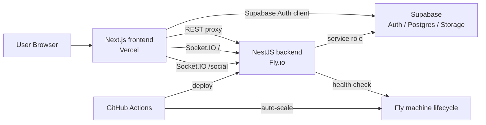

# 01. System Overview

この章は、現行 `main` ブランチにある明専トランプの全体像を、新規開発者向けに整理した入口です。ここで知ってほしいのは、個々の関数の実装詳細ではなく、次の三点です。

1. この repo は今どういう責務分割になっているか
2. ユーザーが触る体験が、どのサブシステムにまたがって成立しているか
3. 2025-06 の Zenn 記事アーカイブ `../archive/2025-06-zenn-meitra-project-memo.md` 時点から何が増え、何を前提にコードを読むべきか

frontend / backend / Supabase / deploy が別々に存在しているだけでなく、ゲーム同期、認証、チャット、チュートリアル、プロフィール、運用監視が相互に関係しています。個別ファイルを読み始める前に、この章で全景を掴んでください。

## 1. プロダクトの最小前提

明専トランプは、4 人 2 チームで遊ぶ対戦型カードゲームです。プロジェクトとしては、そのオンライン版を Web アプリケーションとして提供しています。プレイヤー体験として見ると、現在のシステムは次の体験を一つの流れとして扱います。

- アカウントを作成してサインインする
- ロビーで既存ルームを見る、あるいは新しいルームを作る
- 待機室でチーム分け、準備完了、COM 補充などを行う
- ゲームを開始し、blow phase と play phase をリアルタイムで進める
- 同じ room に紐づくチャットで会話する
- 終了後に勝敗やスコアをユーザープロフィールへ反映する
- ルールや戦略を docs / tutorial 画面で参照する

つまり、これは単純な「1 画面の WebSocket ゲーム」ではありません。現行実装は、認証済みユーザー向けの小さなサービスとして設計されています。

## 2. いまの repo で主役なのはどこか

repo 直下には複数のディレクトリがありますが、現行の主実装は明確です。

| パス | 現在の位置づけ | 補足 |
| --- | --- | --- |
| `mei-tra-frontend/` | Web frontend の主実装 | Next.js App Router。ゲーム UI、認証 UI、プロフィール、チュートリアル、i18n を持つ |
| `mei-tra-backend/` | API / WebSocket backend の主実装 | NestJS。ゲーム同期、チャット、認証検証、プロフィール API、Supabase 永続化を持つ |
| `.github/workflows/` | CI/CD と運用補助 | Fly.io deploy、auto-scale、Claude workflow |
| `docs/` | 設計メモやロードマップ | 一部は今も有効だが、現行実装の導線としては散在している |
| `../archive/2025-06-zenn-meitra-project-memo.md` | 2025-06 に公開した Zenn 記事のアーカイブ | 当時のプロジェクト説明・備忘録として参照可。ただし現行の一次資料ではない |
| `mei-tra-mobile/` | スコープ外寄り | 現時点では主開発対象ではない |
| `mei-tra-cloudflare/` | スコープ外寄り | 現時点では主開発対象ではない |

現行 repo では transport 契約をトップレベル `contracts/` に寄せています。ここには profile REST DTO、social socket payload、game socket payload など、frontend と backend が wire で共有する shape だけを置きます。一方で UI state は frontend 側 `types/`、domain / persistence 型は backend 側 `src/types/` に残します。

repo root を用途ベースで見直すと、温度感は次のように分かれます。

- いま日常的に変更が入りやすい領域:
  - `mei-tra-frontend/`
  - `mei-tra-backend/`
  - `.github/workflows/`
- 現行理解の補助線になる領域:
  - `docs/`
  - `ARCHITECTURE.md`
- 設計史や周辺資産として読む領域:
  - `../archive/2025-06-zenn-meitra-project-memo.md`
  - `public/`
- いまは主対象ではない領域:
  - `mei-tra-mobile/`
  - `mei-tra-cloudflare/`

この分類を最初に持っておくと、repo 内の全ディレクトリを同じ優先度で追わずに済みます。

特に新規参加者は、`docs/` と 2025-06 の Zenn 記事アーカイブ `../archive/2025-06-zenn-meitra-project-memo.md` を「全部現行の正」と読まない方が安全です。現行の正解はあくまで `mei-tra-frontend/` と `mei-tra-backend/` の実装であり、docs 群はその理解を補助する導線として使う、という優先順位を固定しておくべきです。

この一点を外さないだけで、古い設計説明に引っ張られて現行コードの責務線を見失う事故をかなり減らせます。

主役と補助線を最初に切り分けることが、この repo 読解の出発点です。

ここを誤ると、読む順番そのものが崩れます。

順番の誤りは、そのまま認識の誤りになります。

だから入口の整理が要ります。

それが本章の役目です。

## 3. システムの全体像

現行構成を外部サービスまで含めて描くと、だいたい次のようになります。

この図で重要なのは、frontend が backend と Supabase の両方を直接使う点です。

- 認証そのものは frontend から Supabase Auth を使う
- ゲーム同期とチャットは frontend から backend の Socket.IO を使う
- backend は Supabase service role を使って rooms, game_states, user_profiles, chat 系テーブルを操作する
- avatar 画像は backend が Supabase Storage の `avatars` bucket に保存する

つまり、「認証は BFF 経由」ではなく、「認証は frontend 主導、backend は token 検証と永続化を担当」という分担です。

## 4. 実行環境の責務分担

### 4.1 frontend: Next.js App Router

`mei-tra-frontend/` は Next.js 15 系の App Router 構成です。ここでは、次の責務を持ちます。

- ルーティングと画面描画
- `next-intl` による言語切替
- Supabase client を使った sign in / sign up / sign out
- メインゲーム用 Socket の接続管理
- ソーシャルチャット用 `/social` namespace の接続管理
- ルーム一覧、待機室、ゲーム卓、プロフィール、チュートリアルの UI
- backend health の監視と cold start 表示
- avatar upload 用 API route の proxy

### 4.2 backend: NestJS

`mei-tra-backend/` は NestJS 11 系で、次の責務を持ちます。

- Socket.IO ゲーム gateway
- Socket.IO ソーシャルチャット gateway
- token 検証と authenticated user の解決
- room / game state / chat / profile の永続化
- game flow の orchestration
- `/api/health`、`/api/user-profile/*` の REST endpoint
- idle / connection 数の追跡
- COM 自動プレイや chat cleanup のサーバーサイド処理

### 4.3 Supabase

Supabase は現行構成で三つの顔を持っています。

- Auth: フロントエンドのログイン基盤
- Postgres: room / game state / profile / social chat の永続化
- Storage: avatar 画像保存

backend は service role key を使うため、データアクセスの主導権は backend にあります。一方で、frontend は anon key を使って認証セッションを扱います。この二重構成を理解していないと、「なぜ profile を frontend と backend の両方が触っているのか」が見えづらくなります。

### 4.4 Vercel と Fly.io

ホスティングは分離されています。

- frontend は Vercel を想定
- backend は Fly.io を想定

Fly.io 側は常時起動ではなく、待機状態から起動する設計が前提です。そのため frontend には backend cold start を前提にした health polling と UI 表示があります。これは 2025-06 の Zenn 記事アーカイブ `../archive/2025-06-zenn-meitra-project-memo.md` 時点にはなかった前提です。

## 5. 実ユーザーフローとサブシステムの対応

新規開発者は、画面単位ではなく「体験単位」で構造を見た方が理解しやすいです。以下、代表的なユーザーフローごとに、どの層が関与するかを整理します。

### 5.1 サインインする

ユーザーは frontend の `AuthModal` やプロフィール画面から認証操作を行います。ここで実際に走るのは Supabase Auth の client API です。`AuthContext` が session と profile を管理し、`useAuth()` 経由で各画面が参照します。

このフローでは主に次が関わります。

- frontend:
  - `contexts/AuthContext.tsx`
  - `components/auth/*`
  - `app/[locale]/auth/callback/route.ts`
  - `app/[locale]/auth/reset-password/page.tsx`
- Supabase:
  - Auth session
  - `user_profiles` row
- backend:
  - 必要に応じて token を検証し、`update-auth` や socket handshake で user を同期

### 5.2 ルーム一覧を見る / 部屋を作る

サインイン後、トップページまたは `/rooms` で `RoomList` を使ってルーム一覧を表示します。frontend は backend health を見ながら接続状態を表示し、`list-rooms`、`create-room`、`join-room` をメイン socket に投げます。

ここで関わる責務は次の通りです。

- frontend:
  - `hooks/useSocket.ts`
  - `hooks/useRoom.ts`
  - `components/room/RoomList/`
  - `hooks/useBackendStatus.ts`
- backend:
  - `GameGateway`
  - `CreateRoomUseCase`
  - `JoinRoomUseCase`
  - `RoomService`
  - `SupabaseRoomRepository`
- persistence:
  - `rooms`
  - `room_players`
  - `game_states`

### 5.3 待機室で準備し、ゲームを始める

ルームに入ると `PreGameTable` が表示されます。ここでは host 判定、ready 切替、チーム変更、チームシャッフル、COM 補充、プレイヤー追放、ゲーム開始が行われます。

backend 側では、waiting room の操作はそのまま game 開始前の application workflow になっており、GameGateway が直接ロジックを抱えるのではなく UseCase に委譲する構造です。

重要な点:

- host は `room.hostId` で判定される
- game start 前に `fillVacantSeatsWithCOM` で空席が埋められる
- `room.players` の並びが seat order として扱われ、その並びをもとに `startGame` 時に in-memory state を組み直す

つまり、待機室の操作は単なる UI ではなく、後続の play order に影響するゲーム前処理です。

### 5.4 ゲームを進める

ゲーム開始後は、トップページ上の `GameTable` と `GameDock` が中心になります。ただし current `main` の `GameDock` は対局ログの入口ではなく、ゲーム中の補助 UI / utility area です。対局ログの正式な導線はプロフィール画面の「最近の対局」セクションに移っており、そこから `/game-history/[roomId]` の詳細ページへ遷移します。

サーバーは `game-state`、`update-turn`、`blow-updated`、`card-played`、`field-complete` などのイベントを room scope で配信し、frontend の `useGame()` がそれをローカル state に反映します。

この時点では、frontend はゲームロジックの本体を持ちません。UI 側で最小限の入力制約はかけますが、ターン、カード妥当性、field completion、得点計算、game over 判定は backend が担います。

### 5.5 チャットする

チャットはゲームと同じ socket ではなく、別 namespace `/social` を使います。理由は責務分離で、ゲーム同期とは別のイベント体系を持つためです。

チャットは room 単位で join / leave し、`chat:post-message`、`chat:typing`、`chat:list-messages` でやり取りされます。message は Supabase の `chat_messages` に保存されます。

ゲーム体験としては「同じ画面内でチャットしている」ように見えますが、実装としては独立したソーシャルサブシステムです。

### 5.6 プロフィールとアバターを更新する

プロフィール画面は frontend 側にありますが、プロフィール本体の永続化は backend 経由です。特に avatar upload は Next.js の API route を経由して backend の `/api/user-profile/:id/avatar` に転送し、その backend が Sharp で画像を最適化して Supabase Storage に保存します。

また、プロフィールには「最近の対局」セクションがあり、自分が参加した完了済み対局を最大 10 件まで表示します。各行から `/game-history/[roomId]` の replay / audit 詳細ページへ入るため、対局ログはプレイ中 UI ではなく profile-first の導線になっています。

この構成により、画像処理と storage 書き込みの責務は backend に閉じています。

### 5.7 チュートリアル / docs を読む

現行 frontend には `app/[locale]/docs/page.tsx` があり、`TutorialWhitepaper` を使ってルール説明や戦略解説を表示します。これは開発者向け docs ではなく、プレイヤー向けのルール白書です。

プロダクトには「プレイ画面」と「ルール説明画面」の両方が入っている、という理解でいると全体の意図が掴みやすくなります。

## 6. 2025-06 の Zenn 記事アーカイブから見て何が変わったか

2025-06 の Zenn 記事アーカイブ `../archive/2025-06-zenn-meitra-project-memo.md` には、当時のシステム概要として有効な部分が残っています。しかし、いま読むと次の差分があります。

### 6.1 認証が前提になった

旧資料では `User` / `Player` の説明はあるものの、現在のような Supabase Auth ベースのログイン体験は中心ではありませんでした。現行実装では、認証状態が socket 接続条件やプロフィール機能に直結します。

### 6.2 frontend が多画面化した

旧資料ではゲーム画面中心の説明でしたが、現在は少なくとも以下が存在します。

- ランディングページ
- ルーム一覧
- ゲーム卓
- ルール / docs ページ
- プロフィール画面
- auth callback / reset password
- terms / privacy

これは、「ゲーム UI 一枚」として設計を読むと見落としやすい変化です。

### 6.3 国際化と SEO が入った

`next-intl`、`robots.ts`、`sitemap.ts`、locale-aware metadata が入っているため、frontend は単なる内部ツールではなく、公開サイトとしての構成を持っています。

### 6.4 backend の責務分解が進んだ

2025-06 の Zenn 記事アーカイブ `../archive/2025-06-zenn-meitra-project-memo.md` は GameGateway, GameStateService などを中心に説明していましたが、現行 backend はそれより一段進んでいます。

- Gateway: transport 変換とイベント dispatch
- UseCase: ユーザー操作単位の workflow
- Service: domain層のルール判定と session / state 操作
- Repository: Supabase 永続化

`docs/architecture/game-module-layering.md` はこの構造を短く要約した資料です。

### 6.5 チャットと運用機能が増えた

現行実装には、旧資料にないソーシャルチャット、avatar storage、health endpoint、idle tracking、COM 代替、自動スケール用 workflow が含まれています。

## 7. 実装を読む前に固定しておく前提

このプロジェクトは、一見すると「frontend と backend がある普通のフルスタック構成」ですが、実装を読むうえでは先に固定しておくべき前提があります。

### 7.1 transport 契約は `contracts/` が正

frontend と backend が wire で共有する REST DTO / Socket.IO payload は `contracts/` に置いています。ここは transport 専用です。UI state や backend domain を全部ここに集めるわけではありません。

### 7.2 認証とデータアクセスの責務は分かれている

frontend は Supabase Auth を直接扱い、backend は service role で Postgres / Storage を扱います。そのため、「profile を更新する」といっても frontend だけで完結するわけではありません。

### 7.3 メイン socket と social socket は別経路

UI 上は同居していますが、実装上は別 namespace・別 connection lifecycle です。ゲームのバグとチャットのバグを同じ層で考えない方がよいです。

### 7.4 backend は cold start を前提にしている

frontend に `useBackendStatus()` があるのは、待機状態の Fly machine が必要時に起き上がる前提だからです。ローカル環境の感覚のまま本番を想像すると、接続時挙動を見誤ります。

## 8. まずどのファイルから読むべきか

新規参加者が全部を順に読む必要はありません。ただし、起点になるファイルはあります。

### 8.1 最低限の入口

最初に見るべきなのは次のファイルです。

- `mei-tra-frontend/app/[locale]/page.tsx`
- `mei-tra-frontend/hooks/useGame.ts`
- `mei-tra-frontend/hooks/useRoom.ts`
- `mei-tra-backend/src/app.module.ts`
- `mei-tra-backend/src/game.module.ts`
- `mei-tra-backend/src/game.gateway.ts`

この 6 つを見ると、画面入口、frontend state、backend module graph、main gateway の関係が見えます。

### 8.2 認証周りを触るなら

- `mei-tra-frontend/contexts/AuthContext.tsx`
- `mei-tra-frontend/components/auth/*`
- `mei-tra-backend/src/auth/auth.service.ts`
- `mei-tra-backend/src/use-cases/update-auth.use-case.ts`
- `mei-tra-backend/src/controllers/user-profile.controller.ts`

### 8.3 ゲーム進行を触るなら

- `mei-tra-backend/src/use-cases/start-game.use-case.ts`
- `mei-tra-backend/src/use-cases/declare-blow.use-case.ts`
- `mei-tra-backend/src/use-cases/play-card.use-case.ts`
- `mei-tra-backend/src/use-cases/complete-field.use-case.ts`
- `mei-tra-backend/src/use-cases/process-game-over.use-case.ts`

### 8.4 チャットを触るなら

- `mei-tra-frontend/contexts/SocialSocketContext.tsx`
- `mei-tra-frontend/hooks/useSocialSocket.ts`
- `mei-tra-backend/src/social.gateway.ts`
- `mei-tra-backend/src/services/chat.service.ts`
- `mei-tra-backend/src/repositories/implementations/supabase-chat-*.ts`

### 8.5 運用を触るなら

- `mei-tra-backend/src/controllers/health.controller.ts`
- `mei-tra-backend/src/services/activity-tracker.service.ts`
- `mei-tra-backend/fly.toml`
- `.github/workflows/deploy.yml`
- `.github/workflows/auto-scale.yml`
- `mei-tra-backend/scripts/*.sh`

## 9. ドキュメントとコードの優先順位

このシリーズは現行実装を説明するために作っていますが、それでもドキュメントは遅れて古くなる可能性があります。優先順位は次の通りです。

1. 実際のコード
2. この `docs/developer-guide/` シリーズ
3. `ARCHITECTURE.md` や backend 配下の runbook
4. 2025-06 の Zenn 記事アーカイブ `../archive/2025-06-zenn-meitra-project-memo.md`

特に 2025-06 の Zenn 記事アーカイブ `../archive/2025-06-zenn-meitra-project-memo.md` は「間違っている」わけではなく、「時代が違う」資料です。設計史として扱うのが自然です。

## 10. いまのスコープと今後の伸びしろ

現時点での中心は、authenticated Web app としての明専トランプです。そこには次の要素が含まれます。

- 対戦ルーム
- リアルタイム同期
- 認証済みユーザー
- プロフィール
- ソーシャルチャット
- ルール資料
- 運用とコスト最適化

今後拡張するとすれば、次のような軸が考えられます。

- frontend / backend の型共有の再設計
- mobile や Cloudflare 配下の役割整理
- chat と social の拡張
- 観戦や replay などの周辺機能
- backend のイベント契約の明文化と schema 化

ただし、現時点でコードを読むときは、将来像ではなく「いま動いている境界」を正確に掴むことが重要です。

## 11. サブシステムごとの入口マップ

全体像が見えても、実際の作業では「結局どこからファイルを開くべきか」が次の壁になります。ここでは、よくある作業テーマごとに入口を整理します。

### 11.1 UI 文言や見た目を直したい

最初に見る場所:

- `mei-tra-frontend/components/`
- `mei-tra-frontend/app/[locale]/page.tsx`
- `mei-tra-frontend/messages/ja.json`
- `mei-tra-frontend/messages/en.json`
- `mei-tra-frontend/app/globals.scss`

この領域では、まず component と message file を見て、それでも state 起因の差分がある場合だけ hook や context に降りると効率がよくなります。

### 11.2 ルーム参加や待機室の挙動を直したい

最初に見る場所:

- `mei-tra-frontend/hooks/useRoom.ts`
- `mei-tra-frontend/components/room/RoomList/`
- `mei-tra-frontend/components/game/PreGameTable/`
- `mei-tra-backend/src/use-cases/create-room.use-case.ts`
- `mei-tra-backend/src/use-cases/join-room.use-case.ts`
- `mei-tra-backend/src/services/room.service.ts`

room lifecycle は frontend と backend が密接に協調しているので、片側だけ見ても原因特定しにくい領域です。

### 11.3 ゲームルールや turn 進行を直したい

最初に見る場所:

- `mei-tra-backend/src/use-cases/declare-blow.use-case.ts`
- `mei-tra-backend/src/use-cases/play-card.use-case.ts`
- `mei-tra-backend/src/use-cases/complete-field.use-case.ts`
- `mei-tra-backend/src/services/play.service.ts`
- `mei-tra-backend/src/services/score.service.ts`
- `mei-tra-backend/src/services/chombo.service.ts`

ここでは frontend は表示の投影先であり、ルールの source of truth は backend にあります。

### 11.4 認証やプロフィールを触りたい

最初に見る場所:

- `mei-tra-frontend/contexts/AuthContext.tsx`
- `mei-tra-frontend/components/profile/`
- `mei-tra-backend/src/auth/auth.service.ts`
- `mei-tra-backend/src/controllers/user-profile.controller.ts`
- `mei-tra-backend/src/repositories/implementations/supabase-user-profile.repository.ts`

### 11.5 チャットやソーシャル機能を触りたい

最初に見る場所:

- `mei-tra-frontend/contexts/SocialSocketContext.tsx`
- `mei-tra-frontend/hooks/useSocialSocket.ts`
- `mei-tra-frontend/components/social/`
- `mei-tra-backend/src/social.gateway.ts`
- `mei-tra-backend/src/services/chat.service.ts`

## 12. 現行 repo の読み方で意識しておくこと

この repo は増築型で成長してきたため、「最初から全部統一されたクリーンな構造」を期待しすぎない方が読みやすくなります。初期ゲーム実装の上に、認証、i18n、landing、profile、social chat、運用機能が順に積み上がっています。

そのため、構造を理解するときは:

- どの機能が最初からある核か
- どの機能が後から追加された横断 concern か

を分けて考えると整理しやすくなります。

もう一つ大事なのは、画面名や event 名から逆引きする読み方です。この repo では、UI 名称、socket event、UseCase 名、migration 名が比較的素直につながっています。たとえば「avatar upload の経路を知りたい」と思ったら、frontend の profile UI から広く辿るより、`avatar` を起点に route handler、backend controller、repository、migration を縦に追う方が速いです。

同様に「join-room の挙動が変」と感じたら、`join-room` という event を frontend hook、gateway handler、use case、room repository の順で縦断すると、責務境界を崩さずに理解できます。つまりこの repo は、階層を上から順に全部読むより、ユースケース単位で縦に切って読む方が実務に向いています。

## 13. この章を読み終えた時点で答えられればよい問い

この章の目的は詳細暗記ではありません。次の問いに答えられれば十分です。

- 現行主実装はどのディレクトリか
- frontend, backend, Supabase, Fly/Vercel がどう分担しているか
- 2025-06 の Zenn 記事アーカイブと比べて何が増えたか
- 初参加者がどこからコードを開くべきか
- mobile / cloudflare が今の中心対象ではないこと

ここまで答えられれば、以降の章で詳細に入っても迷いにくくなります。

## 14. 代表的な変更要求と影響範囲

実際の開発では、「この機能を変えたい」と言われたときに、どのサブシステムまで波及するかを最初に見積もる必要があります。ここでは代表例を挙げます。

### 14.1 ルームの作成条件を変えたい

影響しやすい場所:

- frontend の `RoomList` create form
- `useRoom()` の emit payload
- backend `CreateRoomUseCase`
- `RoomService.createNewRoom()`
- `RoomSettings` 型
- 必要なら migration

つまり UI 変更に見えても、room schema や use case 契約まで波及し得ます。

### 14.2 プレイヤーのプロフィール項目を増やしたい

影響しやすい場所:

- `user_profiles` migration
- backend `UserProfile` / repository
- frontend `UserProfile` / `AuthContext`
- profile UI
- 可能ならテスト

この種の変更では、frontend だけ直しても永続化されず、DB だけ直しても表示されません。

### 14.3 新しいソーシャル機能を足したい

影響しやすい場所:

- frontend `SocialSocketContext` / `useSocialSocket()`
- social components
- backend `SocialGateway`
- `ChatService`
- chat migration / repository

game と social が同じ画面にいるせいで game 側に書き足したくなりがちですが、構造としては social 側を延ばす方が自然です。

### 14.4 reconnect 挙動を変えたい

影響しやすい場所:

- frontend `app/socket.ts`
- `useSocket()`
- `useGame()` の room bootstrap
- backend `GameGateway.handleConnection()`
- room / game state persistence

この変更は transport, state, persistence の全部に触れるため、もっとも慎重に扱うべき部類です。

## 15. いまの repo を読むときの温度感

最後に、新規参加者に伝えたい現実的な温度感を残しておきます。

- この repo は教材用に整え切ったサンプルではなく、実際に遊べるアプリを運用しながら育てているコードベースである
- したがって、部分的には増築感や非対称性が残る
- それでも、frontend / backend / persistence / ops の責務線はかなり見える状態にある
- まずはその責務線を崩さずに変更することが、最短で安全に開発へ入るコツである

ここを理解しておくと、「完璧な抽象がない」ことに振り回されず、現実的に改善を積み上げやすくなります。

逆に、最初から「この不揃いさを全部統一しよう」とすると失敗しやすいです。改善余地はありますが、現行 feature flow は実運用を通じて積み上がった境界の上に成立しています。新規開発者が最初にやるべきなのは全面再設計ではなく、既存の責務分担を壊さずに小さく変更し、その上で本当に痛い歪みがどこかを掴むことです。

この姿勢は docs の使い方にも当てはまります。シリーズ全体を一度読んだあと、実作業では毎回対応する章へ戻り、route、event、UseCase、repository、migration のどこが今回の変更対象かを都度確認する運用が自然です。

## 16. この後に読む章

ここまでで全体像を掴んだら、次は自分が触る層に進んでください。

- frontend から入る: [02-frontend-architecture.md](./02-frontend-architecture.md)
- backend から入る: [03-backend-architecture.md](./03-backend-architecture.md)
- ゲーム進行そのものを追う: [04-realtime-game-flow.md](./04-realtime-game-flow.md)
- Supabase や認証を追う: [05-data-auth-persistence.md](./05-data-auth-persistence.md)
- 起動、テスト、deploy を知りたい: [06-dev-ops-and-quality.md](./06-dev-ops-and-quality.md)
