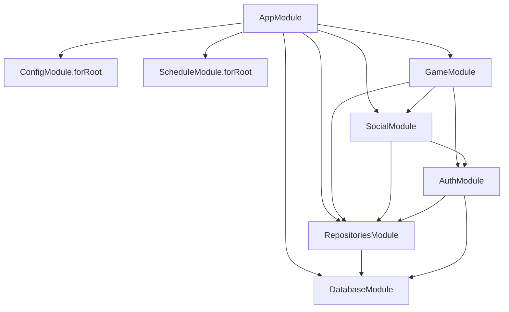

# 03. Backend Architecture

この章では、`mei-tra-backend/` の構造を「NestJS の module 一覧」としてではなく、「どの責務をどの層に置いているか」という観点で整理します。現行 backend を理解するうえで重要なのは、GameGateway が全てを直接処理する設計ではなく、Gateway / UseCase / Service / Repository に責務を分解していることです。

2025-06 の Zenn 記事アーカイブ `../archive/2025-06-zenn-meitra-project-memo.md` 時点の説明だと、GameGateway と GameStateService を中心に読むイメージが強く残ります。しかし今の `main` は、そこから一段進んでいます。Socket イベントを transport layer として扱い、ユーザー操作単位の workflow を UseCase に寄せ、永続化は repository に閉じる構造です。

## 1. backend の役割

frontend が「見せる」「接続する」「認証状態を持つ」のに対して、backend は「正しいゲーム進行とサーバー側の整合性を担保する」役割を持っています。現行 backend の責務は次の通りです。

- Socket.IO によるゲームイベントの受信と配信
- Socket.IO によるソーシャルチャットイベントの受信と配信
- Supabase token の検証
- room / game state / profile / chat の永続化
- turn, declaration, field completion, game over の server-side 判定
- 切断検知、idle 検知、COM 置換、自動プレイ
- health と profile / history の REST endpoint
- 定期 cleanup と運用向け signal の提供

つまり backend は API server でもあり、リアルタイム state coordinator でもあり、永続化 adapter でもあります。

## 2. module graph の全体像

NestJS module 単位で見ると、現行構成は次のように読めます。

`AppModule` に登録されている controller は次の三つです。

- `AppController`
- `HealthController`
- `UserProfileController`

provider としては `APP_FILTER` 経由で Sentry global filter も入っています。

## 3. bootstrapping と runtime 設定

### 3.1 `main.ts`

backend の bootstrapping は比較的シンプルです。

- `SENTRY_DSN` がある場合は Sentry を初期化
- `NestFactory.create(AppModule)`
- `enableCors()`
- `setGlobalPrefix('api')`
- `enableShutdownHooks()`
- `PORT` または `3333` で listen

ここで重要なのは、global prefix が `api` であることです。frontend が `/api/*` を backend に rewrite する前提や、Fly の health check が `/api/health` を見る前提はここに依存しています。

### 3.2 CORS

CORS は HTTP と Socket で少し扱いが違います。

- HTTP (`main.ts`) は `NODE_ENV` に応じて `FRONTEND_URL_DEV` / `FRONTEND_URL_PROD` を切り替える
- Socket.IO gateway (`GameGateway`, `SocialGateway`) は `FRONTEND_URL_DEV` と `FRONTEND_URL_PROD` から allowlist を組み、両方以外は拒否する

credentials も有効なので、auth 系の HTTP フローや cross-origin fetch、さらに socket reconnect を考えるときはこの設定が前提です。特に current `main` では `origin: '*'` を使わず、ローカル frontend と本番 frontend だけを許可します。

### 3.3 ConfigModule

`AppModule` では `ConfigModule.forRoot({ isGlobal: true, envFilePath: ['.env.local', '.env.development', '.env'] })` が入っています。backend は NestJS の config abstraction を使いつつ、実際の env 名は fairly explicit です。後で触れる Supabase config もここに乗ります。

## 4. 各 module の責務

### 4.1 `DatabaseModule`

最下層の infrastructure module です。`ConfigModule.forFeature(supabaseConfig)` を import し、`SupabaseService` を提供します。

`SupabaseService` は service role key を使って `SupabaseClient<Database>` を構築します。backend は anon key ではなく service role で動く、という前提がここで固定されています。

### 4.2 `RepositoriesModule`

repository interface と Supabase 実装の束ね役です。現行では次の token を export しています。

- `IRoomRepository`
- `IGameStateRepository`
- `IUserProfileRepository`
- `IChatRoomRepository`
- `IChatMessageRepository`
- `SUPABASE_CLIENT`

この module を import する上位層は、具象 repository ではなく token に依存します。NestJS の DI で interface 的な抽象を表現するため、string token を使っているのが特徴です。

### 4.3 `AuthModule`

認証検証に関する module です。

- `AuthService`
- `AuthGuard`
- `WsAuthGuard`

を provider / export します。現行コードでは、HTTP guard を前面に使うというよりも、gateway handshake や `update-auth` の中で `AuthService` を直接呼ぶ場面が目立ちます。

### 4.4 `SocialModule`

ソーシャルチャット側の module です。ここには:

- `SocialGateway`
- `ChatService`
- `ChatCleanupService`

が入っています。

`ChatCleanupService` は `@Cron(CronExpression.EVERY_HOUR)` で 24 時間より古いチャット message を消します。つまり social module は gateway だけではなく、運用寄りの cleanup responsibility も持ちます。

### 4.5 `GameModule`

もっとも厚い module です。ここには次が集約されています。

- `GameGateway`
- `ActivityTrackerService`
- `GameStateService`
- `CardService`
- `ScoreService`
- `ChomboService`
- `BlowService`
- `PlayService`
- `RoomService`
- `GameStateFactory`
- `ComPlayerService`
- `ComAutoPlayService`
- 各種 UseCase

GameModule は、transport, application, domain層, session management の中心です。ただし、それぞれが 1 ファイルに直書きではなく token 経由で分離されています。

## 5. layering の見方

現行 backend を理解するには、ファイル名よりも層を見る方が大事です。

### 5.1 Interface Adapters

ここに属するのが:

- `game.gateway.ts`
- `social.gateway.ts`
- `controllers/*.controller.ts`

です。責務は「外部プロトコルをアプリケーション内部の操作に変換すること」であり、ビジネスロジックそのものではありません。

### 5.2 Application / UseCase

`src/use-cases/` がこの層です。ユーザー操作単位で workflow を定義します。代表例:

- `create-room.use-case.ts`
- `join-room.use-case.ts`
- `start-game.use-case.ts`
- `declare-blow.use-case.ts`
- `play-card.use-case.ts`
- `complete-field.use-case.ts`
- `process-game-over.use-case.ts`
- `update-auth.use-case.ts`
- `com-autoplay.use-case.ts`

UseCase は複数 service を束ね、「この操作が成功したらどの event を返すか」まで含めて扱います。

### 5.3 Domain Layer / Application Services

`src/services/` が中心です。ただし、ここにある service がすべて純粋な domain code という意味ではありません。ソースコード上は次の二つに分けて見る方が安全です。

domain層:

- `CardService`
- `BlowService`
- `PlayService`
- `ScoreService`
- `ChomboService`
- `GamePhaseService`

application / session service:

- `RoomService`
- `GameStateService`
- `GameStateManager`
- `PlayerConnectionManager`
- `ComSessionService`
- `TurnMonitorService`
- `ComAutoPlayService`
- `ChatService`
- `ActivityTrackerService`

domain層はゲームルールの正しさを持ちます。application / session service は reconnect、COM 置換、timer、永続化、room lifecycle などを調整します。

### 5.4 Infrastructure

`src/repositories/implementations/` と `src/database/` がこの層です。Supabase とつながる具体実装がここに集まります。

## 6. Gateway の責務境界

### 6.1 `GameGateway`

`GameGateway` はファイルサイズが大きく、一見すると「全部ここにある」ように見えます。ただし役割を分解すると、主な責務は次の通りです。

- socket 接続 / 切断の管理
- handshake からの token / roomId 解決
- room socket join / leave
- `@SubscribeMessage()` ごとの request parsing
- UseCase 実行
- `GatewayEvent` の dispatch
- `TurnMonitorService` を起点にした idle / ack の運用制御
- `ReconnectionUseCase`, `ModeratePlayerUseCase`, `ShuffleTeamsUseCase` への委譲
- `GamePhaseService` / `GameStateManager` を経由した phase 更新の利用
- `JoinRoomGatewayEffectsService` を使った join-room 後の emit 組み立て

重要なのは、カード処理や得点計算を gateway 自身が行っていないことです。大きな gateway ではありますが、計算の中心ではありません。

### 6.2 `SocialGateway`

`SocialGateway` は `/social` namespace 専用です。こちらは `GameGateway` より薄く、責務が比較的きれいです。

- 接続時に token を検証
- `chat:join-room`
- `chat:leave-room`
- `chat:post-message`
- `chat:typing`
- `chat:list-messages`

を `ChatService` に委譲します。

social 側は namespace を分けたことで、game event の複雑さを持ち込まずに済んでいます。

## 7. UseCase 層の役割

backend を読むとき、UseCase がどこまでやるのかを最初に決めておくと理解しやすいです。現行実装では、UseCase は「1 つのユーザー操作を完結させる単位」です。

### 7.1 `CreateRoomUseCase`

ここでは:

- request から room name, pointsToWin, teamAssignmentMethod, playerName, authenticatedUser を受ける
- authenticated user がない場合は作成を拒否
- `RoomService.createNewRoom()` を呼ぶ
- host の room join と COM placeholder 初期化を続けて行う
- game room に対応する chat room も作成する
- rooms list を取り直して返す

つまり「room entity を作る」以上に、「room 作成直後に host が座り、chat room まで揃った状態を返す」ことが責務です。

### 7.2 `JoinRoomUseCase`

ここでは:

- authenticated user があれば `SessionUser` を正規化
- `RoomService.joinRoom()` を呼ぶ
- その内部では `RoomJoinService` が seat 割り当て、COM 置換、vacant seat 復帰、token 更新を処理する
- room を再取得して host 判定を返す
- room が既に PLAYING なら `resumeGame` payload を組み立てる

途中参加や reconnect を考慮している点が重要です。

### 7.3 `StartGameUseCase`

ゲーム開始の直前処理を一手に引き受けます。

- room / game state の整合を確認
- `room.players` の順で in-memory players を再構成
- host 以外の開始を拒否
- `canStartGame()` を確認
- 空席を COM で埋める
- room status を PLAYING に更新
- `startGame()` を呼ぶ
- first blow player を返す

待機室の並びを game state に反映し直す部分は、現行 backend の重要な実装ポイントです。

### 7.4 `DeclareBlowUseCase`

blow phase の 1 手を処理します。

- userId から player を引く
- turn check
- pass / declare 済みチェック
- declaration 妥当性検証
- `blow-updated` と `update-players` event を作る
- 全員行動済みなら play phase への transition helper を呼ぶ
- そうでなければ next turn へ進める

この UseCase は、phase transition の境界にいる代表例です。

### 7.5 `PlayCardUseCase`

play phase の 1 手を処理します。

- player 解決
- hand に card が存在するか確認
- current field の妥当性確認
- turn check
- current field に card を積む
- 4 枚そろったら `completeFieldTrigger` を返す
- まだ 4 枚未満なら next turn を返す

重要なのは、field completion 自体は別 UseCase に渡す点です。1 手の処理と field の確定処理を分けています。

### 7.6 `CompleteFieldUseCase`

field completion 後の大きな流れを扱います。

- winner を判定
- hand からカードを除去
- completed field を保存
- hand が空なら round end 処理へ進む
- play points を計算
- team goal 到達なら `game-over` を返す
- まだ続くなら next round の delayed events を返す

ここは round progression の中枢です。

### 7.7 `ProcessGameOverUseCase`

game over 時に authenticated player だけを拾い、user stats を更新します。ゲーム結果の通知と profile 集計を分離しているのが特徴です。

### 7.8 `UpdateAuthUseCase`

frontend の auth 状態更新を socket connection 側に反映します。

- token 再検証
- global `SessionUser` 一覧の更新
- current room の player 情報も更新
- `auth-updated`, `update-users`, `room-sync`, `update-players`, `room-updated` を返す

現在の frontend は `room-sync` を優先して room/player 状態を更新し、`room-updated` / `update-players` は互換 fallback として残っています。これにより、ログイン後に socket 上の displayName や userId を追従させられます。

### 7.9 `ComAutoPlayUseCase`

現在ターンのプレイヤーが COM かどうかを見て、

- blow phase なら pass
- play phase なら card 選択
- negri 未設定なら negri 選択
- Joker start 時は base suit 補完

を行います。COM 対応を gateway の if 文ではなく UseCase に切り出している点がよい設計ポイントです。

### 7.10 `GetUserRecentGameHistoryUseCase`

プロフィール画面の「最近の対局」一覧に使う read-side です。

- `IRoomRepository.findRecentFinishedByUserId(userId, limit)` で完了済み room を引く
- room ごとに `GameEventLogService.summarizeByRoomId(room.id)` を呼ぶ
- `roomId`, `roomName`, `completedAt`, `roundCount`, `totalEntries`, `winningTeam`, `lastActionType` の一覧向け shape に整える

詳細 replay を返すのではなく、profile 画面に必要な軽量 list item を返すのが役割です。

## 8. Service 層の役割

### 8.1 `RoomService`

RoomService は backend の中でも特に重要です。役割は単なる CRUD ではありません。

- room 作成、取得、更新、削除
- in-memory `roomGameStates` map の管理
- vacant seat のスナップショット管理
- room cleanup
- finished room を一定期間残す retention
- room activity 更新
- `ComSessionService` を使った COM placeholder / COM 置換
- `RoomJoinService` を使った join orchestration
- join / leave / reconnect 周りの補助
- `SeatRestorationService` と `PlayerReferenceRemapperService` を使った vacant seat / playerId 参照修復
- `UserGameStatsService` への stats 更新委譲

また current `main` では、ゲーム終了後すぐに room row を削除しません。socket/timer などの in-memory resource は `releaseRoomResources()` で解放しつつ、finished room 自体は一定期間残して profile の recent matches から参照できるようにしています。

つまり RoomService は、「room entity」と「room に紐づく in-memory game session」の両方を管理しています。

### 8.2 `GameStateService`

1 room に 1 つの in-memory game state を持ちます。

主な responsibilities:

- 初期 state の構築
- `GameStateManager` を介した persisted state の load / save
- `GamePhaseService` を介した合法な `gamePhase` 遷移の検証
- `PlayerConnectionManager` を介した `playerIds` / disconnect timeout 管理
- session concern では `SessionUser` を使い、connection metadata と game rule state を明示的に分け始めている
- players の sanitize
- turn 管理
- deal / blow / play に必要な state 更新

`GameStateFactory` がこれを new して room ごとに作るため、NestJS singleton provider とは別に「room scoped な in-memory state」を実現しています。

### 8.3 `CardService`, `BlowService`, `PlayService`, `ScoreService`, `ChomboService`

これらはゲームルールの純度が高い service 群です。

- `CardService`: カードや山札周り
- `BlowService`: declaration 妥当性や blow phase 支援
- `PlayService`: field winner 判定など
- `ScoreService`: play points / score 計算
- `ChomboService`: 反則判定関連

ゲームのバランスやルール改修を触るなら、この層を見ることになります。

### 8.4 `ChatService`

チャットの application service です。

- room の存在確認
- sender profile の取得
- chat message entity の作成
- listMessages 時の N+1 回避
- public / private chat room 作成

message 取得で sender profile を batch fetch して map 化しているため、単純な repository pass-through より一段上の責務を持っています。

### 8.5 `ActivityTrackerService`

health と scaling のための軽量 service です。

- `recordActivity()`
- `incrementConnections()`
- `decrementConnections()`
- `getStatus()`
- `isIdle()`

backend の「アイドル中かどうか」を判定し、frontend の `backend-status` 表示や auto-scale とつながる地味に重要な service です。

## 9. Repository 層と永続化

repository 実装はすべて Supabase を backend 側から使います。

### 9.1 `SupabaseRoomRepository`

対象テーブル:

- `rooms`
- `room_players`

ここで room metadata と seat / player 情報の両方を扱います。現在は `rooms` を取ったあと、対象 room 全体の `room_players` を一度に取得し、memory 上で room ごとに group 化して `Room` を構築します。source of truth は引き続きこの repository です。

### 9.2 `SupabaseGameStateRepository`

対象テーブル:

- `game_states`

`state_data` JSON に players, deck, agari, blowState, playState を持ち、別カラムで current_player_index, game_phase, scores, team_assignments を持ちます。永続化は「完全に normalize された関係モデル」ではなく、「一部 JSON を含むアプリケーション state snapshot」です。

### 9.3 `SupabaseGameHistoryRepository`

対象テーブル:

- `game_history`

`game_history` は今の `main` では未使用の残骸ではありません。`GameEventLogService` 経由で、`game_started`、`blow_declared`、`card_played`、`field_completed`、`round_completed`、`game_over` などの主要操作を書き込みます。state snapshot の代替ではなく、snapshot に対する補助的な action log / audit trail です。

read-side も入っています。backend には `GameHistoryController` と `GetGameHistoryUseCase` があり、`list`, `summary`, `replay` を返します。frontend は route handler 経由でこれを受け、`/{locale}/game-history/[roomId]` の詳細 page から参照します。対局ログの entrypoint 自体は live game ではなく、profile の recent matches 側に移っています。

### 9.4 `SupabaseUserProfileRepository`

対象テーブル:

- `user_profiles`

主な責務:

- profile の検索
- profile 作成 / 更新
- preferences の merge 更新
- last seen 更新
- game stats 更新
- chat 用の profile batch fetch

### 9.5 `SupabaseChatRoomRepository` と `SupabaseChatMessageRepository`

対象テーブル:

- `chat_rooms`
- `chat_messages`

social module の永続化を切り出しています。chat room と chat message を独立 entity として持っているため、将来的なソーシャル拡張にも耐えやすい構成です。

## 10. REST endpoint の境界

backend の REST は多くありません。むしろ socket 主体です。しかし、少ないからこそ役割が明確です。

### 10.1 `GET /api/health`

`HealthController` が返します。内容は:

- `status`
- `timestamp`
- `uptime`
- `activity`
  - `lastActivity`
  - `lastActivityAgo`
  - `activeConnections`
  - `isIdle`
- `memory`
  - `heapUsed`
  - `heapTotal`
  - `rss`

`idleThreshold` は controller 側で 30 分です。status は idle なら `degraded`、そうでなければ `ok` です。frontend の backend status UI はこれを直接の基礎にしています。

### 10.2 `GET /api/user-profile/:id`

指定 user の profile を返します。UI の詳細表示や refresh のために使います。

### 10.3 `PUT /api/user-profile/:id`

profile 更新 endpoint です。ただし current `main` では `AuthGuard` が掛かっており、`CurrentUser.id === :id` の self-only 更新しか通りません。

- bearer token なし: `401`
- 有効 token だが他人の `:id` を指定: `403`
- 自分自身の `:id`: 更新成功

frontend の通常 UI は profile text update を直接 Supabase に書く経路も持っていますが、この REST endpoint 自体は「server-side に制御された self-only 更新」という扱いです。

### 10.4 `POST /api/user-profile/:id/avatar`

画像 upload 専用です。ここでは:

- 2MB までの画像入力
- JPEG / PNG / WebP の受理
- Sharp で 128x128 WebP に最適化
- 50KB 超なら reject
- `AuthGuard` + self-only ownership check
- 旧 avatar の削除
- `avatars` bucket へ `<userId>/avatar-<timestamp>.webp` 形式で保存
- profile の avatarUrl 更新

を行います。

ここも `PUT /api/user-profile/:id` と同様に self-only です。avatar URL の public path は folder 付きになっており、削除時も最後のファイル名だけではなく storage object path 全体を使います。

### 10.5 `GET /api/user-profile/:id/game-history`

プロフィール画面の「最近の対局」一覧に使う self-only endpoint です。

- `AuthGuard` 付き
- `CurrentUser.id === :id` の self-only 制約
- 完了済み対局のみを新着順で最大 10 件返す
- payload は一覧向け軽量 shape で、詳細 replay は返さない

この endpoint により、対局ログの entrypoint は live game ではなく profile になりました。詳細閲覧は別途 `GET /api/game-history/:roomId/summary|replay` へ進みます。

## 11. Socket interface の境界

backend には二種類の socket interface があります。

### 11.1 game namespace

主な inbound event:

- `create-room`
- `join-room`
- `list-rooms`
- `toggle-player-ready`
- `leave-room`
- `moderate-player`
- `turn-ack`
- `change-player-team`
- `shuffle-teams`
- `fill-with-com`
- `start-game`
- `declare-blow`
- `pass-blow`
- `select-negri`
- `play-card`
- `select-base-suit`
- `reveal-broken-hand`
- `update-auth`

主な outbound event:

- `rooms-list`
- `room-sync`
- `room-updated`
- `update-players`
- `game-state`
- `game-started`
- `update-phase`
- `update-turn`
- `blow-updated`
- `card-played`
- `field-complete`
- `round-results`
- `new-round-started`
- `game-over`
- `player-idle`
- `player-converted-to-com`
- `back-to-lobby`

### 11.2 social namespace

主な inbound event:

- `chat:join-room`
- `chat:leave-room`
- `chat:post-message`
- `chat:typing`
- `chat:list-messages`

主な outbound event:

- `chat:joined`
- `chat:left`
- `chat:message`
- `chat:typing`
- `chat:messages`
- `chat:error`

これらのイベント名と payload shape は、frontend と backend 間の通信契約です。一部は `contracts/` に明示されていますが、すべての socket event が schema 化されているわけではありません。未 schema 化の event は暗黙契約なので、変更時は frontend/backend の両方を同時に確認・更新する必要があります。

## 12. backend の運用寄り機能

backend はゲームロジックだけでなく、運用のための仕掛けもいくつか持っています。

### 12.1 idle と接続数

`ActivityTrackerService` と `HealthController` により、「何分アイドルか」「接続数は何件か」を公開できます。これは auto-scale や frontend の起動中表示を成立させる基礎です。

### 12.2 chat cleanup

`ChatCleanupService` が毎時 cleanup を行い、24 時間を超えた chat message を削除します。message TTL は `chat_rooms.message_ttl_hours` も持っていますが、現行 service は 24 時間 cutoff の cleanup を行っています。

### 12.3 room cleanup

`RoomService` は room expiry と cleanup interval を持ち、古い room を削除します。room persistence は永続ですが、永遠に残す前提ではありません。

### 12.4 Fly.io health check

`fly.toml` の health check は `/api/health` を 15 秒ごとに確認します。runtime visibility を backend 自身が提供している構成です。

## 13. backend を読む順番のおすすめ

backend を初めて読むなら、次の順が効率的です。

1. `src/app.module.ts`
2. `src/game.module.ts`
3. `src/social.module.ts`
4. `src/game.gateway.ts`
5. `src/use-cases/start-game.use-case.ts`
6. `src/use-cases/declare-blow.use-case.ts`
7. `src/use-cases/play-card.use-case.ts`
8. `src/use-cases/complete-field.use-case.ts`
9. `src/services/room.service.ts`
10. `src/repositories/repositories.module.ts`

この順で読むと、「module graph → gateway entry → main workflows → state / persistence」に自然につながります。

## 14. backend を変更するときの注意点

### 14.1 Gateway にロジックを戻しすぎない

大きな gateway だからといって、ロジックを足しやすい場所でもあります。しかし現行設計の価値は、UseCase と Service に責務を切っていることです。新しい user action は UseCase に落とす方が保守しやすくなります。

### 14.2 game state と room state は別物

`room.players` と `game_states.state_data.players` は役割が違います。片方だけ更新するとズレます。特に待機室とゲーム進行の境界では、両者の同期意識が必要です。

### 14.3 in-memory state と persistence の両方を見る

room ごとの `GameStateService` は in-memory にありつつ、Supabase にも snapshot を持ちます。バグ調査時は「DB を見たら終わり」ではなく、再接続時の load/save の流れまで追う必要があります。

### 14.4 authenticated player だけが stats 対象

`ProcessGameOverUseCase` は `userId` を持つ player のみ stats を更新します。COM や未認証相当の participant をどう扱うかは、profile 集計の前提に関わります。

### 14.5 chat と game を混ぜない

同じ Nest app 内にあっても module は分離されています。チャット拡張を game module に足すと、責務がすぐに濁ります。

## 15. DI token ベース実装の読み方

現行 backend は TypeScript interface を runtime で注入できないため、NestJS の provider token に string を使っています。実装を読むときは constructor の型名だけでは不十分で、`@Inject('...')` を追う必要があります。

代表的な token:

- `'IRoomRepository'`
- `'IGameStateRepository'`
- `'IUserProfileRepository'`
- `'IChatRoomRepository'`
- `'IChatMessageRepository'`
- `'IRoomService'`
- `'IGameStateService'`
- `'IPlayCardUseCase'`

この方式の利点は差し替えやテストがしやすいこと、欠点は rename が型安全に波及しないことです。

## 16. 例外処理の流れ

backend はどの層でも同じ流儀でエラーを返しているわけではありません。

### 16.1 Gateway

Gateway は多くの場合、例外を握って `error-message` や `chat:error` を emit します。transport layer として、接続全体を落とすよりユーザーへエラー通知を返す方向です。

### 16.2 UseCase

UseCase は `success: boolean` と `error` / `errorMessage` を返す形が多く、必要なら `events` を添えて返します。Gateway はこれを見て emit 先と文言を決めます。

### 16.3 Repository / Service

Repository や一部 service は throw することがあります。どこで握るか、どこで transport 向けエラーに変換するかは UseCase が決めます。

## 17. REST と WebSocket の使い分け

現行 backend はリアルタイム主体ですが、すべてを socket に寄せてはいません。

- WebSocket: room lifecycle, game progression, social chat
- REST: health, profile read/update, avatar upload

avatar upload を REST にしているのは、multipart/form-data と画像変換が絡むためです。health も機械判定や proxy の都合で REST の方が扱いやすくなっています。

## 18. 次に読む章

backend の責務境界が見えたら、次はそれが実時間でどう動くかを `04` で追うのが自然です。

- イベントの時系列を追う: [04-realtime-game-flow.md](./04-realtime-game-flow.md)
- 認証と永続化をさらに掘る: [05-data-auth-persistence.md](./05-data-auth-persistence.md)
- 起動 / deploy / health をまとめて見る: [06-dev-ops-and-quality.md](./06-dev-ops-and-quality.md)
