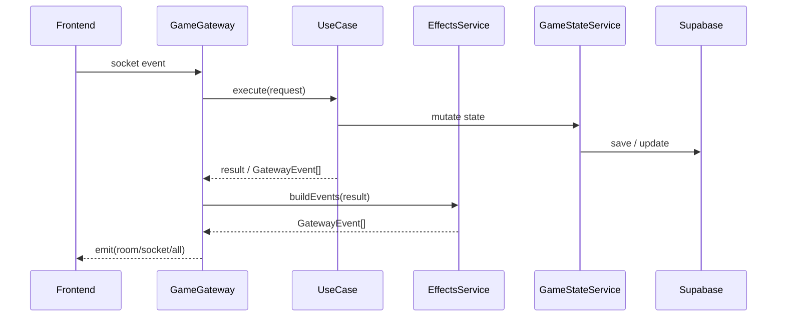

# 04. Realtime Game Flow

この章では、明専トランプの「リアルタイムで同期する部分」を、時系列で追います。frontend の画面遷移と backend の UseCase / GatewayEvent がどう噛み合うかを理解するのが目的です。

このプロジェクトの難しさは、Socket.IO を使っていること自体ではありません。難しいのは、次の状態が同時に存在することです。

- ブラウザ上の UI state
- socket.io の接続状態
- server-side の in-memory game state
- Supabase に保存された room / game state
- 認証済み user と table 上の player の対応

ゲームの不具合を直すときは、どの層の state が source of truth なのかを常に意識する必要があります。

## 1. 大きな流れ

現行のゲーム体験を大きく分けると、次の段階になります。

1. 認証と socket 接続
2. ルーム作成 / 参加
3. 待機室での準備
4. ゲーム開始
5. blow phase
6. play phase
7. field completion
8. round 終了 / 次ラウンド
9. game over
10. 切断 / 再接続 / COM 補完

この章では、この順番で説明します。

流れを一枚で見ると、現行システムの中心は次のシーケンスです。

Gateway が直接ゲームロジックを確定するのではなく、UseCase と GameStateService を経由してから frontend に event を返すのが現行構造です。

## 1.1 `GatewayEvent`, EffectsService, `dispatchEvents()`

UseCase は「何が起きたか」を決めます。EffectsService は、その結果を「どの socket event と payload で送るか」に変換します。Gateway は最終的に `dispatchEvents()` で emit します。

この分離により、`GameGateway` に event 組み立てロジックが集まりすぎるのを防いでいます。

- UseCase: ゲーム開始、参加、再接続などの application flow を実行する
- EffectsService: use-case の結果から `GatewayEvent[]` を組み立てる
- `dispatchEvents()`: `GatewayEvent[]` を Socket.IO の `emit()` に変換する

例えば game start では、`StartGameUseCase` が `players`, `updatePhase`, `currentTurnPlayerId` を返し、`StartGameGatewayEffectsService` が `room-sync`, `room-playing`, `game-started`, `update-phase`, `update-turn` を組み立てます。その後 `GameGateway.dispatchEvents()` が実際に room へ配信します。

`GatewayEvent.scope` は送信先を表します。

- `room`: 指定 room に参加している socket 全員へ送る
- `socket`: 指定 socket 1 つへ送る
- `all`: 接続中の全 socket へ送る

`room` scope の場合、Gateway は `this.server.to(event.roomId)` で Socket.IO room 向け emitter を作ります。この時点ではまだ送信されず、続く `roomEmitter.emit(event.event, payload)` でその room の参加者へ送信されます。`excludeSocketId` が指定されている場合は `roomEmitter.except(socketId).emit(...)` になり、その socket だけ除外されます。

`update-turn` だけは配信後に追加処理があります。payload が次の playerId の場合、`dispatchEvents()` は `startTurnAckMonitor(roomId, playerId)` を起動し、次の手番プレイヤーの ack / idle を監視します。

## 2. 認証と接続開始

### 2.1 frontend 側の前提

ログイン後、frontend は `useSocket()` によってメイン socket を初期化します。このとき token は `useAuth().getAccessToken()` から取得されます。接続前に auth loading が終わっていることが条件です。

`app/socket.ts` の handshake では、token に加えて `sessionStorage.roomId` も送ります。ここが重要です。room に参加した状態で backend が再起動しても、再接続時に roomId を渡せれば backend 側で room socket に戻しやすくなります。

### 2.2 backend 側の接続処理

`GameGateway.handleConnection()` は接続時に:

- handshake auth の token を読む
- token があれば `AuthService.getUserFromSocketToken()` で user を解決する
- `roomId` があれば reconnect / room rejoin の流れへ進む
- connection user 一覧や room state を必要に応じて更新する

未認証でも接続だけはできる場面がありますが、room 作成など一部操作は明示的に拒否されます。チャット namespace 側はもっと厳格で、token がなければ接続を切ります。

### 2.3 ふたつの socket

ここで改めて強調しておくべき点は、ゲームとチャットで socket が別なことです。

- メインゲーム: root namespace `/`
- ソーシャルチャット: namespace `/social`

同じ roomId を使っていても transport は別です。ゲームの reconnect と chat の reconnect は独立に失敗し得ます。

## 3. ルームを作る

ルーム作成は `RoomList` から始まります。frontend は `create-room` event を送ります。payload には room 名、pointsToWin、teamAssignmentMethod などが入ります。

### 3.1 backend 側の主処理

`GameGateway` は `CreateRoomUseCase.execute()` を呼び、そこで:

- authenticated user の存在確認
- `RoomService.createNewRoom()`
- `GameStateFactory` で room 専用 `GameStateService` 生成
- `game_states` の初期化
- pointsToWin の設定
- host の room join と COM placeholder 初期化
- table chat room の作成
- rooms list の再取得

を行います。

### 3.2 作成直後のクライアント通知

作成後、backend は少なくとも次をクライアントへ返します。

- `game-player-joined`
- `set-room-id`
- `room-sync`
- `update-players`
- `room-updated`
- `rooms-list`

現在の frontend は `room-sync` を主系統として room/player 状態を反映し、`room-updated` / `update-players` は互換 fallback として扱います。このイベント群で frontend は「作成成功」と「自分がその room の host / player になったこと」を認識します。

### 3.3 なぜ `set-room-id` が重要か

`currentRoomId` の更新は UI 切替だけでなく、再接続時の handshake input にも使われます。room 作成成功時にこの値を確定させることは、以後の接続安定性に直結します。

## 4. ルームに参加する

### 4.1 `join-room` の流れ

frontend の `useRoom().joinRoom()` が `join-room` を emit します。backend の `JoinRoomUseCase` では:

- user を正規化
- `RoomService.joinRoom()` を呼ぶ
- `RoomJoinService` が seat 復帰 / COM 置換 / token 再登録を行う
- `JoinRoomGatewayEffectsService` が `game-player-joined`, `room-sync`, `room-updated`, `game-state` などの emit を組み立てる
- room を再取得
- host 判定
- room status が PLAYING なら `resumeGame` payload 生成

を行います。

### 4.2 途中参加と resume

現行実装の特徴は、ゲーム中 room への join にも一定の対応があることです。`JoinRoomUseCase.buildResumePayloadIfNeeded()` は、`room.status === PLAYING` だけでなく `state.gamePhase !== null` も見ており、古い room status がずれていても resume を試みます。

返される `resumeGame` には少なくとも次が入ります。

- players
- gamePhase
- currentField
- currentTurn
- blowState
- teamScores
- negriCard
- fields
- roomId
- pointsToWin

frontend はこれを `game-state` 相当として描画し直します。

### 4.3 `game-player-joined` と `room-sync`

参加時、frontend は `game-player-joined` で「自分の playerId がこれだ」と確定し、`room-sync` で room metadata と player list をまとめて更新します。`room-updated` / `update-players` もまだ送られますが、現在の frontend では fallback です。playerId は reconnect や host 判定の軸なので、単に players 配列を増やすだけでは足りません。

## 5. 待機室フェーズ

room に入って game が始まっていない間、frontend は `PreGameTable` を表示します。ここでは次の操作があります。

- ready の切替
- チーム変更
- チームシャッフル
- 空席を COM で埋める
- プレイヤーを退出させる / COM に置き換える
- host が start game

### 5.1 host と team

host は `room.hostId` と `currentPlayerId` の一致で判断されます。team は `room.players` と `teamAssignments` によって持たれますが、ゲーム開始時には `room.players` の順序がより重要になります。

### 5.2 なぜ waiting room の seat order が重要か

`StartGameUseCase` は game 開始前に `room.players` の順で in-memory `state.players` を組み直します。つまり、waiting room の並びがそのままゲーム進行の初期 seat order になります。ここを理解せずに room players をいじると、見た目の並びとサーバー内部の順序がずれる危険があります。

## 6. ゲーム開始

### 6.1 `start-game`

host が `start-game` を emit すると、backend は `StartGameUseCase.execute()` を呼びます。ここで行うことは多いです。

- room existence check
- player existence check
- host authorization check
- `canStartGame()` check
- 空席の COM 補完
- room status を PLAYING に更新
- `roomGameState.startGame()`
- pointsToWin の反映
- hand 同期
- `isPasser` の初期化
- first blow player の決定

### 6.2 開始時の event

少なくとも次の event が room に対して飛びます。

- `room-playing`
- `game-started`
- `update-phase`
- `update-turn`

frontend の `useGame()` はこれを受けて:

- `gameStarted = true`
- `gamePhase = 'blow'`
- players 更新
- current player / current room 更新

を行います。

backend 側では、game start での `blow` への遷移も `GameStateService.transitionPhase()` 経由で行われ、`GamePhaseService` が不正な phase 遷移を弾きます。

## 7. blow phase

blow phase は、現行 game flow の前半です。

### 7.1 主な state

backend の `BlowState` には次があります。

- `currentTrump`
- `currentHighestDeclaration`
- `declarations`
- `actionHistory`
- `lastPasser`
- `isRoundCancelled`
- `currentBlowIndex`

frontend 側もこれに対応して `blowDeclarations`, `blowActionHistory`, `currentHighestDeclaration`, `selectedTrump`, `numberOfPairs` を持ちます。

### 7.2 `declare-blow`

プレイヤーが宣言すると、`DeclareBlowUseCase` が:

- 自分の turn か確認
- 既に declare / pass 済みか確認
- declaration 妥当性を確認
- actionHistory を積む
- `blow-updated` を返す
- 全員行動済みなら play phase への transition
- そうでなければ `update-turn`

を行います。

### 7.3 `pass-blow`

COM の default 行動も含め、pass も UseCase 化されています。実装上は player の `isPasser` が更新され、turn を進めるロジックに組み込まれます。

### 7.4 play への移行

全員が declare または pass すると、`transitionToPlayPhase()` が呼ばれます。ここで:

- currentTrump の確定
- negri まわりの準備
- current field 初期化
- `play-setup-complete` や `update-phase` の準備

が行われます。

### 7.5 round cancel

全員 pass などの条件で round がキャンセルされると、frontend は `round-cancelled` を受けて blow state を reset しつつ、次 dealer や action history を表示に反映します。

## 8. play phase

### 8.1 現在 field の概念

`PlayState.currentField` には:

- `cards`
- `playedBy`
- `baseCard`
- `baseSuit`
- `dealerId`
- `isComplete`

があります。これが現在場に出ている 1 トリック分の情報です。

### 8.2 `select-negri`

play phase の初期には、highest declarer が negri を選ぶ必要があります。`select-negri` はこのための event です。frontend の `play-setup-complete` handler では negri card を hand から取り除く表示更新も行っています。

### 8.3 `play-card`

プレイヤーがカードを出すと、`PlayCardUseCase` が:

- player 解決
- hand に card があるか確認
- current field が有効か確認
- turn check
- field に card を積む
- 4 枚そろったら completeFieldTrigger を返す
- まだなら `update-turn`

を行います。

UI 側は `card-played` を受けて current field と players を更新します。ローカル hand を先に楽観更新しているわけではなく、サーバーから返る players を反映します。

### 8.4 Joker と base suit

current field の最初が `JOKER` で `baseSuit` 未設定の場合、通常の turn progression と少し違う処理が入ります。COM プレイ時には `ComAutoPlayUseCase` が base suit を自動選択し、`field-updated` と `update-turn` を返します。

### 8.5 broken / chombo

broken 関連や反則は `ChomboService` や `reveal-broken-hand` のフローと結び付いており、frontend には `broken` や `reveal-agari` といった event が通知されます。表示上は警告や hand reveal のタイミングに使われます。

## 9. field completion

1 field に 4 枚そろうと、`PlayCardUseCase` はその場で winner を決めません。`completeFieldTrigger` を返し、少し delay を置いて `CompleteFieldUseCase` に渡します。

### 9.1 なぜ delay があるのか

ユーザーに最後の 1 枚が場に出たことを視覚的に見せるためです。即座に場をクリアすると、プレイ感が悪くなります。現行実装では 3000ms の delay が入ります。

### 9.2 `CompleteFieldUseCase`

ここで:

- winner を決定
- hands からカード除去
- completed field 保存
- current field を次 dealer 用に初期化
- `field-complete`
- `update-players`
- まだ hand が残るなら `update-turn`

を行います。

frontend 側は `field-complete` を受けると、completedFields に追加し、current field を空にします。

## 10. round 終了と次ラウンド

全員の hand が空になると round end です。

### 10.1 round end で行うこと

`CompleteFieldUseCase` は:

- highest declaration から declaring team を特定
- wonFields を数える
- `ScoreService.calculatePlayPoints()` を使って play points を加算
- `round-results` を返す

を行います。

### 10.2 次ラウンドへ進む条件

`teamScores.total` のどちらかが `pointsToWin` 以上なら game over、そうでなければ `prepareNextRound()` に進みます。

`prepareNextRound()` では新しい round の初期化と delayed event の返却が行われ、frontend には `new-round-started` や関連 event が通知されます。

## 11. game over

### 11.1 `game-over` event

goal に到達した team があると:

- `game-over`
- room status を FINISHED に更新
- game state 保存
- `GameOverInstruction`

が生成されます。

frontend の `useGame()` は `game-over` を受けると:

- game over modal を出す
- `gameStarted` を false に戻す
- teamScores を初期化
- `sessionStorage.roomId` を消す

を行います。

この `sessionStorage.roomId` の削除は重要です。消さないと、終了した room への再接続ループを起こす可能性があります。

### 11.2 profile stats 反映

`ProcessGameOverUseCase` が authenticated user だけを対象に `updateUserGameStats()` を呼びます。COM や未認証 participant は stats 対象外です。

## 12. 切断、再接続、idle 検知、COM 置換

現行実装で最も運用色が強いのがこの領域です。

### 12.1 turn ack monitor

現行実装では `TurnMonitorService` が turn ごとの monitor を持ち、`GameGateway` はその開始・停止を routing する立場です。

- 一定間隔で `turn-ping`
- ack が来なければ idle warning
- 一定時間 idle が続けば COM 置換

frontend は `update-turn` や `turn-ping` を受けると `turn-ack` を返します。

### 12.2 `player-idle` / `player-idle-cleared`

frontend は idle 状態を `idlePlayerIds` と notification に反映します。これにより、接続断まではしていないが反応のない player を UI で可視化できます。

### 12.3 disconnect から COM へ

切断した player は、すぐに完全削除されるわけではありません。room 状況や timeout に応じて:

- `player-disconnected`
- `player-converted-to-com`

が通知されます。自身が COM 置換された場合、frontend は room state を reset して lobby に戻ります。

### 12.4 reconnect

再接続時には handshake の `roomId` と token を使って、`ReconnectionUseCase` が中心になって backend が:

- 既存 player の socketId を差し替える
- `game-state` を送り直す
- `reconnect-token` と `room-sync` / `update-players` を送る

流れを持ちます。resume を成立させる前提は、frontend が `roomId` を保存していることです。

再接続そのものは phase を変えません。phase の変更は `GamePhaseService` を通すため、resume 中に `play` / `blow` が勝手に書き換わることはありません。

### 12.5 COM 自動プレイ

COM が current player の場合、`ComAutoPlayService` が 2 秒 delay で `ComAutoPlayUseCase` を呼びます。COM は:

- blow では基本 pass
- play では best card を選択
- negri 未設定なら先に negri 選択

を行います。

## 13. social chat の並走

ゲーム中でも `GameDock` の中に `ChatDock` が出るため、ユーザー体験としては一つの flow に見えます。しかし実装としては独立したフローです。current `main` では対局ログの主導線は `GameDock` にはなく、プロフィール画面の「最近の対局」から `/{locale}/game-history/[roomId]` に入る構成です。

### 13.1 room join の単位

chat は `chat:join-room` で roomId ごとに参加します。ゲーム room に参加したからといって、自動的に social namespace の room join が完了するわけではありません。frontend の `ChatDock` / `useSocialSocket()` が別途 join します。

### 13.2 event

主な chat event:

- `chat:join-room`
- `chat:leave-room`
- `chat:post-message`
- `chat:typing`
- `chat:list-messages`

返信:

- `chat:joined`
- `chat:left`
- `chat:message`
- `chat:typing`
- `chat:messages`
- `chat:error`

message は `ChatService.postMessage()` を通って `chat_messages` に永続化されます。

## 14. イベント契約の整理

ここでは、実装上とくに重要なイベントを方向付きで整理します。完全一覧ではなく、開発で頻繁に触るものを優先しています。

### 14.1 メインゲーム socket: client -> server

| event | 主な payload | 用途 |
| --- | --- | --- |
| `create-room` | room 名, pointsToWin, teamAssignmentMethod | ルーム作成 |
| `join-room` | roomId, user | ルーム参加 |
| `list-rooms` | なし | 一覧取得 |
| `toggle-player-ready` | roomId, playerId | ready 切替 |
| `change-player-team` | roomId, playerId, teamChanges | チーム変更 |
| `fill-with-com` | roomId, playerId | 空席 COM 補充 |
| `start-game` | roomId, playerId | ゲーム開始 |
| `declare-blow` | roomId, declaration | blow 宣言 |
| `pass-blow` | roomId | blow パス |
| `select-negri` | roomId, card | negri 選択 |
| `play-card` | roomId, card | カードプレイ |
| `select-base-suit` | roomId, suit | Joker 開始時の base suit 選択 |
| `reveal-broken-hand` | roomId, playerId | broken hand 表示 |
| `moderate-player` | roomId, requesterPlayerId, targetPlayerId, action | 退出 / COM 置換 |
| `turn-ack` | roomId | idle monitor 向け ack |
| `update-auth` | token | socket 上の auth 同期 |

### 14.2 メインゲーム socket: server -> client

| event | 主な payload | 用途 |
| --- | --- | --- |
| `rooms-list` | Room[] | ロビー一覧同期 |
| `room-sync` | Room + TransportPlayer[] | room/player 同期の主系統 |
| `room-updated` | Room | 待機室情報更新（互換 fallback） |
| `update-players` | Player[] | player 表示更新（互換 fallback） |
| `game-state` | players, phase, field, turn, scores, blowState | resume / 初期同期 |
| `game-started` | roomId, players, pointsToWin | ゲーム開始通知 |
| `update-phase` | phase, scores, winner? | フェーズ更新 |
| `update-turn` | playerId | 現在手番更新 |
| `blow-updated` | declarations, actionHistory, currentHighest | blow 状態同期 |
| `card-played` | playerId, card, field, players | 場と hand 同期 |
| `field-updated` | Field | Joker base suit 補完など |
| `field-complete` | winnerId, field, nextPlayerId | 1 トリック終了 |
| `round-results` | scores | round 得点更新 |
| `new-round-started` | players, turn, phase, currentField, completedFields など | 次ラウンド準備 |
| `game-over` | winner, finalScores | ゲーム終了 |
| `game-paused` / `game-resumed` | message | 進行停止 / 再開 |
| `player-idle` / `player-idle-cleared` | playerId, playerName? | idle 可視化 |
| `player-converted-to-com` | playerId, playerName?, message | COM 置換通知 |
| `back-to-lobby` | なし | 自 room state をクリアして戻す |

### 14.3 social socket

| 方向 | event | 主な payload |
| --- | --- | --- |
| C -> S | `chat:join-room` | roomId |
| C -> S | `chat:leave-room` | roomId |
| C -> S | `chat:post-message` | roomId, content, contentType, replyTo |
| C -> S | `chat:typing` | roomId |
| C -> S | `chat:list-messages` | roomId, limit, cursor |
| S -> C | `chat:joined` | roomId, success |
| S -> C | `chat:left` | roomId, success |
| S -> C | `chat:message` | ChatMessageEvent |
| S -> C | `chat:typing` | ChatTypingEvent |
| S -> C | `chat:messages` | roomId, messages[] |
| S -> C | `chat:error` | message |

## 15. デバッグするときの見方

ゲーム同期バグを追うときは、次の順で観測すると効率がよいです。

1. frontend で何の event を emit したか
2. backend Gateway でその event をどの UseCase に委譲したか
3. UseCase が返した `GatewayEvent` は何か
4. `roomGameState.saveState()` されたか
5. frontend `useGame()` / `useRoom()` が何を state に反映したか

「画面が変だ」という報告でも、実際には:

- event 自体が飛んでいない
- UseCase が validation で落ちた
- save はされたが event が返っていない
- event は返ったが `useGame()` が拾っていない

のどこかです。

## 16. この章で押さえておくべきこと

最後に、この章の要点を短くまとめます。

- room 作成 / 参加 / ゲーム開始 / 1 手 / field completion / game over は別々の UseCase で処理される
- frontend の表示状態は `useGame()` / `useRoom()` が event を受けて構成する
- reconnect と COM 置換は、現行実装の重要な運用対応である
- chat はゲームと同じ画面に見えても別 namespace / 別 flow である
- 一部のイベント契約は `contracts/` に明示済みだが、未 schema 化の event は暗黙契約として残るため、frontend と backend の両方を一緒に変更する意識が必要である

## 17. reconnect 系の見方

reconnect 系バグは通常のプレイバグより観測点が多いです。次の順で切り分けると追いやすくなります。

1. browser に `sessionStorage.roomId` が残っているか
2. reconnect 時に handshake auth callback が実行されているか
3. backend が既存 player を `userId` または `socketId` で再特定できているか
4. `game-state` が再送されているか
5. frontend が `currentRoomId`, `currentPlayerId`, `players` を再同期できているか

reconnect は transport 問題に見えますが、実際には identity と persistence の問題でもあります。

## 18. COM 置換系の見方

COM 置換バグでは、room state と game state の両方を見る必要があります。

- `room.players` の seat 情報
- `game_states.state_data.players` の現在状態
- idle monitor の timeout
- `player-converted-to-com` event の payload
- 置換後に auto-play が継続するか

プレイヤー除去と COM 置換は UI 上は似ていますが、内部状態の意味はかなり違います。

## 19. 代表的な操作の end-to-end 追跡メモ

### 19.1 room 作成

`RoomList.submit` -> `useRoom.createRoom()` -> `socket.emit('create-room')` -> `CreateRoomUseCase` -> `RoomService.createNewRoom()` -> `rooms`, `game_states` 作成 -> `room-sync`, `set-room-id`, `rooms-list`

### 19.2 ゲーム開始

`PreGameTable.start` -> `useGame.startGame()` -> `socket.emit('start-game')` -> `GameGateway.handleStartGame()` -> `StartGameUseCase` -> `fillVacantSeatsWithCOM()` -> `roomGameState.startGame()` -> `StartGameGatewayEffectsService.buildEvents()` -> `game-started`, `update-phase`, `update-turn`

### 19.3 1 枚出す

`GameTable.playCard` -> `socket.emit('play-card')` -> `PlayCardUseCase` -> `card-played` -> 4 枚なら `completeFieldTrigger` -> `CompleteFieldUseCase` -> `field-complete`

### 19.4 auth を socket に反映

`ProfileEditForm` -> `socket.emit('update-auth', { token })` -> `UpdateAuthUseCase` -> `auth-updated`, `update-users`, `room-sync`, `room-updated`, `update-players`

## 20. frontend state と主要 event の対応

イベントフローを追うとき、frontend のどの state がどの event で更新されるかを覚えておくと調査が速くなります。

| frontend state | 主に更新する event |
| --- | --- |
| `currentRoomId` | `set-room-id`, `game-player-joined`, `game-state`, `back-to-lobby` |
| `room` / `host` / `ready` | `room-sync`, `room-updated`, `game-state`, `back-to-lobby` |
| `players` | `room-sync`, `update-players`, `game-state`, `game-started`, `card-played`, `new-round-started` |
| `gamePhase` | `game-state`, `update-phase`, `broken`, `new-round-started` |
| `whoseTurn` | `game-state`, `update-turn`, `blow-started`, `new-round-started` |
| `completedFields` | `game-state`, `field-complete`, `new-round-started` |
| `idlePlayerIds` | `player-idle`, `player-idle-cleared`, `player-converted-to-com`, `player-left` |

この表を頭に入れておくと、「どの event が欠けると UI がどう壊れるか」を推測しやすくなります。

## 21. 次に読む章

この時系列の上にある認証・永続化・型の話を整理したい場合は、次の章に進んでください。

- Supabase / Auth / DB / Storage を整理する: [05-data-auth-persistence.md](./05-data-auth-persistence.md)
- 起動、テスト、deploy、health、運用手順を見る: [06-dev-ops-and-quality.md](./06-dev-ops-and-quality.md)
