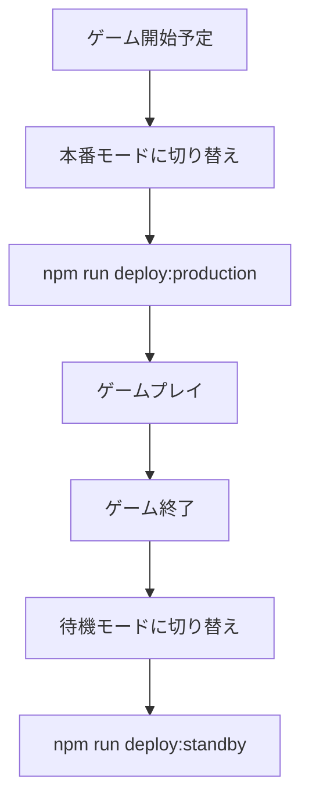

# Deployment Guide

## Production Mode Management

このプロジェクトでは、コスト最適化のために `min_machines_running` の設定を動的に変更できます。

### 📈 本番モード（ゲームプレイ時）

ゲームをプレイする直前に実行してください。常に1台のマシンが稼働状態を維持します。

```bash
# 方法1: npmスクリプト
npm run deploy:production

# 方法2: 直接実行
./scripts/set-production-mode.sh
```

### 💤 待機モード（コスト最適化）

ゲーム終了後に実行してください。リクエストがない時はマシンが0台になります。

```bash
# 方法1: npmスクリプト  
npm run deploy:standby

# 方法2: 直接実行
./scripts/set-standby-mode.sh
```

## 設定の詳細

### 本番モード (`min_machines_running = 1`)
- ✅ 常に1台のマシンが起動済み
- ✅ レスポンス時間が早い
- ❌ 常時課金が発生

### 待機モード (`min_machines_running = 0`)
- ✅ アイドル時は課金なし
- ✅ コスト効率が良い
- ❌ 初回リクエスト時に起動時間が必要（数秒）

## 運用フロー



## 注意事項

- デプロイには1-2分程度かかります
- 変更後は `fly.toml` の設定が更新されます
- バックアップファイル（`.bak`）が作成されます 