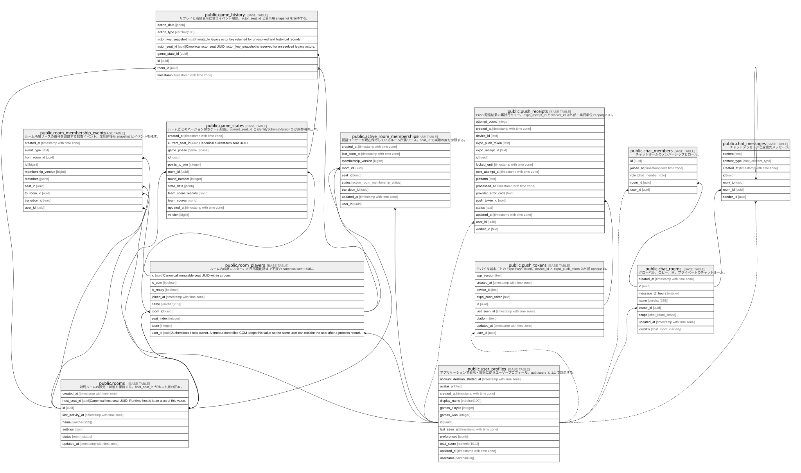

# Meitra

## Description

Meitra の Supabase public スキーマ。認証の正本は Supabase Auth の auth.users、アプリケーション側のユーザー表示は public.user_profiles で管理する。

## Viewpoints

| Name                                                  | Description                                                          |
| ----------------------------------------------------- | -------------------------------------------------------------------- |
| [ゲーム進行](viewpoint-gameplay.md)                        | ルーム、座席、ゲーム状態、リプレイ履歴の関係。                                              |
| [ルーム所属リース](viewpoint-room-membership.md)              | 同一ユーザーの多重入室を防ぎ、再接続・退出を監査するための所属管理。                                   |
| [ソーシャルと通知](viewpoint-social-notifications.md)         | チャットとモバイル Push 通知の永続化。                                               |

## Tables

| Name                                                                | Columns | Comment                                                                                              | Type       |
| ------------------------------------------------------------------- | ------- | ---------------------------------------------------------------------------------------------------- | ---------- |
| [public.active_room_memberships](public.active_room_memberships.md) | 9       | 認証ユーザーが現在保持しているルーム所属のリース。二重参加を防ぐ。                                                                    | BASE TABLE |
| [public.chat_members](public.chat_members.md)                       | 5       | チャットルームのメンバーシップとロール。                                                                                 | BASE TABLE |
| [public.chat_messages](public.chat_messages.md)                     | 7       | チャットメッセージと返信先メッセージ。                                                                                  | BASE TABLE |
| [public.chat_rooms](public.chat_rooms.md)                           | 8       | グローバル、ロビー、卓、プライベートのチャットルーム。                                                                          | BASE TABLE |
| [public.game_history](public.game_history.md)                       | 7       | リプレイと戦績表示に使うゲームイベント履歴。                                                                               | BASE TABLE |
| [public.game_states](public.game_states.md)                         | 12      | ルームごとのバージョン付きゲーム状態スナップショット。詳細な進行状態は state_data JSONB に保持する。                                          | BASE TABLE |
| [public.push_receipts](public.push_receipts.md)                     | 16      | Push 配信結果の再試行キュー。処理中レコードは worker_id と locked_until で排他する。                                            | BASE TABLE |
| [public.push_tokens](public.push_tokens.md)                         | 9       | モバイル端末ごとの Expo Push Token。サービスロールだけが操作する。                                                            | BASE TABLE |
| [public.room_membership_events](public.room_membership_events.md)   | 9       | ルーム所属リースの遷移を追跡する監査イベント。                                                                              | BASE TABLE |
| [public.room_players](public.room_players.md)                       | 12      | ルーム内の座席、チーム、COM 状態、参加者識別子を保持するロスター。                                                                  | BASE TABLE |
| [public.rooms](public.rooms.md)                                     | 8       | 対局ルームの設定・状態・ホストを保持する。                                                                                | BASE TABLE |
| [public.user_profiles](public.user_profiles.md)                     | 12      | アプリケーションで表示・集計に使うユーザープロフィール。auth.users と 1:1 で対応する。                                                  | BASE TABLE |

## Stored procedures and functions

| Name                                      | ReturnType    | Arguments                                                                                                                                         | Type     |
| ----------------------------------------- | ------------- | ------------------------------------------------------------------------------------------------------------------------------------------------- | -------- |
| public.anonymize_account_references       | jsonb         | p_user_id uuid                                                                                                                                    | FUNCTION |
| public.atomic_update_game_state           | jsonb         | p_room_id uuid, p_state_patch jsonb DEFAULT '{}'::jsonb, p_scalar_patch jsonb DEFAULT '{}'::jsonb, p_expected_version bigint DEFAULT NULL::bigint | FUNCTION |
| public.cancel_room_membership_reservation | bool          | p_user_id uuid, p_transition_id uuid                                                                                                              | FUNCTION |
| public.claim_push_receipts                | push_receipts | p_limit integer, p_worker_id text, p_lock_seconds integer                                                                                         | FUNCTION |
| public.claim_room_membership              | jsonb         | p_user_id uuid, p_room_id uuid, p_player_id text, p_transition_id uuid                                                                            | FUNCTION |
| public.cleanup_abandoned_private_rooms    | void          |                                                                                                                                                   | FUNCTION |
| public.cleanup_old_game_data              | void          |                                                                                                                                                   | FUNCTION |
| public.complete_push_receipt              | bool          | p_receipt_row_id uuid, p_worker_id text, p_status text, p_provider_error_code text DEFAULT NULL::text                                             | FUNCTION |
| public.finish_room_membership_timeout     | jsonb         | p_user_id uuid, p_room_id uuid, p_expected_version bigint, p_transition_id uuid, p_succeeded boolean                                              | FUNCTION |
| public.handle_new_user                    | trigger       |                                                                                                                                                   | FUNCTION |
| public.load_room_game_state               | jsonb         | p_room_id uuid                                                                                                                                    | FUNCTION |
| public.mark_account_deletion_started      | jsonb         | p_user_id uuid                                                                                                                                    | FUNCTION |
| public.mark_room_membership_disconnected  | jsonb         | p_user_id uuid, p_room_id uuid, p_expected_version bigint, p_transition_id uuid                                                                   | FUNCTION |
| public.persist_room_roster_atomic         | jsonb         | p_room_id uuid, p_room_players jsonb, p_player_states jsonb, p_host_id text DEFAULT NULL::text, p_expected_version bigint DEFAULT NULL::bigint    | FUNCTION |
| public.reject_deleting_room_host          | trigger       |                                                                                                                                                   | FUNCTION |
| public.reject_deleting_room_player_user   | trigger       |                                                                                                                                                   | FUNCTION |
| public.release_room_membership            | jsonb         | p_user_id uuid, p_room_id uuid, p_expected_version bigint, p_transition_id uuid                                                                   | FUNCTION |
| public.release_room_membership_by_player  | bool          | p_room_id uuid, p_player_id text, p_transition_id uuid                                                                                            | FUNCTION |
| public.release_room_memberships_for_room  | int4          | p_room_id uuid, p_transition_id uuid                                                                                                              | FUNCTION |
| public.release_stale_room_membership      | bool          | p_membership active_room_memberships, p_transition_id uuid                                                                                        | FUNCTION |
| public.reschedule_push_receipt            | bool          | p_receipt_row_id uuid, p_worker_id text, p_next_attempt_at timestamp with time zone, p_provider_error_code text DEFAULT NULL::text                | FUNCTION |
| public.reserve_room_membership            | jsonb         | p_user_id uuid, p_player_id text, p_transition_id uuid                                                                                            | FUNCTION |
| public.start_room_membership_timeout      | jsonb         | p_user_id uuid, p_room_id uuid, p_expected_version bigint, p_transition_id uuid                                                                   | FUNCTION |
| public.update_updated_at_column           | trigger       |                                                                                                                                                   | FUNCTION |
| public.update_user_last_seen              | void          | user_uuid uuid                                                                                                                                    | FUNCTION |
| public.upsert_push_token                  | push_tokens   | p_user_id uuid, p_device_id text, p_platform text, p_expo_push_token text, p_app_version text DEFAULT NULL::text                                  | FUNCTION |

## Enums

| Name | Values |
| ---- | ------- |
| auth.aal_level | aal1, aal2, aal3 |
| auth.code_challenge_method | plain, s256 |
| auth.factor_status | unverified, verified |
| auth.factor_type | phone, totp, webauthn |
| auth.oauth_registration_type | dynamic, manual |
| auth.one_time_token_type | confirmation_token, email_change_token_current, email_change_token_new, phone_change_token, reauthentication_token, recovery_token |
| net.request_status | ERROR, PENDING, SUCCESS |
| public.active_room_membership_status | active, disconnected, moving |
| public.chat_content_type | emoji, system, text |
| public.chat_member_role | member, moderator |
| public.chat_room_scope | global, lobby, private, table |
| public.chat_room_visibility | friends, private, public |
| public.game_phase | blow, deal, play, waiting |
| public.room_status | abandoned, finished, playing, ready, waiting |
| public.team_assignment_method | host-choice, random |
| public.trump_type | club, daiya, herz, tra, zuppe |
| realtime.action | DELETE, ERROR, INSERT, TRUNCATE, UPDATE |
| realtime.equality_op | eq, gt, gte, in, lt, lte, neq |
| storage.buckettype | ANALYTICS, STANDARD |

## 全体 ER 図（全テーブル・全カラム）

---

> Generated by [tbls](https://github.com/k1LoW/tbls)
