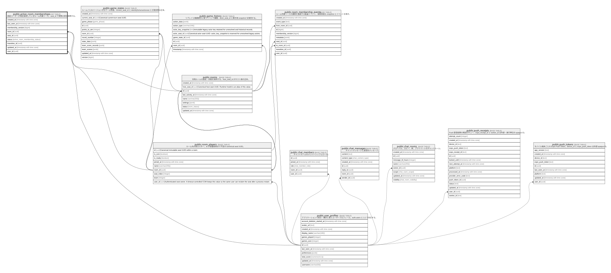

# public.active_room_memberships

## Description

認証ユーザーが現在保持しているルーム所属リース。seat_id で実際の席を参照する。

## Columns

| Name               | Type                          | Default | Nullable | Parents                                                                       |
| ------------------ | ----------------------------- | ------- | -------- | ----------------------------------------------------------------------------- |
| created_at         | timestamp with time zone      | now()   | false    |                                                                               |
| last_seen_at       | timestamp with time zone      | now()   | false    |                                                                               |
| membership_version | bigint                        | 1       | false    |                                                                               |
| player_id          | varchar(255)                  |         | false    |                                                                               |
| room_id            | uuid                          |         | true     | [public.rooms](public.rooms.md) [public.room_players](public.room_players.md) |
| seat_id            | uuid                          |         | true     | [public.room_players](public.room_players.md)                                 |
| status             | active_room_membership_status |         | false    |                                                                               |
| transition_id      | uuid                          |         | false    |                                                                               |
| updated_at         | timestamp with time zone      | now()   | false    |                                                                               |
| user_id            | uuid                          |         | false    | [public.user_profiles](public.user_profiles.md)                               |

## Viewpoints

| Name                                             | Definition                                                           |
| ------------------------------------------------ | -------------------------------------------------------------------- |
| [ルーム所属リース](viewpoint-room-membership.md)         | 同一ユーザーの多重入室を防ぎ、再接続・退出を席UUIDとともに監査する。                                 |

## Constraints

| Name                                        | Type        | Definition                                                                                        |
| ------------------------------------------- | ----------- | ------------------------------------------------------------------------------------------------- |
| active_room_memberships_pkey                | PRIMARY KEY | PRIMARY KEY (user_id)                                                                             |
| active_room_memberships_room_id_fkey        | FOREIGN KEY | FOREIGN KEY (room_id) REFERENCES rooms(id) ON DELETE CASCADE                                      |
| active_room_memberships_room_required       | CHECK       | CHECK (((status = 'moving'::active_room_membership_status) OR (room_id IS NOT NULL)))             |
| active_room_memberships_seat_same_room_fkey | FOREIGN KEY | FOREIGN KEY (room_id, seat_id) REFERENCES room_players(room_id, id) DEFERRABLE INITIALLY DEFERRED |
| active_room_memberships_user_id_fkey        | FOREIGN KEY | FOREIGN KEY (user_id) REFERENCES user_profiles(id) ON DELETE CASCADE                              |
| active_room_memberships_version_positive    | CHECK       | CHECK ((membership_version > 0))                                                                  |

## Indexes

| Name                                    | Definition                                                                                                                                                 |
| --------------------------------------- | ---------------------------------------------------------------------------------------------------------------------------------------------------------- |
| active_room_memberships_pkey            | CREATE UNIQUE INDEX active_room_memberships_pkey ON public.active_room_memberships USING btree (user_id)                                                   |
| active_room_memberships_room_id_idx     | CREATE INDEX active_room_memberships_room_id_idx ON public.active_room_memberships USING btree (room_id) WHERE (room_id IS NOT NULL)                       |
| active_room_memberships_room_player_key | CREATE UNIQUE INDEX active_room_memberships_room_player_key ON public.active_room_memberships USING btree (room_id, player_id) WHERE (room_id IS NOT NULL) |
| active_room_memberships_room_seat_idx   | CREATE INDEX active_room_memberships_room_seat_idx ON public.active_room_memberships USING btree (room_id, seat_id) WHERE (room_id IS NOT NULL)            |

## Triggers

| Name                                      | Definition                                                                                                                                                                                                         |
| ----------------------------------------- | ------------------------------------------------------------------------------------------------------------------------------------------------------------------------------------------------------------------ |
| sync_active_room_membership_seat          | CREATE TRIGGER sync_active_room_membership_seat BEFORE INSERT OR UPDATE OF room_id, player_id, user_id, seat_id ON public.active_room_memberships FOR EACH ROW EXECUTE FUNCTION sync_active_room_membership_seat() |
| update_active_room_memberships_updated_at | CREATE TRIGGER update_active_room_memberships_updated_at BEFORE UPDATE ON public.active_room_memberships FOR EACH ROW EXECUTE FUNCTION update_updated_at_column()                                                  |

## Relations

---

> Generated by [tbls](https://github.com/k1LoW/tbls)
