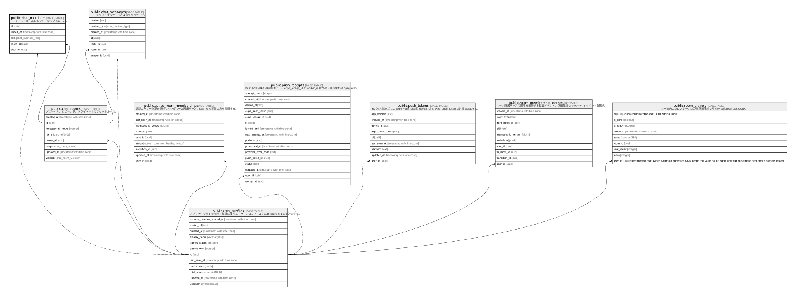

# public.chat_members

## Description

チャットルームのメンバーシップとロール。

## Columns

| Name      | Type                     | Default                    | Nullable | Parents                                         |
| --------- | ------------------------ | -------------------------- | -------- | ----------------------------------------------- |
| id        | uuid                     | uuid_generate_v4()         | false    |                                                 |
| joined_at | timestamp with time zone | now()                      | true     |                                                 |
| role      | chat_member_role         | 'member'::chat_member_role | false    |                                                 |
| room_id   | uuid                     |                            | true     | [public.chat_rooms](public.chat_rooms.md)       |
| user_id   | uuid                     |                            | true     | [public.user_profiles](public.user_profiles.md) |

## Viewpoints

| Name                                                  | Definition                             |
| ----------------------------------------------------- | -------------------------------------- |
| [ソーシャルと通知](viewpoint-social-notifications.md)         | チャットとモバイル Push 通知の永続化。                 |

## Constraints

| Name                             | Type        | Definition                                                        |
| -------------------------------- | ----------- | ----------------------------------------------------------------- |
| chat_members_pkey                | PRIMARY KEY | PRIMARY KEY (id)                                                  |
| chat_members_room_id_fkey        | FOREIGN KEY | FOREIGN KEY (room_id) REFERENCES chat_rooms(id) ON DELETE CASCADE |
| chat_members_room_id_user_id_key | UNIQUE      | UNIQUE (room_id, user_id)                                         |
| chat_members_user_id_fkey        | FOREIGN KEY | FOREIGN KEY (user_id) REFERENCES auth.users(id) ON DELETE CASCADE |

## Indexes

| Name                             | Definition                                                                                                 |
| -------------------------------- | ---------------------------------------------------------------------------------------------------------- |
| chat_members_pkey                | CREATE UNIQUE INDEX chat_members_pkey ON public.chat_members USING btree (id)                              |
| chat_members_room_id_user_id_key | CREATE UNIQUE INDEX chat_members_room_id_user_id_key ON public.chat_members USING btree (room_id, user_id) |
| idx_chat_members_room_id         | CREATE INDEX idx_chat_members_room_id ON public.chat_members USING btree (room_id)                         |
| idx_chat_members_user_id         | CREATE INDEX idx_chat_members_user_id ON public.chat_members USING btree (user_id)                         |

## Relations

---

> Generated by [tbls](https://github.com/k1LoW/tbls)
