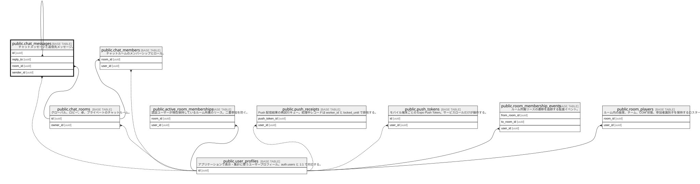

# public.chat_messages

## Description

チャットメッセージと返信先メッセージ。

## Columns

| Name         | Type                     | Default                   | Nullable | Children                                        | Parents                                         |
| ------------ | ------------------------ | ------------------------- | -------- | ----------------------------------------------- | ----------------------------------------------- |
| content      | text                     |                           | false    |                                                 |                                                 |
| content_type | chat_content_type        | 'text'::chat_content_type | false    |                                                 |                                                 |
| created_at   | timestamp with time zone | now()                     | true     |                                                 |                                                 |
| id           | uuid                     | uuid_generate_v4()        | false    | [public.chat_messages](public.chat_messages.md) |                                                 |
| reply_to     | uuid                     |                           | true     |                                                 | [public.chat_messages](public.chat_messages.md) |
| room_id      | uuid                     |                           | true     |                                                 | [public.chat_rooms](public.chat_rooms.md)       |
| sender_id    | uuid                     |                           | true     |                                                 | [public.user_profiles](public.user_profiles.md) |

## Viewpoints

| Name                                                  | Definition                             |
| ----------------------------------------------------- | -------------------------------------- |
| [ソーシャルと通知](viewpoint-social-notifications.md)         | チャットとモバイル Push 通知の永続化。                 |

## Constraints

| Name                         | Type        | Definition                                                             |
| ---------------------------- | ----------- | ---------------------------------------------------------------------- |
| chat_messages_pkey           | PRIMARY KEY | PRIMARY KEY (id)                                                       |
| chat_messages_reply_to_fkey  | FOREIGN KEY | FOREIGN KEY (reply_to) REFERENCES chat_messages(id) ON DELETE SET NULL |
| chat_messages_room_id_fkey   | FOREIGN KEY | FOREIGN KEY (room_id) REFERENCES chat_rooms(id) ON DELETE CASCADE      |
| chat_messages_sender_id_fkey | FOREIGN KEY | FOREIGN KEY (sender_id) REFERENCES auth.users(id) ON DELETE SET NULL   |

## Indexes

| Name                           | Definition                                                                                                 |
| ------------------------------ | ---------------------------------------------------------------------------------------------------------- |
| chat_messages_pkey             | CREATE UNIQUE INDEX chat_messages_pkey ON public.chat_messages USING btree (id)                            |
| idx_chat_messages_created_at   | CREATE INDEX idx_chat_messages_created_at ON public.chat_messages USING btree (created_at)                 |
| idx_chat_messages_room_created | CREATE INDEX idx_chat_messages_room_created ON public.chat_messages USING btree (room_id, created_at DESC) |
| idx_chat_messages_room_id      | CREATE INDEX idx_chat_messages_room_id ON public.chat_messages USING btree (room_id)                       |
| idx_chat_messages_sender_id    | CREATE INDEX idx_chat_messages_sender_id ON public.chat_messages USING btree (sender_id)                   |

## Relations

---

> Generated by [tbls](https://github.com/k1LoW/tbls)
