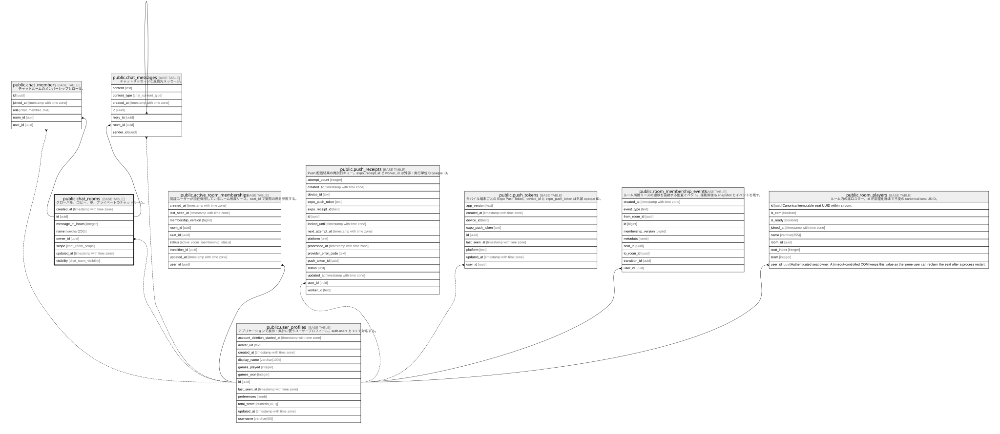

# public.chat_rooms

## Description

グローバル、ロビー、卓、プライベートのチャットルーム。

## Columns

| Name              | Type                     | Default                        | Nullable | Children                                                                                      | Parents                                         |
| ----------------- | ------------------------ | ------------------------------ | -------- | --------------------------------------------------------------------------------------------- | ----------------------------------------------- |
| created_at        | timestamp with time zone | now()                          | true     |                                                                                               |                                                 |
| id                | uuid                     | uuid_generate_v4()             | false    | [public.chat_members](public.chat_members.md) [public.chat_messages](public.chat_messages.md) |                                                 |
| message_ttl_hours | integer                  | 24                             | false    |                                                                                               |                                                 |
| name              | varchar(255)             |                                | true     |                                                                                               |                                                 |
| owner_id          | uuid                     |                                | true     |                                                                                               | [public.user_profiles](public.user_profiles.md) |
| scope             | chat_room_scope          |                                | false    |                                                                                               |                                                 |
| updated_at        | timestamp with time zone | now()                          | true     |                                                                                               |                                                 |
| visibility        | chat_room_visibility     | 'public'::chat_room_visibility | false    |                                                                                               |                                                 |

## Viewpoints

| Name                                                  | Definition                             |
| ----------------------------------------------------- | -------------------------------------- |
| [ソーシャルと通知](viewpoint-social-notifications.md)         | チャットとモバイル Push 通知の永続化。                 |

## Constraints

| Name                     | Type        | Definition                                                          |
| ------------------------ | ----------- | ------------------------------------------------------------------- |
| chat_rooms_owner_id_fkey | FOREIGN KEY | FOREIGN KEY (owner_id) REFERENCES auth.users(id) ON DELETE SET NULL |
| chat_rooms_pkey          | PRIMARY KEY | PRIMARY KEY (id)                                                    |

## Indexes

| Name                      | Definition                                                                           |
| ------------------------- | ------------------------------------------------------------------------------------ |
| chat_rooms_pkey           | CREATE UNIQUE INDEX chat_rooms_pkey ON public.chat_rooms USING btree (id)            |
| idx_chat_rooms_owner_id   | CREATE INDEX idx_chat_rooms_owner_id ON public.chat_rooms USING btree (owner_id)     |
| idx_chat_rooms_scope      | CREATE INDEX idx_chat_rooms_scope ON public.chat_rooms USING btree (scope)           |
| idx_chat_rooms_visibility | CREATE INDEX idx_chat_rooms_visibility ON public.chat_rooms USING btree (visibility) |

## Triggers

| Name                         | Definition                                                                                                                              |
| ---------------------------- | --------------------------------------------------------------------------------------------------------------------------------------- |
| update_chat_rooms_updated_at | CREATE TRIGGER update_chat_rooms_updated_at BEFORE UPDATE ON public.chat_rooms FOR EACH ROW EXECUTE FUNCTION update_updated_at_column() |

## Relations

---

> Generated by [tbls](https://github.com/k1LoW/tbls)
