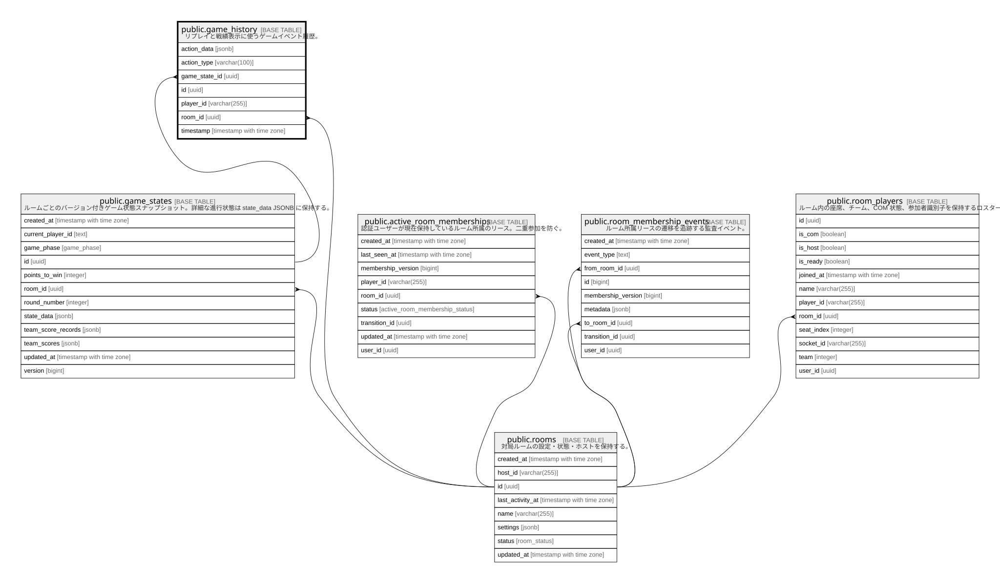

# public.game_history

## Description

リプレイと戦績表示に使うゲームイベント履歴。

## Columns

| Name          | Type                     | Default            | Nullable | Parents                                     |
| ------------- | ------------------------ | ------------------ | -------- | ------------------------------------------- |
| action_data   | jsonb                    | '{}'::jsonb        | true     |                                             |
| action_type   | varchar(100)             |                    | false    |                                             |
| game_state_id | uuid                     |                    | true     | [public.game_states](public.game_states.md) |
| id            | uuid                     | uuid_generate_v4() | false    |                                             |
| player_id     | varchar(255)             |                    | true     |                                             |
| room_id       | uuid                     |                    | true     | [public.rooms](public.rooms.md)             |
| timestamp     | timestamp with time zone | now()              | true     |                                             |

## Viewpoints

| Name                                | Definition                                     |
| ----------------------------------- | ---------------------------------------------- |
| [ゲーム進行](viewpoint-gameplay.md)      | ルーム、座席、ゲーム状態、リプレイ履歴の関係。                        |

## Constraints

| Name                            | Type        | Definition                                                               |
| ------------------------------- | ----------- | ------------------------------------------------------------------------ |
| game_history_game_state_id_fkey | FOREIGN KEY | FOREIGN KEY (game_state_id) REFERENCES game_states(id) ON DELETE CASCADE |
| game_history_pkey               | PRIMARY KEY | PRIMARY KEY (id)                                                         |
| game_history_room_id_fkey       | FOREIGN KEY | FOREIGN KEY (room_id) REFERENCES rooms(id) ON DELETE CASCADE             |

## Indexes

| Name                       | Definition                                                                               |
| -------------------------- | ---------------------------------------------------------------------------------------- |
| game_history_pkey          | CREATE UNIQUE INDEX game_history_pkey ON public.game_history USING btree (id)            |
| idx_game_history_room_id   | CREATE INDEX idx_game_history_room_id ON public.game_history USING btree (room_id)       |
| idx_game_history_timestamp | CREATE INDEX idx_game_history_timestamp ON public.game_history USING btree ("timestamp") |

## Relations

---

> Generated by [tbls](https://github.com/k1LoW/tbls)
