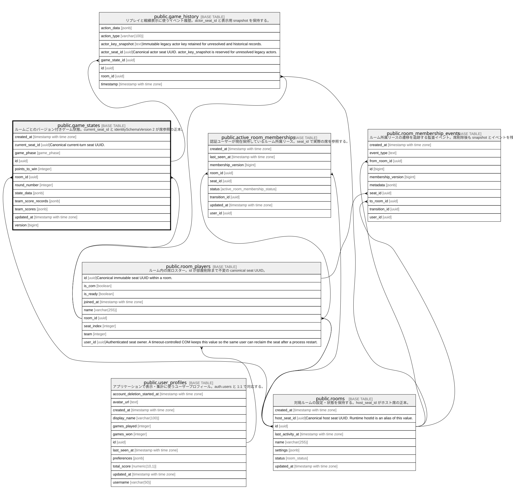

# public.game_states

## Description

ルームごとのバージョン付きゲーム状態。current_seat_id と identitySchemaVersion 2 が席参照の正本。

## Columns

| Name               | Type                     | Default                                                               | Nullable | Children                                      | Parents                                                                       | Comment                                               |
| ------------------ | ------------------------ | --------------------------------------------------------------------- | -------- | --------------------------------------------- | ----------------------------------------------------------------------------- | ----------------------------------------------------- |
| created_at         | timestamp with time zone | now()                                                                 | true     |                                               |                                                                               |                                                       |
| current_player_id  | text                     |                                                                       | true     |                                               |                                                                               |                                                       |
| current_seat_id    | uuid                     |                                                                       | true     |                                               | [public.room_players](public.room_players.md)                                 | Canonical current-turn seat UUID scoped to this room. |
| game_phase         | game_phase               |                                                                       | true     |                                               |                                                                               |                                                       |
| id                 | uuid                     | uuid_generate_v4()                                                    | false    | [public.game_history](public.game_history.md) |                                                                               |                                                       |
| points_to_win      | integer                  | 10                                                                    | true     |                                               |                                                                               |                                                       |
| room_id            | uuid                     |                                                                       | true     |                                               | [public.rooms](public.rooms.md) [public.room_players](public.room_players.md) |                                                       |
| round_number       | integer                  | 1                                                                     | true     |                                               |                                                                               |                                                       |
| state_data         | jsonb                    | '{}'::jsonb                                                           | false    |                                               |                                                                               |                                                       |
| team_score_records | jsonb                    | '{"0": [], "1": []}'::jsonb                                           | true     |                                               |                                                                               |                                                       |
| team_scores        | jsonb                    | '{"0": {"play": 0, "total": 0}, "1": {"play": 0, "total": 0}}'::jsonb | true     |                                               |                                                                               |                                                       |
| updated_at         | timestamp with time zone | now()                                                                 | true     |                                               |                                                                               |                                                       |
| version            | bigint                   | 0                                                                     | false    |                                               |                                                                               |                                                       |

## Viewpoints

| Name                                | Definition                                               |
| ----------------------------------- | -------------------------------------------------------- |
| [ゲーム進行](viewpoint-gameplay.md)      | ルーム、canonical seat、ゲーム状態、リプレイ履歴の関係。                      |

## Constraints

| Name                                    | Type        | Definition                                                                                                                                     |
| --------------------------------------- | ----------- | ---------------------------------------------------------------------------------------------------------------------------------------------- |
| game_states_current_seat_same_room_fkey | FOREIGN KEY | FOREIGN KEY (room_id, current_seat_id) REFERENCES room_players(room_id, id) ON DELETE SET NULL (current_seat_id) DEFERRABLE INITIALLY DEFERRED |
| game_states_pkey                        | PRIMARY KEY | PRIMARY KEY (id)                                                                                                                               |
| game_states_room_id_fkey                | FOREIGN KEY | FOREIGN KEY (room_id) REFERENCES rooms(id) ON DELETE CASCADE                                                                                   |
| game_states_room_id_key                 | UNIQUE      | UNIQUE (room_id)                                                                                                                               |

## Indexes

| Name                            | Definition                                                                                                                           |
| ------------------------------- | ------------------------------------------------------------------------------------------------------------------------------------ |
| game_states_current_seat_id_idx | CREATE INDEX game_states_current_seat_id_idx ON public.game_states USING btree (current_seat_id) WHERE (current_seat_id IS NOT NULL) |
| game_states_pkey                | CREATE UNIQUE INDEX game_states_pkey ON public.game_states USING btree (id)                                                          |
| game_states_room_id_key         | CREATE UNIQUE INDEX game_states_room_id_key ON public.game_states USING btree (room_id)                                              |
| idx_game_states_room_id         | CREATE INDEX idx_game_states_room_id ON public.game_states USING btree (room_id)                                                     |

## Triggers

| Name                                  | Definition                                                                                                                                                                                                     |
| ------------------------------------- | -------------------------------------------------------------------------------------------------------------------------------------------------------------------------------------------------------------- |
| sync_game_state_current_seat_identity | CREATE TRIGGER sync_game_state_current_seat_identity BEFORE INSERT OR UPDATE OF current_player_id, current_seat_id ON public.game_states FOR EACH ROW EXECUTE FUNCTION sync_game_state_current_seat_identity() |
| update_game_states_updated_at         | CREATE TRIGGER update_game_states_updated_at BEFORE UPDATE ON public.game_states FOR EACH ROW EXECUTE FUNCTION update_updated_at_column()                                                                      |

## Relations

---

> Generated by [tbls](https://github.com/k1LoW/tbls)
