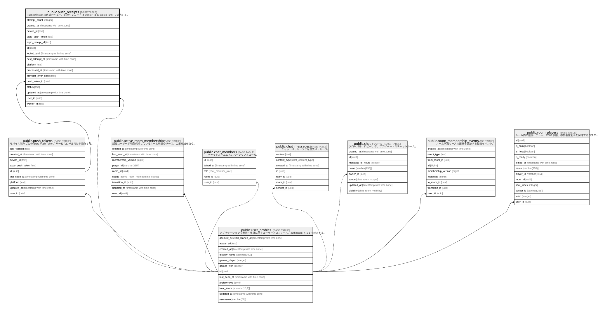

# public.push_receipts

## Description

Push 配信結果の再試行キュー。処理中レコードは worker_id と locked_until で排他する。

## Columns

| Name                | Type                     | Default                        | Nullable | Parents                                         |
| ------------------- | ------------------------ | ------------------------------ | -------- | ----------------------------------------------- |
| attempt_count       | integer                  | 0                              | false    |                                                 |
| created_at          | timestamp with time zone | now()                          | false    |                                                 |
| device_id           | text                     |                                | false    |                                                 |
| expo_push_token     | text                     |                                | false    |                                                 |
| expo_receipt_id     | text                     |                                | false    |                                                 |
| id                  | uuid                     | uuid_generate_v4()             | false    |                                                 |
| locked_until        | timestamp with time zone |                                | true     |                                                 |
| next_attempt_at     | timestamp with time zone | (now() + '00:15:00'::interval) | false    |                                                 |
| platform            | text                     |                                | false    |                                                 |
| processed_at        | timestamp with time zone |                                | true     |                                                 |
| provider_error_code | text                     |                                | true     |                                                 |
| push_token_id       | uuid                     |                                | true     | [public.push_tokens](public.push_tokens.md)     |
| status              | text                     | 'pending'::text                | false    |                                                 |
| updated_at          | timestamp with time zone | now()                          | false    |                                                 |
| user_id             | uuid                     |                                | false    | [public.user_profiles](public.user_profiles.md) |
| worker_id           | text                     |                                | true     |                                                 |

## Viewpoints

| Name                                                  | Definition                             |
| ----------------------------------------------------- | -------------------------------------- |
| [ソーシャルと通知](viewpoint-social-notifications.md)         | チャットとモバイル Push 通知の永続化。                 |

## Constraints

| Name                               | Type        | Definition                                                                                                                         |
| ---------------------------------- | ----------- | ---------------------------------------------------------------------------------------------------------------------------------- |
| push_receipts_attempt_count_check  | CHECK       | CHECK ((attempt_count >= 0))                                                                                                       |
| push_receipts_device_id_check      | CHECK       | CHECK (((char_length(device_id) >= 1) AND (char_length(device_id) <= 255)))                                                        |
| push_receipts_expo_receipt_id_key  | UNIQUE      | UNIQUE (expo_receipt_id)                                                                                                           |
| push_receipts_pkey                 | PRIMARY KEY | PRIMARY KEY (id)                                                                                                                   |
| push_receipts_platform_check       | CHECK       | CHECK ((platform = ANY (ARRAY['ios'::text, 'android'::text])))                                                                     |
| push_receipts_provider_error_check | CHECK       | CHECK (((provider_error_code IS NULL) OR ((char_length(provider_error_code) >= 1) AND (char_length(provider_error_code) <= 100)))) |
| push_receipts_push_token_id_fkey   | FOREIGN KEY | FOREIGN KEY (push_token_id) REFERENCES push_tokens(id) ON DELETE SET NULL                                                          |
| push_receipts_status_check         | CHECK       | CHECK ((status = ANY (ARRAY['pending'::text, 'processing'::text, 'delivered'::text, 'failed'::text, 'expired'::text])))            |
| push_receipts_token_check          | CHECK       | CHECK ((expo_push_token ~ '^(Expo|Exponent)PushToken\[[^]]+\]$'::text))                                                            |
| push_receipts_user_id_fkey         | FOREIGN KEY | FOREIGN KEY (user_id) REFERENCES auth.users(id) ON DELETE CASCADE                                                                  |
| push_receipts_worker_id_check      | CHECK       | CHECK (((worker_id IS NULL) OR ((char_length(worker_id) >= 1) AND (char_length(worker_id) <= 128))))                               |

## Indexes

| Name                              | Definition                                                                                                                                |
| --------------------------------- | ----------------------------------------------------------------------------------------------------------------------------------------- |
| idx_push_receipts_pending         | CREATE INDEX idx_push_receipts_pending ON public.push_receipts USING btree (next_attempt_at, created_at) WHERE (status = 'pending'::text) |
| idx_push_receipts_processing_lock | CREATE INDEX idx_push_receipts_processing_lock ON public.push_receipts USING btree (locked_until) WHERE (status = 'processing'::text)     |
| idx_push_receipts_user_id         | CREATE INDEX idx_push_receipts_user_id ON public.push_receipts USING btree (user_id)                                                      |
| push_receipts_expo_receipt_id_key | CREATE UNIQUE INDEX push_receipts_expo_receipt_id_key ON public.push_receipts USING btree (expo_receipt_id)                               |
| push_receipts_pkey                | CREATE UNIQUE INDEX push_receipts_pkey ON public.push_receipts USING btree (id)                                                           |

## Triggers

| Name                            | Definition                                                                                                                                    |
| ------------------------------- | --------------------------------------------------------------------------------------------------------------------------------------------- |
| update_push_receipts_updated_at | CREATE TRIGGER update_push_receipts_updated_at BEFORE UPDATE ON public.push_receipts FOR EACH ROW EXECUTE FUNCTION update_updated_at_column() |

## Relations

---

> Generated by [tbls](https://github.com/k1LoW/tbls)
