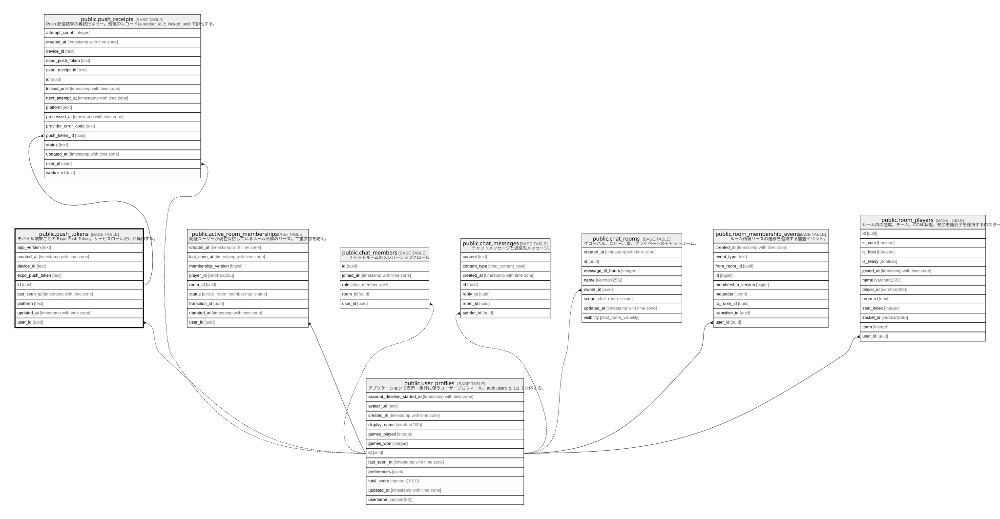

# public.push_tokens

## Description

モバイル端末ごとの Expo Push Token。サービスロールだけが操作する。

## Columns

| Name            | Type                     | Default            | Nullable | Children                                        | Parents                                         |
| --------------- | ------------------------ | ------------------ | -------- | ----------------------------------------------- | ----------------------------------------------- |
| app_version     | text                     |                    | true     |                                                 |                                                 |
| created_at      | timestamp with time zone | now()              | false    |                                                 |                                                 |
| device_id       | text                     |                    | false    |                                                 |                                                 |
| expo_push_token | text                     |                    | false    |                                                 |                                                 |
| id              | uuid                     | uuid_generate_v4() | false    | [public.push_receipts](public.push_receipts.md) |                                                 |
| last_seen_at    | timestamp with time zone | now()              | false    |                                                 |                                                 |
| platform        | text                     |                    | false    |                                                 |                                                 |
| updated_at      | timestamp with time zone | now()              | false    |                                                 |                                                 |
| user_id         | uuid                     |                    | false    |                                                 | [public.user_profiles](public.user_profiles.md) |

## Viewpoints

| Name                                                  | Definition                             |
| ----------------------------------------------------- | -------------------------------------- |
| [ソーシャルと通知](viewpoint-social-notifications.md)         | チャットとモバイル Push 通知の永続化。                 |

## Constraints

| Name                               | Type        | Definition                                                              |
| ---------------------------------- | ----------- | ----------------------------------------------------------------------- |
| push_tokens_device_platform_unique | UNIQUE      | UNIQUE (user_id, device_id, platform)                                   |
| push_tokens_pkey                   | PRIMARY KEY | PRIMARY KEY (id)                                                        |
| push_tokens_platform_check         | CHECK       | CHECK ((platform = ANY (ARRAY['ios'::text, 'android'::text])))          |
| push_tokens_token_format_check     | CHECK       | CHECK ((expo_push_token ~ '^(Expo|Exponent)PushToken\[[^]]+\]$'::text)) |
| push_tokens_token_unique           | UNIQUE      | UNIQUE (expo_push_token)                                                |
| push_tokens_user_id_fkey           | FOREIGN KEY | FOREIGN KEY (user_id) REFERENCES auth.users(id) ON DELETE CASCADE       |

## Indexes

| Name                               | Definition                                                                                                              |
| ---------------------------------- | ----------------------------------------------------------------------------------------------------------------------- |
| idx_push_tokens_last_seen_at       | CREATE INDEX idx_push_tokens_last_seen_at ON public.push_tokens USING btree (last_seen_at)                              |
| idx_push_tokens_user_id            | CREATE INDEX idx_push_tokens_user_id ON public.push_tokens USING btree (user_id)                                        |
| push_tokens_device_platform_unique | CREATE UNIQUE INDEX push_tokens_device_platform_unique ON public.push_tokens USING btree (user_id, device_id, platform) |
| push_tokens_pkey                   | CREATE UNIQUE INDEX push_tokens_pkey ON public.push_tokens USING btree (id)                                             |
| push_tokens_token_unique           | CREATE UNIQUE INDEX push_tokens_token_unique ON public.push_tokens USING btree (expo_push_token)                        |

## Triggers

| Name                          | Definition                                                                                                                                |
| ----------------------------- | ----------------------------------------------------------------------------------------------------------------------------------------- |
| update_push_tokens_updated_at | CREATE TRIGGER update_push_tokens_updated_at BEFORE UPDATE ON public.push_tokens FOR EACH ROW EXECUTE FUNCTION update_updated_at_column() |

## Relations

---

> Generated by [tbls](https://github.com/k1LoW/tbls)
