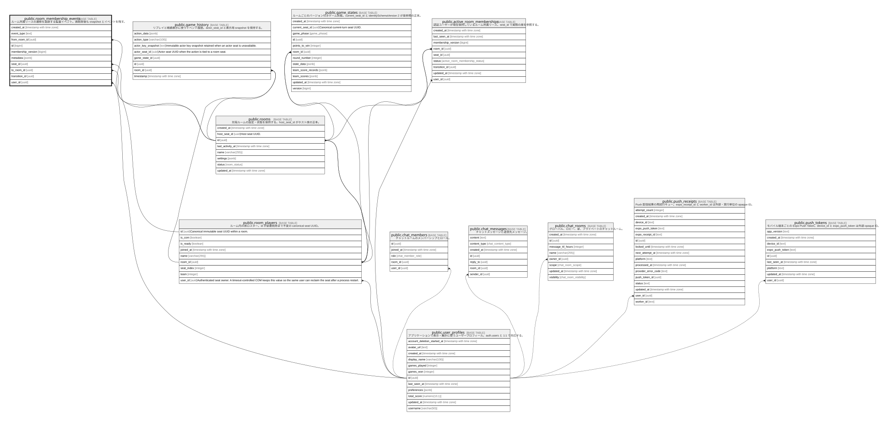

# public.room_membership_events

## Description

ルーム所属リースの遷移を追跡する監査イベント。

## Columns

| Name               | Type                     | Default     | Nullable | Parents                                         |
| ------------------ | ------------------------ | ----------- | -------- | ----------------------------------------------- |
| created_at         | timestamp with time zone | now()       | false    |                                                 |
| event_type         | text                     |             | false    |                                                 |
| from_room_id       | uuid                     |             | true     | [public.rooms](public.rooms.md)                 |
| id                 | bigint                   |             | false    |                                                 |
| membership_version | bigint                   |             | true     |                                                 |
| metadata           | jsonb                    | '{}'::jsonb | false    |                                                 |
| to_room_id         | uuid                     |             | true     | [public.rooms](public.rooms.md)                 |
| transition_id      | uuid                     |             | false    |                                                 |
| user_id            | uuid                     |             | false    | [public.user_profiles](public.user_profiles.md) |

## Viewpoints

| Name                                             | Definition                                                           |
| ------------------------------------------------ | -------------------------------------------------------------------- |
| [ルーム所属リース](viewpoint-room-membership.md)         | 同一ユーザーの多重入室を防ぎ、再接続・退出を監査するための所属管理。                                   |

## Constraints

| Name                                     | Type        | Definition                                                           |
| ---------------------------------------- | ----------- | -------------------------------------------------------------------- |
| room_membership_events_from_room_id_fkey | FOREIGN KEY | FOREIGN KEY (from_room_id) REFERENCES rooms(id) ON DELETE SET NULL   |
| room_membership_events_pkey              | PRIMARY KEY | PRIMARY KEY (id)                                                     |
| room_membership_events_to_room_id_fkey   | FOREIGN KEY | FOREIGN KEY (to_room_id) REFERENCES rooms(id) ON DELETE SET NULL     |
| room_membership_events_user_id_fkey      | FOREIGN KEY | FOREIGN KEY (user_id) REFERENCES user_profiles(id) ON DELETE CASCADE |

## Indexes

| Name                                    | Definition                                                                                                                   |
| --------------------------------------- | ---------------------------------------------------------------------------------------------------------------------------- |
| room_membership_events_pkey             | CREATE UNIQUE INDEX room_membership_events_pkey ON public.room_membership_events USING btree (id)                            |
| room_membership_events_transition_idx   | CREATE INDEX room_membership_events_transition_idx ON public.room_membership_events USING btree (transition_id)              |
| room_membership_events_user_created_idx | CREATE INDEX room_membership_events_user_created_idx ON public.room_membership_events USING btree (user_id, created_at DESC) |

## Relations

---

> Generated by [tbls](https://github.com/k1LoW/tbls)
