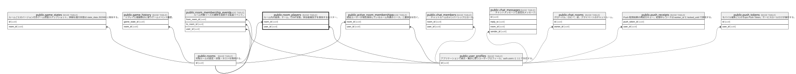

# public.room_players

## Description

ルーム内の席ロスター。id が部屋削除まで不変の canonical seat UUID。

## Columns

| Name       | Type                     | Default            | Nullable | Children                                                                                                                                                                                                                                                        | Parents                                         | Comment                                                                                                                            |
| ---------- | ------------------------ | ------------------ | -------- | --------------------------------------------------------------------------------------------------------------------------------------------------------------------------------------------------------------------------------------------------------------- | ----------------------------------------------- | ---------------------------------------------------------------------------------------------------------------------------------- |
| id         | uuid                     | uuid_generate_v4() | false    | [public.active_room_memberships](public.active_room_memberships.md) [public.game_history](public.game_history.md) [public.game_states](public.game_states.md) [public.room_membership_events](public.room_membership_events.md) [public.rooms](public.rooms.md) |                                                 | Canonical immutable seat UUID within a room.                                                                                       |
| is_com     | boolean                  | false              | false    |                                                                                                                                                                                                                                                                 |                                                 |                                                                                                                                    |
| is_ready   | boolean                  | false              | true     |                                                                                                                                                                                                                                                                 |                                                 |                                                                                                                                    |
| joined_at  | timestamp with time zone | now()              | true     |                                                                                                                                                                                                                                                                 |                                                 |                                                                                                                                    |
| name       | varchar(255)             |                    | false    |                                                                                                                                                                                                                                                                 |                                                 |                                                                                                                                    |
| room_id    | uuid                     |                    | true     | [public.active_room_memberships](public.active_room_memberships.md) [public.game_history](public.game_history.md) [public.game_states](public.game_states.md) [public.rooms](public.rooms.md)                                                                   | [public.rooms](public.rooms.md)                 |                                                                                                                                    |
| seat_index | integer                  |                    | false    |                                                                                                                                                                                                                                                                 |                                                 |                                                                                                                                    |
| team       | integer                  | 0                  | false    |                                                                                                                                                                                                                                                                 |                                                 |                                                                                                                                    |
| user_id    | uuid                     |                    | true     |                                                                                                                                                                                                                                                                 | [public.user_profiles](public.user_profiles.md) | Authenticated seat owner. A timeout-controlled COM keeps this value so the same user can reclaim the seat after a process restart. |

## Viewpoints

| Name                                             | Definition                                                           |
| ------------------------------------------------ | -------------------------------------------------------------------- |
| [ゲーム進行](viewpoint-gameplay.md)                   | ルーム、canonical seat、ゲーム状態、リプレイ履歴の関係。                                  |
| [ルーム所属リース](viewpoint-room-membership.md)         | 同一ユーザーの多重入室を防ぎ、再接続・退出を席UUIDとともに監査する。                                 |

## Constraints

| Name                                | Type        | Definition                                                            |
| ----------------------------------- | ----------- | --------------------------------------------------------------------- |
| room_players_pkey                   | PRIMARY KEY | PRIMARY KEY (id)                                                      |
| room_players_room_id_fkey           | FOREIGN KEY | FOREIGN KEY (room_id) REFERENCES rooms(id) ON DELETE CASCADE          |
| room_players_room_id_id_key         | UNIQUE      | UNIQUE (room_id, id)                                                  |
| room_players_room_id_seat_index_key | UNIQUE      | UNIQUE (room_id, seat_index) DEFERRABLE INITIALLY DEFERRED            |
| room_players_user_id_fkey           | FOREIGN KEY | FOREIGN KEY (user_id) REFERENCES user_profiles(id) ON DELETE SET NULL |

## Indexes

| Name                                | Definition                                                                                                                          |
| ----------------------------------- | ----------------------------------------------------------------------------------------------------------------------------------- |
| idx_room_players_room_id            | CREATE INDEX idx_room_players_room_id ON public.room_players USING btree (room_id)                                                  |
| idx_room_players_user_id            | CREATE INDEX idx_room_players_user_id ON public.room_players USING btree (user_id)                                                  |
| room_players_pkey                   | CREATE UNIQUE INDEX room_players_pkey ON public.room_players USING btree (id)                                                       |
| room_players_room_id_id_key         | CREATE UNIQUE INDEX room_players_room_id_id_key ON public.room_players USING btree (room_id, id)                                    |
| room_players_room_id_seat_index_key | CREATE UNIQUE INDEX room_players_room_id_seat_index_key ON public.room_players USING btree (room_id, seat_index)                    |
| room_players_room_user_unique       | CREATE UNIQUE INDEX room_players_room_user_unique ON public.room_players USING btree (room_id, user_id) WHERE (user_id IS NOT NULL) |

## Triggers

| Name                              | Definition                                                                                                                                                                 |
| --------------------------------- | -------------------------------------------------------------------------------------------------------------------------------------------------------------------------- |
| reject_deleting_room_player_user  | CREATE TRIGGER reject_deleting_room_player_user BEFORE INSERT OR UPDATE OF user_id ON public.room_players FOR EACH ROW EXECUTE FUNCTION reject_deleting_room_player_user() |
| reject_room_player_seat_delete    | CREATE TRIGGER reject_room_player_seat_delete BEFORE DELETE ON public.room_players FOR EACH ROW EXECUTE FUNCTION reject_room_player_seat_delete()                          |
| reject_room_player_seat_id_change | CREATE TRIGGER reject_room_player_seat_id_change BEFORE UPDATE OF id, room_id ON public.room_players FOR EACH ROW EXECUTE FUNCTION reject_room_player_seat_id_change()     |

## Relations

---

> Generated by [tbls](https://github.com/k1LoW/tbls)
