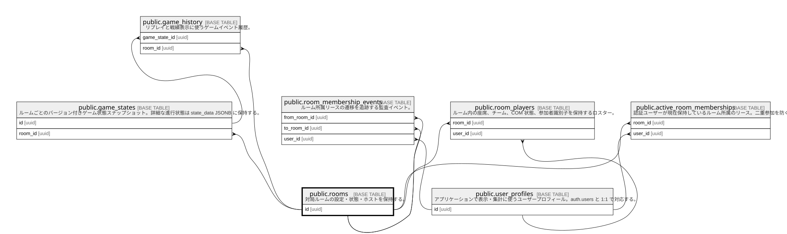

# public.rooms

## Description

対局ルームの設定・状態・ホストを保持する。

## Columns

| Name             | Type                     | Default                                                                                                                                        | Nullable | Children                                                                                                                                                                                                                                                                      |
| ---------------- | ------------------------ | ---------------------------------------------------------------------------------------------------------------------------------------------- | -------- | ----------------------------------------------------------------------------------------------------------------------------------------------------------------------------------------------------------------------------------------------------------------------------- |
| created_at       | timestamp with time zone | now()                                                                                                                                          | true     |                                                                                                                                                                                                                                                                               |
| host_id          | varchar(255)             |                                                                                                                                                | false    |                                                                                                                                                                                                                                                                               |
| id               | uuid                     | uuid_generate_v4()                                                                                                                             | false    | [public.active_room_memberships](public.active_room_memberships.md) [public.game_history](public.game_history.md) [public.game_states](public.game_states.md) [public.room_membership_events](public.room_membership_events.md) [public.room_players](public.room_players.md) |
| last_activity_at | timestamp with time zone | now()                                                                                                                                          | true     |                                                                                                                                                                                                                                                                               |
| name             | varchar(255)             |                                                                                                                                                | false    |                                                                                                                                                                                                                                                                               |
| settings         | jsonb                    | '{"password": null, "isPrivate": false, "maxPlayers": 4, "pointsToWin": 10, "allowSpectators": true, "teamAssignmentMethod": "random"}'::jsonb | false    |                                                                                                                                                                                                                                                                               |
| status           | room_status              | 'waiting'::room_status                                                                                                                         | false    |                                                                                                                                                                                                                                                                               |
| updated_at       | timestamp with time zone | now()                                                                                                                                          | true     |                                                                                                                                                                                                                                                                               |

## Viewpoints

| Name                                             | Definition                                                           |
| ------------------------------------------------ | -------------------------------------------------------------------- |
| [ゲーム進行](viewpoint-gameplay.md)                   | ルーム、座席、ゲーム状態、リプレイ履歴の関係。                                              |
| [ルーム所属リース](viewpoint-room-membership.md)         | 同一ユーザーの多重入室を防ぎ、再接続・退出を監査するための所属管理。                                   |

## Constraints

| Name       | Type        | Definition       |
| ---------- | ----------- | ---------------- |
| rooms_pkey | PRIMARY KEY | PRIMARY KEY (id) |

## Indexes

| Name                    | Definition                                                                          |
| ----------------------- | ----------------------------------------------------------------------------------- |
| idx_rooms_host_id       | CREATE INDEX idx_rooms_host_id ON public.rooms USING btree (host_id)                |
| idx_rooms_last_activity | CREATE INDEX idx_rooms_last_activity ON public.rooms USING btree (last_activity_at) |
| idx_rooms_status        | CREATE INDEX idx_rooms_status ON public.rooms USING btree (status)                  |
| rooms_pkey              | CREATE UNIQUE INDEX rooms_pkey ON public.rooms USING btree (id)                     |

## Triggers

| Name                      | Definition                                                                                                                                            |
| ------------------------- | ----------------------------------------------------------------------------------------------------------------------------------------------------- |
| reject_deleting_room_host | CREATE TRIGGER reject_deleting_room_host BEFORE INSERT OR UPDATE OF host_id ON public.rooms FOR EACH ROW EXECUTE FUNCTION reject_deleting_room_host() |
| update_rooms_updated_at   | CREATE TRIGGER update_rooms_updated_at BEFORE UPDATE ON public.rooms FOR EACH ROW EXECUTE FUNCTION update_updated_at_column()                         |

## Relations

---

> Generated by [tbls](https://github.com/k1LoW/tbls)
