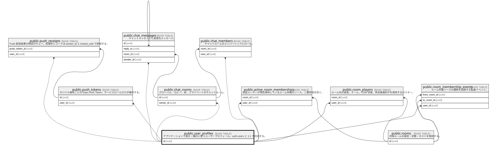

# public.user_profiles

## Description

アプリケーションで表示・集計に使うユーザープロフィール。auth.users と 1:1 で対応する。

## Columns

| Name                        | Type                     | Default                                                                                   | Nullable | Children                                                                                                                                                                                                                                                                                                                                                                                                                |
| --------------------------- | ------------------------ | ----------------------------------------------------------------------------------------- | -------- | ----------------------------------------------------------------------------------------------------------------------------------------------------------------------------------------------------------------------------------------------------------------------------------------------------------------------------------------------------------------------------------------------------------------------- |
| account_deletion_started_at | timestamp with time zone |                                                                                           | true     |                                                                                                                                                                                                                                                                                                                                                                                                                         |
| avatar_url                  | text                     |                                                                                           | true     |                                                                                                                                                                                                                                                                                                                                                                                                                         |
| created_at                  | timestamp with time zone | now()                                                                                     | true     |                                                                                                                                                                                                                                                                                                                                                                                                                         |
| display_name                | varchar(100)             |                                                                                           | false    |                                                                                                                                                                                                                                                                                                                                                                                                                         |
| games_played                | integer                  | 0                                                                                         | true     |                                                                                                                                                                                                                                                                                                                                                                                                                         |
| games_won                   | integer                  | 0                                                                                         | true     |                                                                                                                                                                                                                                                                                                                                                                                                                         |
| id                          | uuid                     |                                                                                           | false    | [public.active_room_memberships](public.active_room_memberships.md) [public.chat_members](public.chat_members.md) [public.chat_messages](public.chat_messages.md) [public.chat_rooms](public.chat_rooms.md) [public.push_receipts](public.push_receipts.md) [public.push_tokens](public.push_tokens.md) [public.room_membership_events](public.room_membership_events.md) [public.room_players](public.room_players.md) |
| last_seen_at                | timestamp with time zone | now()                                                                                     | true     |                                                                                                                                                                                                                                                                                                                                                                                                                         |
| preferences                 | jsonb                    | '{"sound": true, "theme": "light", "fontSize": "standard", "notifications": true}'::jsonb | true     |                                                                                                                                                                                                                                                                                                                                                                                                                         |
| total_score                 | numeric(10,1)            | 0                                                                                         | true     |                                                                                                                                                                                                                                                                                                                                                                                                                         |
| updated_at                  | timestamp with time zone | now()                                                                                     | true     |                                                                                                                                                                                                                                                                                                                                                                                                                         |
| username                    | varchar(50)              |                                                                                           | false    |                                                                                                                                                                                                                                                                                                                                                                                                                         |

## Viewpoints

| Name                                                  | Definition                                                           |
| ----------------------------------------------------- | -------------------------------------------------------------------- |
| [ゲーム進行](viewpoint-gameplay.md)                        | ルーム、canonical seat、ゲーム状態、リプレイ履歴の関係。                                  |
| [ルーム所属リース](viewpoint-room-membership.md)              | 同一ユーザーの多重入室を防ぎ、再接続・退出を席UUIDとともに監査する。                                 |
| [ソーシャルと通知](viewpoint-social-notifications.md)         | チャットとモバイル Push 通知の永続化。                                               |

## Constraints

| Name                       | Type        | Definition                                                   |
| -------------------------- | ----------- | ------------------------------------------------------------ |
| display_name_length        | CHECK       | CHECK ((char_length((display_name)::text) >= 1))             |
| user_profiles_id_fkey      | FOREIGN KEY | FOREIGN KEY (id) REFERENCES auth.users(id) ON DELETE CASCADE |
| user_profiles_pkey         | PRIMARY KEY | PRIMARY KEY (id)                                             |
| user_profiles_username_key | UNIQUE      | UNIQUE (username)                                            |
| username_length            | CHECK       | CHECK ((char_length((username)::text) >= 3))                 |

## Indexes

| Name                                          | Definition                                                                                                                                                                   |
| --------------------------------------------- | ---------------------------------------------------------------------------------------------------------------------------------------------------------------------------- |
| idx_user_profiles_account_deletion_started_at | CREATE INDEX idx_user_profiles_account_deletion_started_at ON public.user_profiles USING btree (account_deletion_started_at) WHERE (account_deletion_started_at IS NOT NULL) |
| idx_user_profiles_last_seen                   | CREATE INDEX idx_user_profiles_last_seen ON public.user_profiles USING btree (last_seen_at)                                                                                  |
| idx_user_profiles_username                    | CREATE INDEX idx_user_profiles_username ON public.user_profiles USING btree (username)                                                                                       |
| user_profiles_pkey                            | CREATE UNIQUE INDEX user_profiles_pkey ON public.user_profiles USING btree (id)                                                                                              |
| user_profiles_username_key                    | CREATE UNIQUE INDEX user_profiles_username_key ON public.user_profiles USING btree (username)                                                                                |

## Triggers

| Name                            | Definition                                                                                                                                    |
| ------------------------------- | --------------------------------------------------------------------------------------------------------------------------------------------- |
| update_user_profiles_updated_at | CREATE TRIGGER update_user_profiles_updated_at BEFORE UPDATE ON public.user_profiles FOR EACH ROW EXECUTE FUNCTION update_updated_at_column() |

## Relations

---

> Generated by [tbls](https://github.com/k1LoW/tbls)
