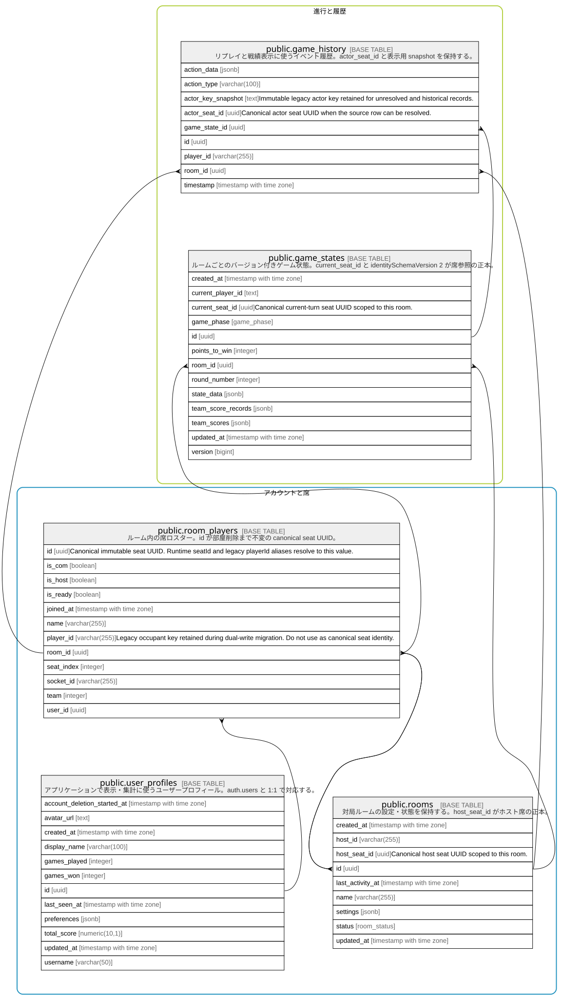

# ゲーム進行

## Description

ルーム、座席、ゲーム状態、リプレイ履歴の関係。

## Tables

### 参加者とルーム

ユーザー、ルーム、卓上の座席を結ぶテーブル。

| Name                                            | Columns | Comment                                                                                | Type       |
| ----------------------------------------------- | ------- | -------------------------------------------------------------------------------------- | ---------- |
| [public.room_players](public.room_players.md)   | 12      | ルーム内の座席、チーム、COM 状態、参加者識別子を保持するロスター。                                                    | BASE TABLE |
| [public.rooms](public.rooms.md)                 | 8       | 対局ルームの設定・状態・ホストを保持する。                                                                  | BASE TABLE |
| [public.user_profiles](public.user_profiles.md) | 12      | アプリケーションで表示・集計に使うユーザープロフィール。auth.users と 1:1 で対応する。                                    | BASE TABLE |

### 進行と履歴

ライブ状態スナップショットと完了済みアクションの履歴。

| Name                                          | Columns | Comment                                                                                              | Type       |
| --------------------------------------------- | ------- | ---------------------------------------------------------------------------------------------------- | ---------- |
| [public.game_history](public.game_history.md) | 7       | リプレイと戦績表示に使うゲームイベント履歴。                                                                               | BASE TABLE |
| [public.game_states](public.game_states.md)   | 12      | ルームごとのバージョン付きゲーム状態スナップショット。詳細な進行状態は state_data JSONB に保持する。                                          | BASE TABLE |

## Relations

---

> Generated by [tbls](https://github.com/k1LoW/tbls)
