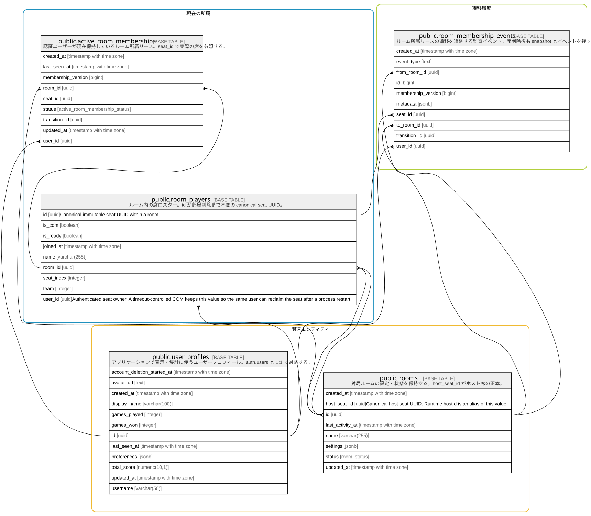

# ルーム所属リース

## Description

同一ユーザーの多重入室を防ぎ、再接続・退出を監査するための所属管理。

## Tables

### 現在の所属

ユーザーが現在予約または保持しているルーム所属。

| Name                                                                | Columns | Comment                                                            | Type       |
| ------------------------------------------------------------------- | ------- | ------------------------------------------------------------------ | ---------- |
| [public.active_room_memberships](public.active_room_memberships.md) | 9       | 認証ユーザーが現在保持しているルーム所属のリース。二重参加を防ぐ。                                  | BASE TABLE |

### 遷移履歴

所属の予約、確定、解放を追跡するイベント。

| Name                                                              | Columns | Comment                                        | Type       |
| ----------------------------------------------------------------- | ------- | ---------------------------------------------- | ---------- |
| [public.room_membership_events](public.room_membership_events.md) | 9       | ルーム所属リースの遷移を追跡する監査イベント。                        | BASE TABLE |

### 関連エンティティ

所属リースが参照するアプリケーションユーザーと対局ルーム。

| Name                                            | Columns | Comment                                                                                | Type       |
| ----------------------------------------------- | ------- | -------------------------------------------------------------------------------------- | ---------- |
| [public.rooms](public.rooms.md)                 | 8       | 対局ルームの設定・状態・ホストを保持する。                                                                  | BASE TABLE |
| [public.user_profiles](public.user_profiles.md) | 12      | アプリケーションで表示・集計に使うユーザープロフィール。auth.users と 1:1 で対応する。                                    | BASE TABLE |

## Relations

---

> Generated by [tbls](https://github.com/k1LoW/tbls)
