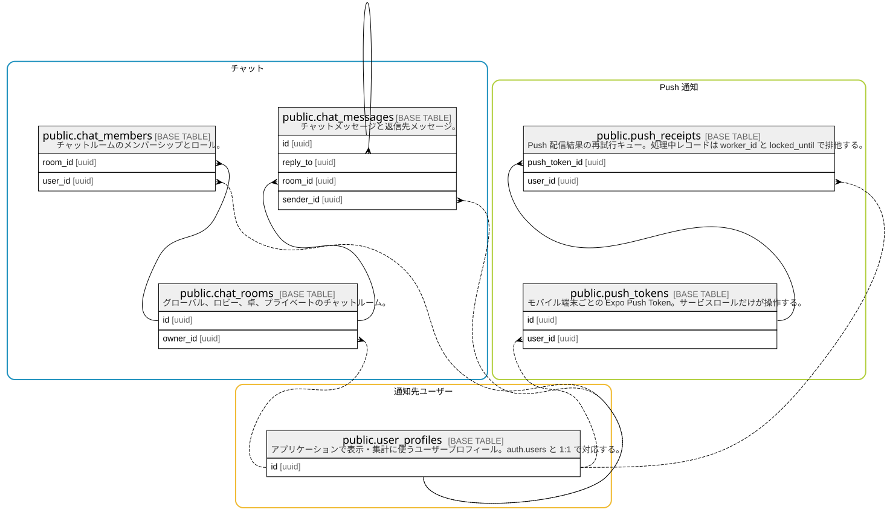

# ソーシャルと通知

## Description

チャットとモバイル Push 通知の永続化。

## Tables

### チャット

ルーム、参加者、メッセージのチャット基盤。

| Name                                            | Columns | Comment                                                | Type       |
| ----------------------------------------------- | ------- | ------------------------------------------------------ | ---------- |
| [public.chat_members](public.chat_members.md)   | 5       | チャットルームのメンバーシップとロール。                                   | BASE TABLE |
| [public.chat_messages](public.chat_messages.md) | 7       | チャットメッセージと返信先メッセージ。                                    | BASE TABLE |
| [public.chat_rooms](public.chat_rooms.md)       | 8       | グローバル、ロビー、卓、プライベートのチャットルーム。                            | BASE TABLE |

### Push 通知

端末トークンと配信結果の再試行キュー。

| Name                                            | Columns | Comment                                                                              | Type       |
| ----------------------------------------------- | ------- | ------------------------------------------------------------------------------------ | ---------- |
| [public.push_receipts](public.push_receipts.md) | 16      | Push 配信結果の再試行キュー。処理中レコードは worker_id と locked_until で排他する。                            | BASE TABLE |
| [public.push_tokens](public.push_tokens.md)     | 9       | モバイル端末ごとの Expo Push Token。サービスロールだけが操作する。                                            | BASE TABLE |

### 通知先ユーザー

チャットと Push 通知の送受信対象となるアプリケーションユーザー。

| Name                                            | Columns | Comment                                                                                | Type       |
| ----------------------------------------------- | ------- | -------------------------------------------------------------------------------------- | ---------- |
| [public.user_profiles](public.user_profiles.md) | 12      | アプリケーションで表示・集計に使うユーザープロフィール。auth.users と 1:1 で対応する。                                    | BASE TABLE |

## Relations

---

> Generated by [tbls](https://github.com/k1LoW/tbls)
